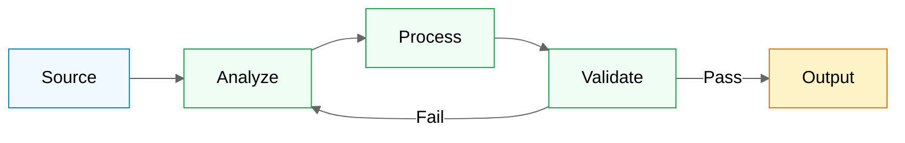

# Mermaid Reference

Syntax traps, palette, and a worked example. Load when writing or fixing a
diagram.

## Compatibility traps

These fail at render time, and the failure looks like a wall of error text
rather than a missing diagram — so they cost a review cycle each.

- **Never use `:::className` on a subgraph.** Only nodes take class
  assignment: `NODE["label"]:::className`, not
  `subgraph Name["label"]:::className`.
- **No emojis in `quadrantChart` labels or `init` config blocks** — syntax
  error. Emojis are fine in node labels, pie labels, and prose outside fences.
- **Use `flowchart`, not `block-beta`** — block diagrams are not stable across
  renderers.
- **Quote any node label containing spaces, parentheses, or punctuation:**
  `A["Run tests (CI)"]`.
- **Sequence diagrams**: declare every participant before first use, or the
  render order is renderer-dependent.

## Palette

Traffic-light semantics so colour carries meaning instead of decoration.

```mermaid
%%{init: {'theme':'neutral'}}%%
flowchart LR
    classDef active fill:#22c55e,stroke:#166534,color:#fff
    classDef pending fill:#eab308,stroke:#a16207,color:#fff
    classDef error fill:#ef4444,stroke:#dc2626,color:#fff
    classDef external fill:#3b82f6,stroke:#1d4ed8,color:#fff
```

| Class | Colour | Use for |
|-------|--------|---------|
| `active` | Green | Healthy / running components |
| `pending` | Yellow | In-progress or queued states |
| `error` | Red | Error, rejected, failed states |
| `external` | Blue | Third-party services and systems |

Colour must be redundant with the label — readers with colour-vision
deficiency, and anyone reading a printed page, get the same information.

## Layout

| Direction | Use for |
|-----------|---------|
| `LR` | Pipelines, timelines, progressions |
| `TB` | Hierarchies, decision trees |

Keep to ~20 nodes. Group with subgraphs by logical category. If a diagram needs
a legend to be understood, it is doing two jobs.

## Worked example



## Page structure

````markdown
# <Subject> Diagrams

> One line: which part of the system this page covers.

## <Diagram name>

<2-4 lines: what to look at and why it matters.>

```mermaid
...
```

## Related

- [Diagram hub](README.md)
````

No "Table of Contents" — the renderer makes one, and a hand copy goes stale
the first time a diagram is renamed.
