# Architecture Diagrams

> Visual documentation of the Manifest parallel LLM agent orchestration framework

**Last Updated**: 2026-02-13
**Project**: Manifest - AI Agent Orchestration Framework

---

## Table of Contents

1. [Application Architecture](#application-architecture)
2. [Python Parallel Agent Architecture](#python-parallel-agent-architecture)
3. [Git Platform Detection & Operations](#git-platform-detection--operations)
4. [Bootstrap Installation Flow](#bootstrap-installation-flow)
5. [Parallel Agent Execution Flow](#parallel-agent-execution-flow)
6. [Skill Processing Architecture](#skill-processing-architecture)
7. [Validation Pipeline](#validation-pipeline)
8. [Model Selection & Credit Fallback](#model-selection--credit-fallback)
9. [Configuration Layer](#configuration-layer)
10. [Cross-Verification Consensus](#cross-verification-consensus)
11. [Service State Management](#service-state-management)
12. [Issue Management Architecture](#issue-management-architecture)
13. [Label Management Architecture](#label-management-architecture)

---

## Application Architecture

High-level overview of the complete system showing major components and their relationships.

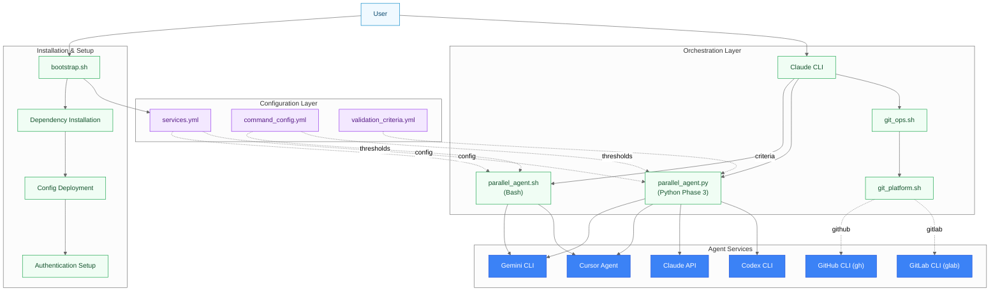

**Key Components**:

- **bootstrap.sh**: Automated installation and configuration deployment with Python version detection
- **Git Platform Scripts**: Platform-agnostic Git operations (GitHub/GitLab/plain git)
- **parallel_agent.sh**: Bash orchestrator for multiple LLM agents (deprecated — use parallel_agent.py)
- **parallel_agent.py**: Python orchestrator with full feature parity
  (logging, validation, synthesis, streaming, Codex agent, services.yml)
- **Configuration Layer**: YAML files controlling behavior, validation rules, and Phase 3 features
- **Agent Services**: External LLM and Git hosting CLIs

---

## Python Parallel Agent Architecture

Detailed architecture of the Python parallel agent implementation with full feature parity:
comprehensive logging, validation, synthesis, streaming, Codex agent, and services.yml integration.

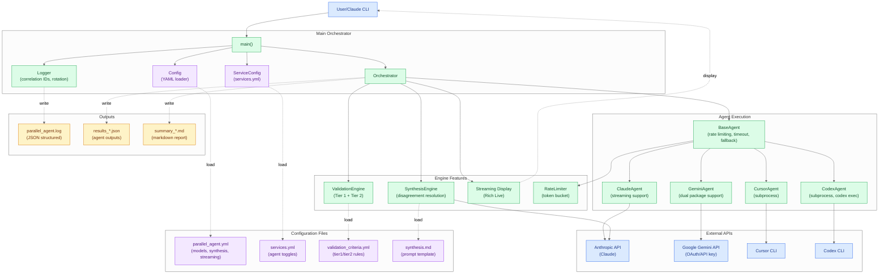

**Components**:

- **ServiceConfig**: Reads `services.yml` for agent enable/disable state, minimum agent validation
- **Logger**: Structured JSON logging with correlation IDs (`YYYYMMDD_HHMMSS_PID`),
  rotating file handler (10MB, 5 backups), performance metrics
- **ValidationEngine**:
  - Tier 1 (critical): Security, error handling, breaking changes, cross-verification
  - Tier 2 (quality): Bug detection, performance, maintainability, test coverage
  - Verdicts: APPROVED, NEEDS_REVIEW, BLOCKED
- **SynthesisEngine**: Automatic disagreement resolution when consensus < 50%, uses Claude Sonnet with synthesis.md template
- **Streaming**: Real-time Rich Live display with progressive updates (4 updates/sec, 500 char truncation)
- **RateLimiter**: Token bucket algorithm with burst support and adaptive backoff
- **CodexAgent**: Subprocess-based agent using `codex exec` with `--output-last-message` for reliable output capture
- **Dual Package Support**: google-genai (new) with fallback to google-generativeai (legacy), unified interface

**Execution Flow**:

1. **Initialization**: Load config + services.yml, create logger with correlation ID, set up rate limiters
2. **Agent Selection**: services.yml state -> `--*-only` exclusive flags -> `--no-*` overrides -> minimum agent check
3. **Agent Execution**: Run Claude/Gemini/Cursor/Codex in parallel with streaming or progress display
4. **Consensus**: Calculate consensus score using keyword-based analysis
5. **Synthesis**: If consensus < 50%, trigger SynthesisEngine for unified recommendation
6. **Validation**: Run ValidationEngine if `--validate` flag set
7. **Output**: Write structured logs, JSON results (with duration), markdown summary (sandbox-aware fallback)

**Statistics**:

- Classes: 11 (Config, ServiceConfig, Logger, RateLimiter, ValidationEngine, SynthesisEngine,
  BaseAgent, ClaudeAgent, GeminiAgent, CursorAgent, CodexAgent, Orchestrator)
- CLI Flags: 27 (--codex-only, --codex-model, --no-cursor, --no-gemini, --no-codex, --status added)
- Agents: 4 (Claude, Gemini, Cursor, Codex)

---

## Git Platform Detection & Operations

Platform-agnostic Git operations flow with automatic platform detection and routing to appropriate CLI tools.

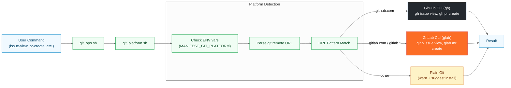

**Detection Logic**:

1. **Environment Override**: `MANIFEST_GIT_PLATFORM` forces specific platform
2. **Remote URL Parsing**: Reads `git remote get-url origin` (or `$MANIFEST_GIT_REMOTE`)
3. **Pattern Matching**:
   - `*github.com*` → GitHub (gh)
   - `*gitlab.com*` or `*gitlab.*` → GitLab (glab)
   - Other → Plain git (warn)

**Subcommand Mapping**:

| Generic | GitHub (gh) | GitLab (glab) |
|---------|-------------|---------------|
| issue-comment | gh issue comment | glab issue note |
| issue-edit | gh issue edit | glab issue update |
| pr-create | gh pr create | glab mr create |
| pr-view | gh pr view | glab mr view |

---

## Bootstrap Installation Flow

Complete installation and configuration deployment process with Git CLI auto-detection.

```mermaid
%%{init: {'theme':'neutral'}}%%
flowchart TD
    classDef input fill:#f0f9ff,stroke:#0284c7,color:#0c4a6e
    classDef process fill:#f0fdf4,stroke:#16a34a,color:#14532d
    classDef decision fill:#fef3c7,stroke:#d97706,color:#78350f
    classDef success fill:#22c55e,stroke:#166534,color:#fff
    classDef skip fill:#e5e7eb,stroke:#6b7280,color:#374151

    START["./bootstrap.sh"]:::input
    PARSE_ARGS["Parse CLI Arguments<br/>(--enable/--disable flags)"]:::process
    DETECT_PLATFORM["Detect OS Platform<br/>(macOS, Linux distro)"]:::process

    LOAD_CONFIG{"Load Existing<br/>services.yml?"}:::decision
    MERGE_CONFIG["Merge File Config<br/>with CLI Args"]:::process

    INSTALL_PKG["Install Package Manager<br/>(Homebrew on macOS)"]:::process
    INSTALL_NODE["Install Node.js<br/>(for npm CLIs)"]:::process

    CHECK_CLAUDE{"Claude<br/>Enabled?"}:::decision
    INSTALL_CLAUDE["Install Claude CLI<br/>(npm install -g)"]:::process
    SKIP_CLAUDE["Skip Claude"]:::skip

    CHECK_GEMINI{"Gemini<br/>Enabled?"}:::decision
    INSTALL_GEMINI["Install Gemini CLI<br/>(npm install -g)"]:::process
    SKIP_GEMINI["Skip Gemini"]:::skip

    CHECK_GH{"GitHub CLI<br/>Enabled/Auto?"}:::decision
    AUTO_GH{"gh already<br/>installed?"}:::decision
    INSTALL_GH["Install GitHub CLI<br/>(brew/apt/dnf)"]:::process
    SKIP_GH["Disable GitHub CLI"]:::skip

    CHECK_GLAB{"GitLab CLI<br/>Enabled/Auto?"}:::decision
    AUTO_GLAB{"glab already<br/>installed?"}:::decision
    INSTALL_GLAB["Install GitLab CLI<br/>(brew/apt/dnf)"]:::process
    SKIP_GLAB["Disable GitLab CLI"]:::skip

    CHECK_JQ["Check jq<br/>(required by git_ops.sh)"]:::process
    INSTALL_JQ["Install jq"]:::process

    CHECK_CURSOR{"Cursor<br/>Enabled?"}:::decision
    OPEN_CURSOR["Open Cursor<br/>Download Page"]:::process
    SKIP_CURSOR["Skip Cursor"]:::skip

    DEPLOY["Deploy Config Files<br/>(~/.claude, ~/.cursor, ~/.gemini)"]:::process
    WRITE_SERVICES["Write services.yml<br/>(with final toggles)"]:::process

    AUTH_CLAUDE["Setup Claude Auth"]:::process
    AUTH_GEMINI["Setup Gemini Auth"]:::process
    AUTH_GH["Setup GitHub Auth<br/>(gh auth login)"]:::process
    AUTH_GLAB["Setup GitLab Auth<br/>(glab auth login)"]:::process

    VERIFY["Verify Installation<br/>(check files, CLIs, scripts)"]:::process
    DONE["Installation Complete"]:::success

    START --> PARSE_ARGS
    PARSE_ARGS --> DETECT_PLATFORM
    DETECT_PLATFORM --> LOAD_CONFIG

    LOAD_CONFIG -->|Yes| MERGE_CONFIG
    LOAD_CONFIG -->|No| INSTALL_PKG
    MERGE_CONFIG --> INSTALL_PKG

    INSTALL_PKG --> INSTALL_NODE
    INSTALL_NODE --> CHECK_CLAUDE

    CHECK_CLAUDE -->|Yes| INSTALL_CLAUDE
    CHECK_CLAUDE -->|No| SKIP_CLAUDE
    INSTALL_CLAUDE --> CHECK_GEMINI
    SKIP_CLAUDE --> CHECK_GEMINI

    CHECK_GEMINI -->|Yes| INSTALL_GEMINI
    CHECK_GEMINI -->|No| SKIP_GEMINI
    INSTALL_GEMINI --> CHECK_GH
    SKIP_GEMINI --> CHECK_GH

    CHECK_GH -->|Enabled| INSTALL_GH
    CHECK_GH -->|Auto| AUTO_GH
    CHECK_GH -->|Disabled| SKIP_GH
    AUTO_GH -->|Yes| SKIP_GH
    AUTO_GH -->|No| SKIP_GH
    INSTALL_GH --> CHECK_GLAB
    SKIP_GH --> CHECK_GLAB

    CHECK_GLAB -->|Enabled| INSTALL_GLAB
    CHECK_GLAB -->|Auto| AUTO_GLAB
    CHECK_GLAB -->|Disabled| SKIP_GLAB
    AUTO_GLAB -->|Yes| SKIP_GLAB
    AUTO_GLAB -->|No| SKIP_GLAB
    INSTALL_GLAB --> CHECK_JQ
    SKIP_GLAB --> CHECK_JQ

    CHECK_JQ -->|Not Found| INSTALL_JQ
    CHECK_JQ -->|Found| CHECK_CURSOR
    INSTALL_JQ --> CHECK_CURSOR

    CHECK_CURSOR -->|Yes| OPEN_CURSOR
    CHECK_CURSOR -->|No| SKIP_CURSOR
    OPEN_CURSOR --> DEPLOY
    SKIP_CURSOR --> DEPLOY

    DEPLOY --> WRITE_SERVICES
    WRITE_SERVICES --> AUTH_CLAUDE
    AUTH_CLAUDE --> AUTH_GEMINI
    AUTH_GEMINI --> AUTH_GH
    AUTH_GH --> AUTH_GLAB
    AUTH_GLAB --> VERIFY
    VERIFY --> DONE
```

**Key Features**:

- **Auto-Detection**: gh/glab default to `auto` mode (enable if already installed)
- **Platform-Specific Install**: Uses appropriate package manager (brew/apt/dnf/pacman)
- **Dependency Checking**: Verifies jq is installed (required for git_ops.sh JSON normalization)
- **Service Toggles**: Writes final enabled/disabled state to services.yml

---

## Parallel Agent Execution Flow

How multiple LLM agents are orchestrated for cross-verification with consensus scoring,
including sandbox detection and output verification.

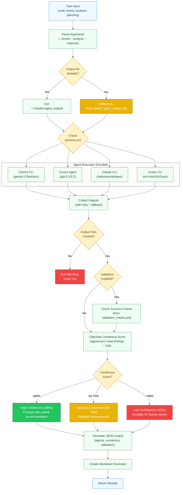

**Execution Model**:

- **Sandbox Detection**: Auto-detects write restrictions and falls back to `/tmp` if needed
- **Parallel Execution**: All enabled agents run simultaneously via background processes
- **Output Verification**: Explicit check that files were created before proceeding
- **Retry Logic**: Failed agents retry once after 5s delay
- **Credit Fallback**: Automatically retries with cheaper models on quota errors
- **Partial Results**: Continues with available agents if some fail

**Sandbox Handling** (New in 2026-02-06):

When running in sandboxed environments (e.g., Task subagents):

1. Script tests if `~/.claude/.agent_outputs` is writable
2. Falls back to `/tmp/.claude_agent_outputs_$$` if restricted
3. Verifies output files exist after agents complete
4. Exit code 13 if no files created (with helpful error message)

**Consensus Calculation**:

```text
Consensus Score = (Agreements / Total_Findings) * 100

≥80%: High confidence (auto-proceed)
50-79%: Medium confidence (show disagreements)
<50%: Low confidence (user decision required)
```

---

## Skill Processing Architecture

How slash commands (skills) are processed from user input to execution with parallel agent integration.


**Command Types**:

- **ALWAYS Parallel**: `/refactor-python`, `/refactor-shell` (security-sensitive)
- **CONDITIONAL**: `/docs-diagrams` (5+ modules), `/plan-manage` (complex planning),
  `/browser-test` (critical flows, 3+ tests)
- **NEVER Parallel**: `/docs-readme` (straightforward documentation)

---

## Validation Pipeline

How code changes and agent outputs are validated against Tier 1 (critical) and Tier 2 (quality) criteria.

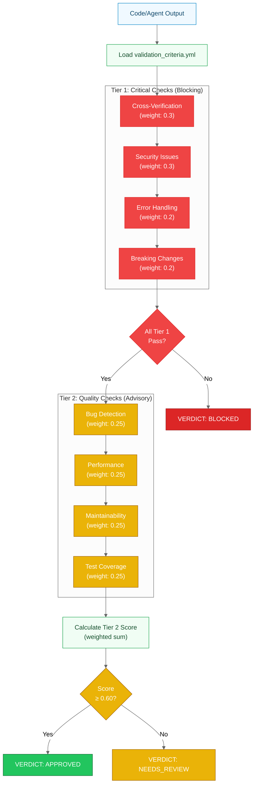

**Validation Verdicts**:

- **APPROVED**: All Tier 1 pass, Tier 2 ≥ 0.60 → Safe to proceed
- **NEEDS_REVIEW**: All Tier 1 pass, Tier 2 < 0.60 → Manual review recommended
- **BLOCKED**: Any Tier 1 fails → Changes rejected

**Command-Specific Overrides**:
Commands can override default thresholds in `validation_criteria.yml`:

```yaml
command_overrides:
  refactor-python:
    tier1:
      security_issues: 0.5  # Higher weight for Python security
  project-commit:
    tier2:
      test_coverage: 0.0    # Don't require tests for commits
```

---

## Model Selection & Credit Fallback

Automatic model tier selection and graceful fallback when quota/credits are exhausted.

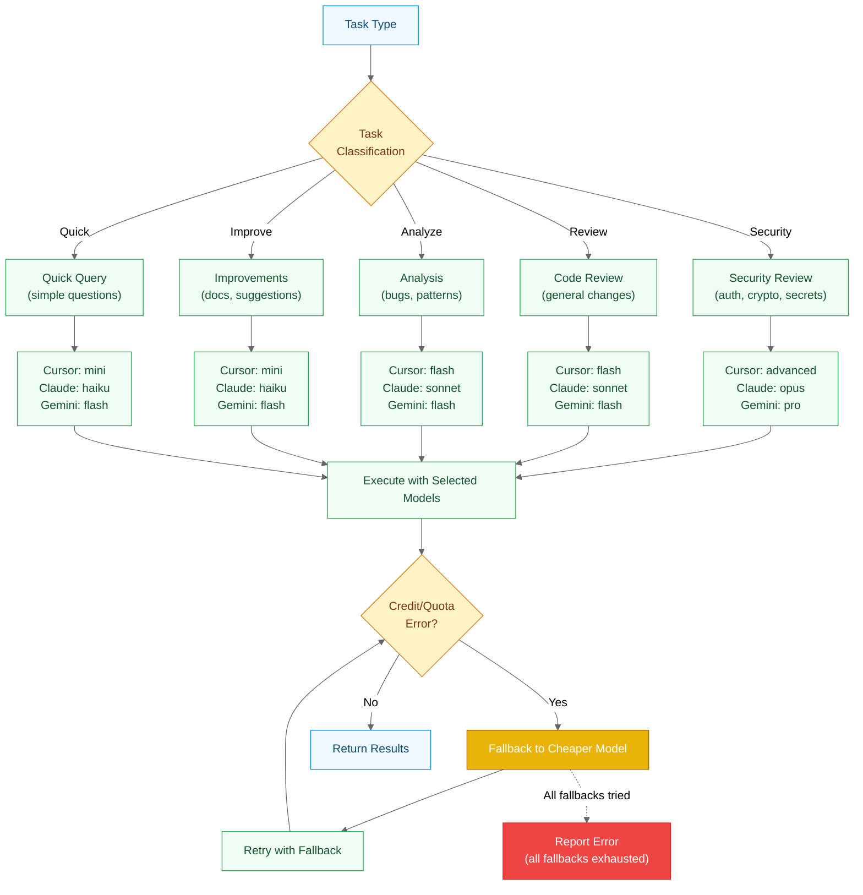

**Cursor Fallback Chain**:

```text
gpt-5.2 (advanced) → gpt-5.1-codex (flash) → gpt-5.1-codex-mini (mini) → auto
```

**Claude Fallback Chain**:

```text
opus → sonnet → haiku
```

**Codex Fallback Chain**:

```text
o3-pro (advanced) → o3 (flash) → o4-mini (mini)
```

**Error Detection**:
The script parses stderr for patterns:

- "credit", "quota", "rate limit", "insufficient"
- Automatically retries with next cheaper model
- Continues with available agents if one exhausts credits

---

## Configuration Layer

How YAML configuration files control behavior, thresholds, and service toggles.

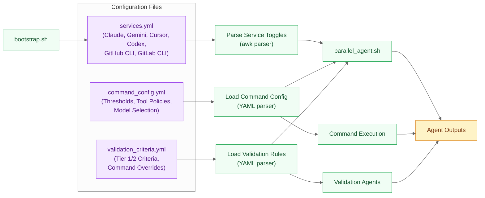

**services.yml Structure**:

```yaml
services:
  claude:
    enabled: true
    command: claude
  gemini:
    enabled: true
    command: gemini
  cursor:
    enabled: true
    command: cursor
  git_cli:
    github:
      enabled: auto  # auto-detect
      command: gh
    gitlab:
      enabled: auto
      command: glab
    detection:
      platform: auto
      remote: origin
```

**Key Features**:

- **Service Toggles**: Enable/disable agents and Git CLIs
- **Auto-Detection**: gh/glab default to `auto` (enable if installed)
- **Nested Configuration**: git_cli section contains github/gitlab subsections
- **Reconfigurable**: `bootstrap.sh --reconfigure` updates toggles without reinstall

---

## Cross-Verification Consensus

How agent outputs are compared and consensus scores are calculated for decision-making.

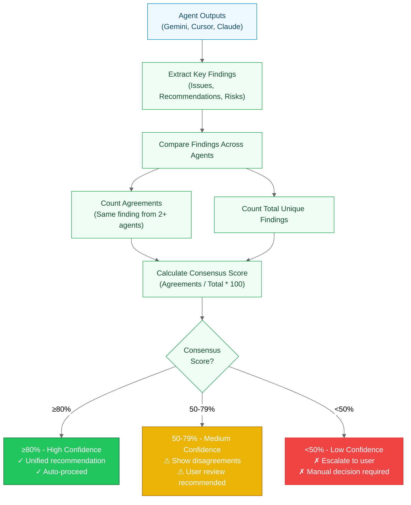

**Example Consensus Calculation**:

Given 3 agents with these findings:

- **Gemini**: [A, B, C, D]
- **Cursor**: [A, B, E]
- **Claude**: [A, C, F]

**Analysis**:

- Total unique findings: A, B, C, D, E, F = **6**
- Agreements (2+ agents):
  - A: all 3 agents ✓
  - B: Gemini + Cursor ✓
  - C: Gemini + Claude ✓
- Agreement count: **3**
- **Consensus Score**: 3/6 * 100 = **50%** (MEDIUM)

**Action**: Show disagreements (D, E, F are unique to single agents), recommend user review.

---

## Service State Management

Lifecycle and state transitions of enabled services throughout the framework.

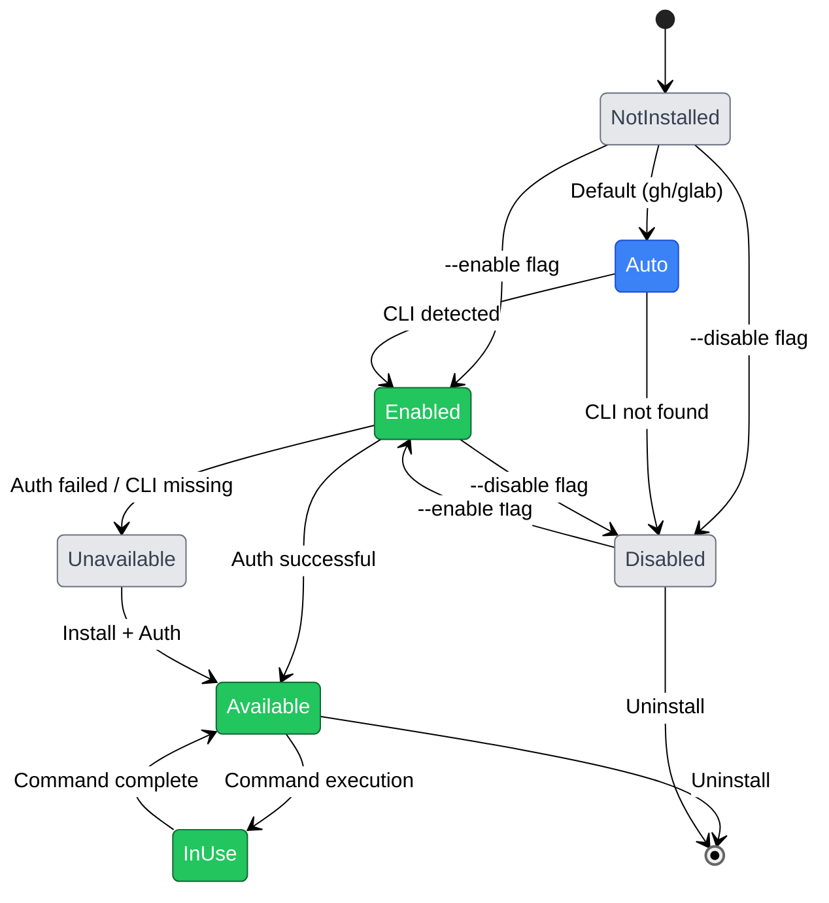

**State Descriptions**:

- **NotInstalled**: Service not yet configured (initial state)
- **Auto**: Auto-detect mode (default for gh/glab)
- **Enabled**: Explicitly enabled by user
- **Disabled**: Explicitly disabled by user
- **Available**: CLI installed and authenticated (ready for use)
- **Unavailable**: Enabled but CLI missing or auth failed
- **InUse**: Currently executing a command

**Transitions**:

- `bootstrap.sh` initializes state based on flags and detection
- `services.yml` persists state across sessions
- `bootstrap.sh --reconfigure` allows state changes without reinstall

---

## Issue Management Architecture

Shows the two issue management commands and how they interact with different platforms.

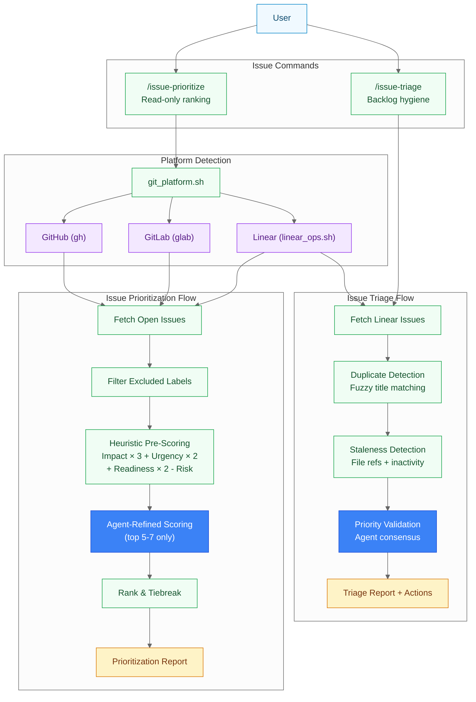

**Key differences**:

- **issue-prioritize**: Multi-platform (GitHub, GitLab, Linear), read-only, scoring-focused
- **issue-triage**: Linear-only, performs mutations (mark duplicates, close stale), hygiene-focused

**Scoring formula**: `Priority Score = (Impact × 3) + (Urgency × 2) + (Readiness × 2) - Risk`

**Tiebreakers**: bugs > features, unblockers > isolated, planned > unplanned, older > newer

---

## Label Management Architecture

How the canonical label registry drives consistent label provisioning across GitHub, GitLab, and Linear.

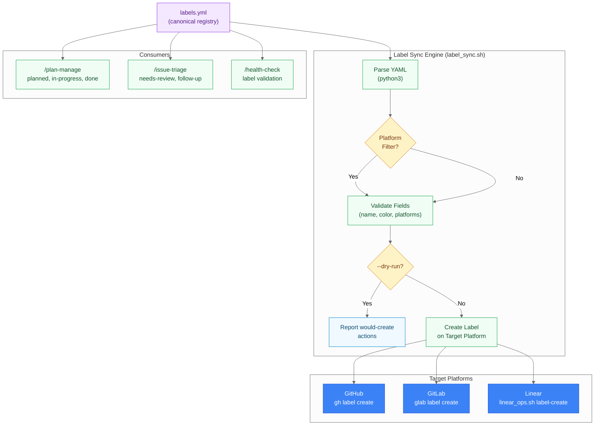

**Canonical Labels** (5 labels, 3 platforms):

| Label | Color | Platforms | Used By |
|-------|-------|-----------|---------|
| `planned` | `#1D76DB` (Blue) | GitHub, GitLab, Linear | /plan-manage create |
| `in-progress` | `#FBCA04` (Yellow) | GitHub, GitLab, Linear | /plan-manage execute |
| `needs-review` | `#E3A21A` (Orange) | GitHub, GitLab, Linear | /issue-triage |
| `done` | `#0E8A16` (Green) | GitHub, GitLab, Linear | /plan-manage execute |
| `follow-up` | `#D4C5F9` (Lavender) | GitHub, GitLab, Linear | /issue-triage |
| `future` | `#C2E0C6` (Green) | GitHub, GitLab, Linear | /issue-prioritize |

**Deprecated**: `processed` (replaced by `done`)

**Sync Modes**:

- `--dry-run`: Report what would be created without making changes
- `--validate`: Alias for `--dry-run` (validation only)
- `--platform <name>`: Restrict sync to a single platform (github, gitlab, linear)

---

## Related Documents

- [AGENTS.md](../AGENTS.md) - AI agent instructions for all platforms
- [CLAUDE.md](../CLAUDE.md) - Claude Code project instructions
- [README.md](../README.md) - Project overview and quick start
- [docs/GETTING_STARTED.md](GETTING_STARTED.md) - First-time setup walkthrough
- [docs/CONFIGURATION.md](CONFIGURATION.md) - Complete configuration reference
- [docs/TROUBLESHOOTING.md](TROUBLESHOOTING.md) - Common problems and solutions
- [configs/claude/.plans/README.md](../configs/claude/.plans/README.md) - Plan management quick reference
