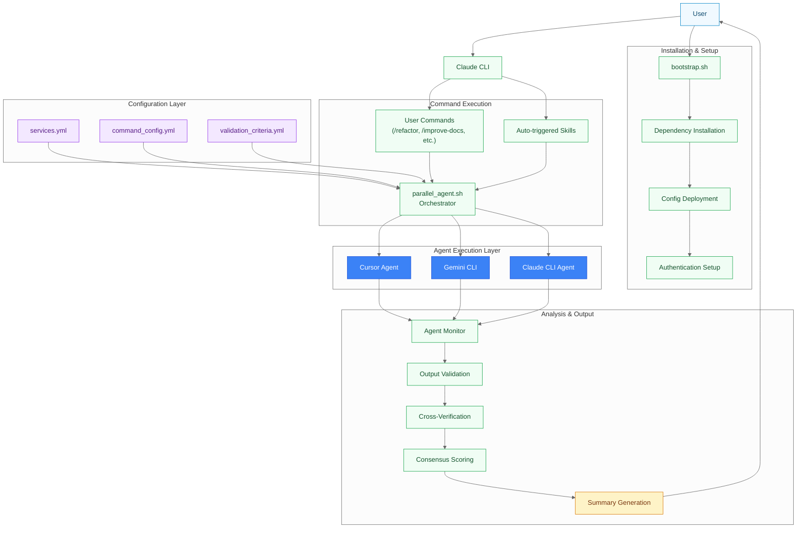
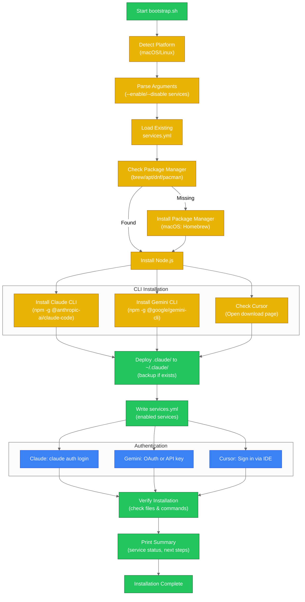
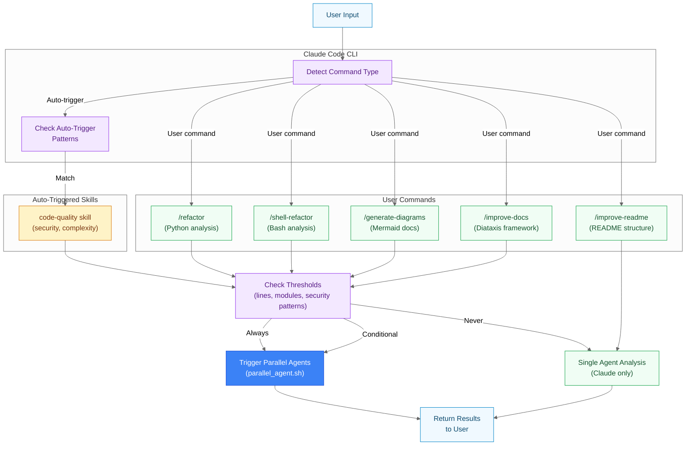
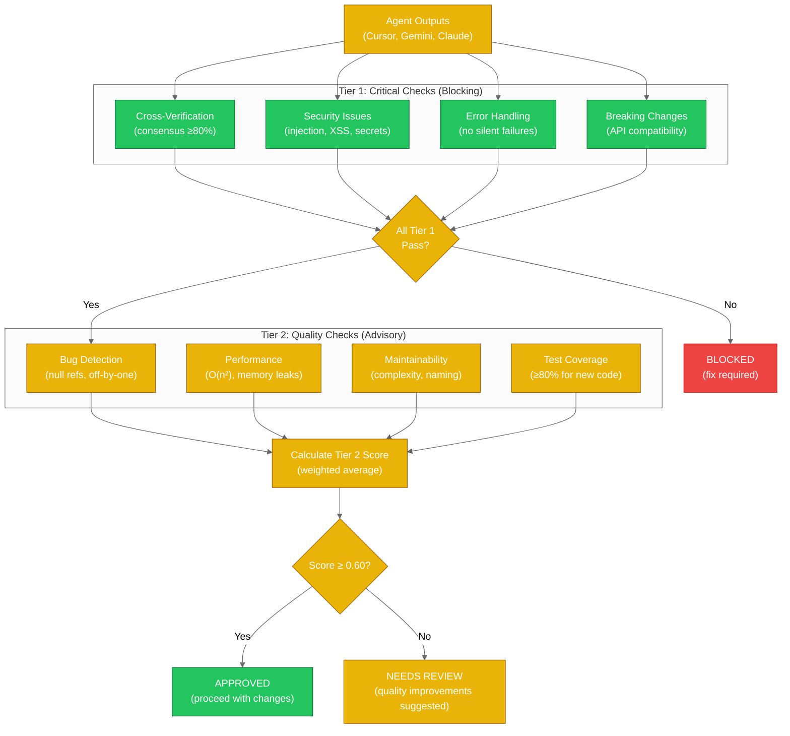
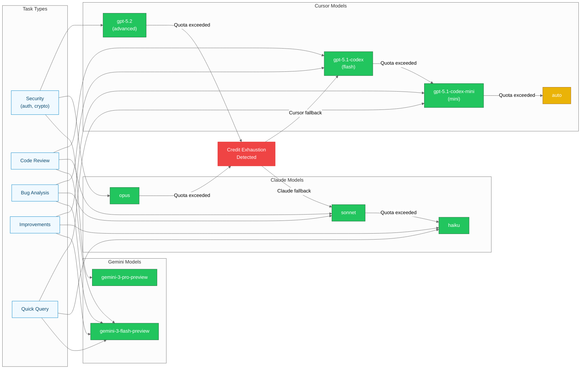
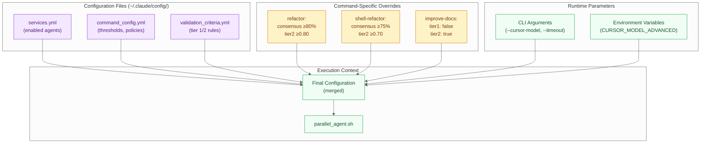
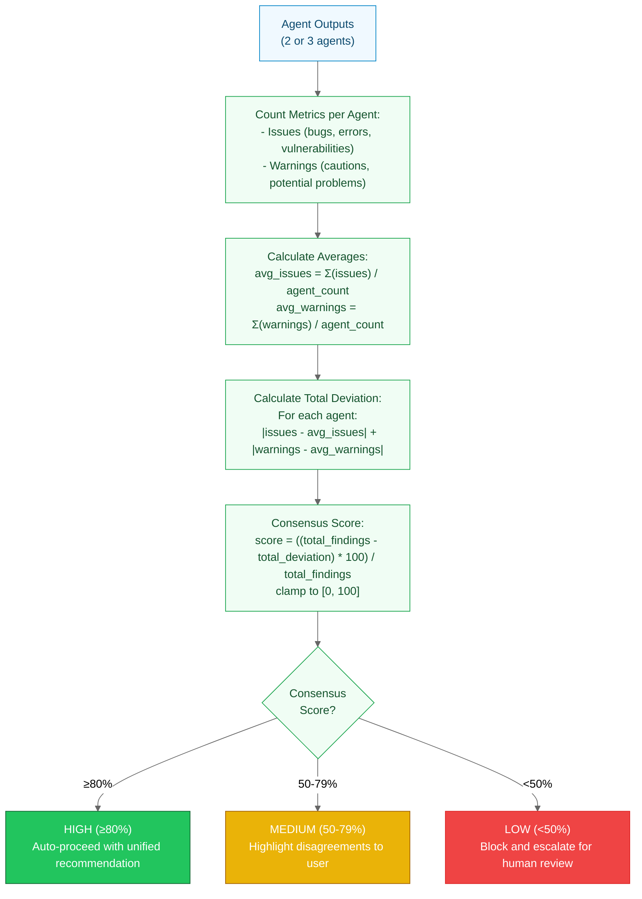
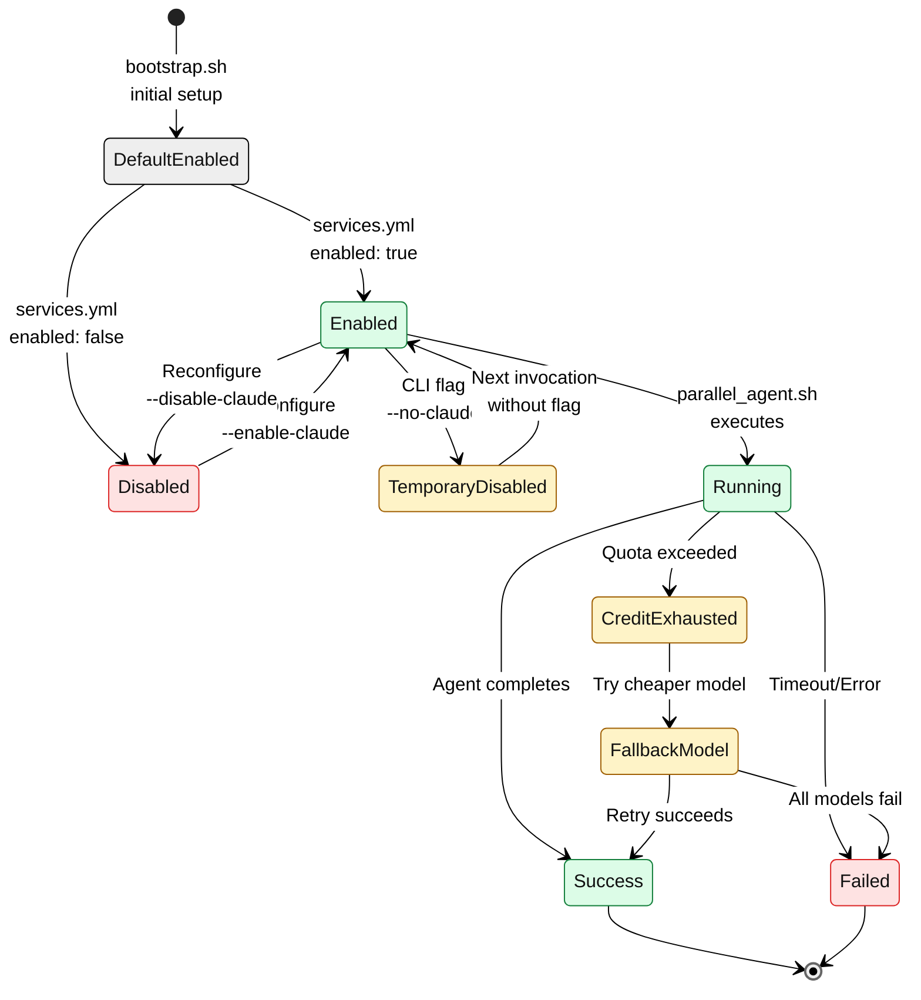

# Architecture Diagrams

> Visual documentation of the Manifest parallel LLM agent orchestration framework

**Last Updated**: 2026-02-05
**Project**: Manifest - AI Agent Orchestration Framework

---

## Table of Contents

1. [Application Architecture](#application-architecture)
2. [Bootstrap Installation Flow](#bootstrap-installation-flow)
3. [Parallel Agent Execution Flow](#parallel-agent-execution-flow)
4. [Command Processing Architecture](#command-processing-architecture)
5. [Validation Pipeline](#validation-pipeline)
6. [Model Selection & Credit Fallback](#model-selection--credit-fallback)
7. [Configuration Layer](#configuration-layer)
8. [Cross-Verification Consensus](#cross-verification-consensus)
9. [Service State Management](#service-state-management)

---

## Application Architecture

High-level overview of the complete system showing major components and their relationships.



**Key Components:**

- **Bootstrap Layer**: Automated installation and configuration for macOS/Linux
- **Configuration Layer**: YAML-based configuration for services, commands, and validation
- **Command Execution**: User-invoked commands and auto-triggered skills
- **Agent Layer**: Three independent AI agents (Cursor, Gemini, Claude) running in parallel
- **Analysis Layer**: Output validation, cross-verification, and consensus scoring

---

## Bootstrap Installation Flow

Detailed bootstrap process showing platform detection, dependency installation, and service configuration.



**Platform Support:**

- **macOS**: Homebrew for package management
- **Linux**: apt, dnf, yum, pacman, zypper support
- **Services**: Toggle-based (--enable/--disable flags)
- **Reconfiguration**: Run with --reconfigure to update service settings

---

## Parallel Agent Execution Flow

End-to-end flow from command invocation through parallel agent execution to final output.

```mermaid
%%{init: {'theme':'neutral'}}%%
flowchart LR
    classDef input fill:#f0f9ff,stroke:#0284c7,color:#0c4a6e
    classDef process fill:#f0fdf4,stroke:#16a34a,color:#14532d
    classDef output fill:#fef3c7,stroke:#d97706,color:#78350f
    classDef validation fill:#fef2f2,stroke:#dc2626,color:#7f1d1d

    USER["User Invokes<br/>/refactor or script"]:::input

    PARSE["Parse Arguments<br/>(--review, --analyze, --cursor-model)"]:::process
    LOAD_SVC["Load services.yml<br/>(enabled services)"]:::process
    VALIDATE_AGENTS["Validate Agent<br/>Availability"]:::process

    BUILD["Build Prompts<br/>(per mode: review/analyze/improve)"]:::process

    RESOLVE["Resolve Model Tiers<br/>(mini/flash/advanced → gpt-5.2)"]:::process

    PREFLIGHT["Pre-flight Credit Check<br/>(optional)"]:::validation

    subgraph "Parallel Execution"
        CURSOR_EXEC["Cursor Agent<br/>cursor agent --model"]:::process
        GEMINI_EXEC["Gemini CLI<br/>gemini --model"]:::process
        CLAUDE_EXEC["Claude CLI<br/>claude --model"]:::process
    end

    MONITOR["Monitor Agents<br/>(PIDs, spinner UI)"]:::process

    VALIDATE_OUT["Validate Outputs<br/>(non-empty, no fatal errors)"]:::validation

    CROSS_VERIFY["Cross-Verification<br/>(consensus scoring)"]:::process

    JSON_OUT["JSON Output<br/>(results_YYYYMMDD_HHMMSS.json)"]:::output
    MD_OUT["Markdown Summary<br/>(summary_YYYYMMDD_HHMMSS.md)"]:::output

    USER --> PARSE
    PARSE --> LOAD_SVC
    LOAD_SVC --> VALIDATE_AGENTS
    VALIDATE_AGENTS --> BUILD
    BUILD --> RESOLVE
    RESOLVE --> PREFLIGHT

    PREFLIGHT --> CURSOR_EXEC
    PREFLIGHT --> GEMINI_EXEC
    PREFLIGHT --> CLAUDE_EXEC

    CURSOR_EXEC --> MONITOR
    GEMINI_EXEC --> MONITOR
    CLAUDE_EXEC --> MONITOR

    MONITOR --> VALIDATE_OUT
    VALIDATE_OUT --> CROSS_VERIFY

    CROSS_VERIFY --> JSON_OUT
    CROSS_VERIFY --> MD_OUT

    JSON_OUT --> USER
    MD_OUT --> USER
```



**Execution Characteristics:**

- **Parallel Execution**: All enabled agents run simultaneously (background processes)
- **Timeouts**: Default 600s (10 minutes) per agent, configurable via --timeout
- **Retry Logic**: Automatic retry on failure with exponential backoff
- **Progress Monitoring**: Real-time spinner UI showing agent status

---

## Command Processing Architecture

How user commands flow through the Claude Code CLI and trigger orchestration.



**Command Categories:**

| Command | Parallel Agents | Trigger Condition |
|---------|----------------|-------------------|
| `/refactor` | ALWAYS | N/A |
| `/shell-refactor` | ALWAYS | N/A |
| `code-quality` (skill) | ALWAYS | Auto-triggered |
| `/generate-diagrams` | CONDITIONAL | ≥5 unique imports |
| `/improve-docs` | CONDITIONAL | ≥500 lines |
| `/improve-readme` | NEVER | N/A |

---

## Validation Pipeline

Two-tier validation system for code review outputs.



**Tier 1 Criteria (Blocking):**

| Criterion | Weight | Description |
|-----------|--------|-------------|
| Cross-Verification | 0.30 | Agents agree on key findings |
| Security | 0.30 | No injection, XSS, auth bypass, secrets |
| Error Handling | 0.20 | Proper exceptions, no silent failures |
| Breaking Changes | 0.20 | API compatibility, data migrations |

**Tier 2 Criteria (Quality):**

| Criterion | Weight | Description |
|-----------|--------|-------------|
| Bug Detection | 0.25 | Logic errors, null refs, race conditions |
| Performance | 0.25 | No O(n²), memory leaks, blocking I/O |
| Maintainability | 0.25 | Clear naming, reasonable complexity |
| Test Coverage | 0.25 | ≥80% coverage for new code |

---

## Model Selection & Credit Fallback

Dynamic model selection based on task complexity with automatic fallback on credit exhaustion.



**Model Tier Mappings:**

| Tier | Cursor | Claude | Gemini |
|------|--------|--------|--------|
| Advanced/Opus/Pro | gpt-5.2 | opus | gemini-3-pro-preview |
| Flash/Sonnet | gpt-5.1-codex | sonnet | gemini-3-flash-preview |
| Mini/Haiku | gpt-5.1-codex-mini | haiku | N/A |
| Fallback | auto | haiku | N/A |

**Credit Detection:**

- Parse stderr for: `credit`, `quota`, `rate limit`, `exceeded`, `insufficient`
- Automatic fallback chain with exponential model downgrade
- Optional pre-flight check with `--check-credits` flag

---

## Configuration Layer

YAML-based configuration hierarchy showing how settings flow through the system.



**Configuration Priority (Highest to Lowest):**

1. **CLI Arguments**: `--cursor-model advanced`, `--timeout 900`
2. **Command Overrides**: Per-command settings in `validation_criteria.yml`
3. **Environment Variables**: `CURSOR_MODEL_ADVANCED=gpt-5.2`
4. **Base Configuration**: Default values in `command_config.yml`
5. **Service Toggles**: `services.yml` enabled/disabled flags

**Key Configuration Files:**

- `services.yml`: Which agents are enabled (claude, gemini, cursor)
- `command_config.yml`: Thresholds, model mappings, consensus rules
- `validation_criteria.yml`: Tier 1/2 validation checks and scoring

---

## Cross-Verification Consensus

Algorithm for calculating consensus score between multiple agent outputs.



**Consensus Example:**

```
Agent Findings:
- Cursor:  15 issues, 8 warnings  (total: 23)
- Gemini:  12 issues, 10 warnings (total: 22)
- Claude:  14 issues, 9 warnings  (total: 23)

Averages:
- avg_issues = (15+12+14)/3 = 13.67
- avg_warnings = (8+10+9)/3 = 9

Deviations:
- Cursor:  |15-13.67| + |8-9| = 1.33 + 1 = 2.33
- Gemini:  |12-13.67| + |10-9| = 1.67 + 1 = 2.67
- Claude:  |14-13.67| + |9-9| = 0.33 + 0 = 0.33
- Total deviation = 5.33

Consensus Score:
- total_findings = 68
- score = ((68 - 5.33) * 100) / 68 = 92.2%
- Result: HIGH confidence (agents largely agree)
```

---

## Service State Management

State transitions for enabled/disabled services throughout the lifecycle.



**State Transitions:**

1. **Bootstrap**: All services start enabled by default
2. **Configuration**: `services.yml` persists enabled/disabled state
3. **Runtime Override**: CLI flags (`--cursor-only`, `--no-claude`) temporarily modify state
4. **Execution**: Running state while agent processes request
5. **Credit Exhaustion**: Automatic fallback to cheaper models
6. **Reconfiguration**: User can change enabled state via `bootstrap.sh --reconfigure`

**Fallback Chains:**

- **Cursor**: gpt-5.2 → gpt-5.1-codex → gpt-5.1-codex-mini → auto
- **Claude**: opus → sonnet → haiku


---

## Related Documents

- [CLAUDE.md](../CLAUDE.md) - Repository context for AI assistants
- [.claude/CLAUDE.md](../.claude/CLAUDE.md) - Full orchestration guide (deployed to ~/.claude/)
- [README.md](../README.md) - Project overview and quick start
- [GETTING_STARTED.md](GETTING_STARTED.md) - First-time setup walkthrough
- [CONFIGURATION.md](CONFIGURATION.md) - Complete configuration reference
- [TROUBLESHOOTING.md](TROUBLESHOOTING.md) - Common problems and solutions

---

**Generated by**: `/generate-diagrams` command
**Mermaid Version**: Compatible with GitHub/GitLab markdown renderers
**Last Validated**: 2026-02-04
