# Architecture Diagrams

> Visual documentation of the Manifest parallel LLM agent orchestration framework

**Last Updated**: 2026-06-15
**Project**: Manifest - AI Agent Orchestration Framework

---

## Table of Contents

1. [Application Architecture](#application-architecture)
2. [Python Parallel Agent Architecture](#python-parallel-agent-architecture)
3. [agents/ Package Module Dependency Graph](#agents-package-module-dependency-graph)
4. [Agent Backend Selection (SDK vs CLI Fallback)](#agent-backend-selection-sdk-vs-cli-fallback)
5. [Git Platform Detection & Operations](#git-platform-detection--operations)
6. [Bootstrap Installation Flow](#bootstrap-installation-flow)
7. [Parallel Agent Execution Flow](#parallel-agent-execution-flow)
8. [Skill Processing Architecture](#skill-processing-architecture)
9. [Validation Pipeline](#validation-pipeline)
10. [Model Selection & Credit Fallback](#model-selection--credit-fallback)
11. [Model Pin Staleness Check](#model-pin-staleness-check)
12. [Configuration Layer](#configuration-layer)
13. [Cross-Verification Consensus](#cross-verification-consensus)
14. [Service State Management](#service-state-management)
15. [Issue Management Architecture](#issue-management-architecture)
16. [Issue-Linking Hooks (commit-issue-sync / pr-issue-sync)](#issue-linking-hooks-commit-issue-sync--pr-issue-sync)
17. [Autonomous Issue Developer (/auto-issue-dev)](#autonomous-issue-developer-auto-issue-dev)
18. [Label Management Architecture](#label-management-architecture)
19. [SkillClaw Passive Ingest & Evolve Pipeline](#skillclaw-passive-ingest--evolve-pipeline)

---

## Application Architecture

High-level overview of the complete system showing major components and their relationships.

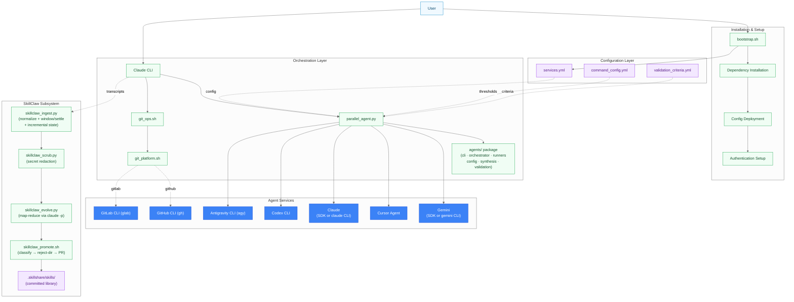

**Key Components**:

- **bootstrap.sh**: Automated installation and configuration deployment with Python version detection
- **Git Platform Scripts**: Platform-agnostic Git operations (GitHub/GitLab/plain git)
- **parallel_agent.py**: Python orchestrator with full feature parity
  (logging, validation, synthesis, streaming, Codex agent, services.yml)
- **Configuration Layer**: YAML files controlling behavior, validation rules, and Phase 3 features
- **Agent Services**: External LLM and Git hosting CLIs. Claude and Gemini execute via their
  SDK when the package + API key are present, otherwise fall back to their OAuth-authenticated
  CLI binaries (`claude` / `gemini`) through the generic CLIAgent — all five providers can run
  through CLIAgent paths
- **SkillClaw Subsystem**: Passive transcript ingestion pipeline — reads existing Claude Code
  session `.jsonl` files, scrubs secrets, distills candidate skills via `claude -p` (Max-backed
  map-reduce), and opens a PR-gated review into `.skillshare/skills/`; no daemon, no proxy

---

## Python Parallel Agent Architecture

Architecture of the modular `agents/` package. `parallel_agent.py` is now a thin entry point;
all logic lives in six focused modules: `cli`, `orchestrator`, `runners`, `config`, `synthesis`, `validation`.

```mermaid
%%{init: {'theme':'neutral'}}%%
flowchart TB
    classDef active fill:#dcfce7,stroke:#16a34a,color:#14532d
    classDef pending fill:#fef3c7,stroke:#d97706,color:#78350f
    classDef error fill:#fee2e2,stroke:#dc2626,color:#7f1d1d
    classDef external fill:#dbeafe,stroke:#2563eb,color:#1e3a8a
    classDef config fill:#f3e8ff,stroke:#9333ea,color:#581c87

    USER["User/Claude CLI"]:::external

    subgraph "agents/cli.py"
        MAIN["main()"]:::active
        SELECT["select_backend()<br/>(sdk | cli | skip)"]:::active
    end

    subgraph "agents/config.py"
        LOGGER["Logger<br/>(correlation IDs, rotation)"]:::active
        CONFIG["Config<br/>(YAML loader)"]:::config
        SVC_CFG["ServiceConfig<br/>(services.yml)"]:::config
        LIMITER["RateLimiter<br/>(token bucket)"]:::active
    end

    subgraph "agents/orchestrator.py"
        ORCH["Orchestrator"]:::active
        STREAM["Streaming Display<br/>(Rich Live)"]:::active
    end

    subgraph "agents/runners.py"
        BASE["BaseAgent<br/>(rate limiting, timeout, fallback)"]:::active
        CLAUDE_AG["ClaudeAgent<br/>(SDK, streaming support)"]:::active
        GEMINI_AG["GeminiAgent<br/>(SDK, dual package support)"]:::active
        CLI_AG["CLIAgent<br/>(claude | gemini | cursor | codex | antigravity,<br/>config-driven)"]:::active
    end

    subgraph "agents/validation.py + synthesis.py"
        VALIDATE["ValidationEngine<br/>(Tier 1 + Tier 2)"]:::active
        SYNTH["SynthesisEngine<br/>(disagreement resolution)"]:::active
    end

    subgraph "External APIs"
        ANTHROPIC["Anthropic API<br/>(Claude)"]:::external
        GOOGLE["Google Gemini API<br/>(OAuth/API key)"]:::external
        CLI_BINS["CLI binaries<br/>(claude | gemini | cursor | codex | agy)"]:::external
    end

    subgraph "Configuration Files"
        PA_YML["parallel_agent.yml<br/>(models, synthesis, streaming)"]:::config
        SVC_YML["services.yml<br/>(agent toggles)"]:::config
        VAL_YML["validation_criteria.yml<br/>(tier1/tier2 rules)"]:::config
        SYNTH_MD["synthesis.md<br/>(prompt template)"]:::config
    end

    subgraph "Outputs"
        LOGS["parallel_agent.log<br/>(JSON structured)"]:::pending
        RESULTS["results_*.json<br/>(agent outputs)"]:::pending
        SUMMARY["summary_*.md<br/>(markdown report)"]:::pending
    end

    USER --> MAIN
    MAIN --> CONFIG
    MAIN --> SVC_CFG
    MAIN --> LOGGER
    MAIN --> SELECT
    SELECT -.->|sdk| CLAUDE_AG
    SELECT -.->|sdk| GEMINI_AG
    SELECT -.->|cli fallback| CLI_AG
    MAIN --> ORCH
    CONFIG -.->|load| PA_YML
    SVC_CFG -.->|load| SVC_YML
    LOGGER -.->|write| LOGS

    ORCH --> VALIDATE
    ORCH --> SYNTH
    ORCH --> STREAM
    ORCH --> BASE

    BASE --> LIMITER
    BASE --> CLAUDE_AG
    BASE --> GEMINI_AG
    BASE --> CLI_AG

    CLAUDE_AG --> ANTHROPIC
    GEMINI_AG --> GOOGLE
    CLI_AG --> CLI_BINS

    VALIDATE -.->|load| VAL_YML
    SYNTH -.->|load| SYNTH_MD
    SYNTH --> ANTHROPIC

    ORCH -.->|write| RESULTS
    ORCH -.->|write| SUMMARY

    STREAM -.->|display| USER
```

**Components**:

- **ServiceConfig**: Reads `services.yml` for agent enable/disable state, minimum agent validation
- **Logger**: Structured JSON logging with correlation IDs (`YYYYMMDD_HHMMSS_PID`),
  rotating file handler (10MB, 5 backups), performance metrics
- **ValidationEngine**:
  - Tier 1 (critical): Security, error handling, breaking changes, cross-verification
  - Tier 2 (quality): Bug detection, performance, maintainability, test coverage
  - Verdicts: APPROVED, NEEDS_REVIEW, BLOCKED
- **SynthesisEngine**: Automatic disagreement resolution when consensus < 50%, uses Claude Sonnet with synthesis.md template
- **Streaming**: Real-time Rich Live display with progressive updates (4 updates/sec, 500 char truncation)
- **RateLimiter**: Token bucket algorithm with burst support and adaptive backoff
- **select_backend()**: Per-provider backend picker for SDK-capable providers (Claude, Gemini):
  SDK when package + API key are both present, else OAuth-authenticated CLI binary via CLIAgent,
  else SDK-own-auth (ADC/OAuth), else skip with a warning — never a crashed orchestration
- **CLIAgent**: Generic YAML-driven subprocess agent; provider variation (claude | gemini |
  cursor | codex | antigravity) is config data in the `cli_agents:` block — no per-provider
  subclass needed. The claude/gemini entries back the OAuth CLI fallback
- **Dual Package Support**: google-genai (new) with fallback to google-generativeai (legacy), unified interface

**Execution Flow**:

1. **Initialization**: Load config + services.yml, create logger with correlation ID, set up rate limiters
2. **Agent Selection**: services.yml state -> `--*-only` exclusive flags -> `--no-*` overrides -> minimum agent check
3. **Backend Selection**: `select_backend()` picks SDK vs CLI fallback for Claude/Gemini;
   Cursor/Codex/Antigravity always run via CLIAgent
4. **Agent Execution**: Run Claude/Gemini/Cursor/Codex/Antigravity in parallel with streaming or progress display
5. **Consensus**: Calculate consensus score using keyword-based analysis
6. **Synthesis**: If consensus < 50%, trigger SynthesisEngine for unified recommendation
7. **Validation**: Run ValidationEngine if `--validate` flag set
8. **Output**: Write structured logs, JSON results (with duration), markdown summary (sandbox-aware fallback)

**Statistics**:

- Modules: 6 (`config`, `runners`, `synthesis`, `validation`, `orchestrator`, `cli`) + `__init__`
- Classes: 11 (Config, ServiceConfig, Logger, RateLimiter, ValidationEngine, SynthesisEngine,
  BaseAgent, ClaudeAgent, GeminiAgent, CLIAgent, Orchestrator)
- CLI Flags: 28 (argparse in `agents/cli.py`)
- Agents: 5 (Claude, Gemini, Cursor, Codex, Antigravity)
- Total lines: ~2,540 across package (27-line entry point)

---

## agents/ Package Module Dependency Graph

Import dependency graph of the `agents/` package (PR #260). Arrows point from depended-upon
module to dependant — `config.py` is the shared foundation with zero local deps; `cli.py` has
the highest fan-in and wires all modules together.

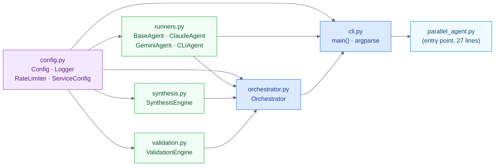

**Module responsibilities**:

| Module | Responsibility | Deps |
|--------|---------------|------|
| `config.py` | Config, Logger, RateLimiter, ServiceConfig, optional SDK guards | stdlib, yaml |
| `runners.py` | All four agent classes + BaseAgent | config |
| `synthesis.py` | SynthesisEngine — disagreement resolution | config |
| `validation.py` | ValidationEngine — Tier 1/2 criteria | config |
| `orchestrator.py` | Parallel execution, consensus scoring, Rich streaming | config, runners, synthesis, validation |
| `cli.py` | Argparse, `main()`, agent wiring | config, runners, orchestrator |
| `parallel_agent.py` | `asyncio.run(main())` entry point | cli |

**Design principle**: Dependency arrows flow strictly bottom-up. No circular imports.
`config.py` is independently testable; `orchestrator.py` is testable without `cli.py`.

---

## Agent Backend Selection (SDK vs CLI Fallback)

How `select_backend()` in `agents/cli.py` picks an execution backend for the SDK-capable
providers (Claude, Gemini). The SDK is preferred only when both the package and its API key
are present; otherwise the OAuth-authenticated provider CLI (`claude` / `gemini`) is used via
the generic CLIAgent — the common subscription-login setup needs no API key. An installed SDK
may carry its own auth (ADC/OAuth), so it is tried before the provider is skipped.

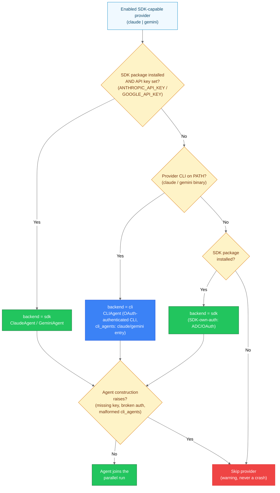

**Key points**:

- **Cursor / Codex / Antigravity** have no SDK path — they always run via CLIAgent and bypass
  `select_backend()` entirely
- **All five providers** can therefore execute through CLIAgent paths; the `cli_agents:` block
  in `parallel_agent.yml` carries the per-provider argv shape (`base_args`, `model_args`,
  `prompt_args`, output strategy)
- **Degradation is per-provider**: a failed backend (exception at construction) skips just that
  provider with a warning; orchestration continues with the remaining agents subject to the
  minimum-agent check

---

## Git Platform Detection & Operations

Platform-agnostic Git operations flow with automatic platform detection and routing to appropriate CLI tools.

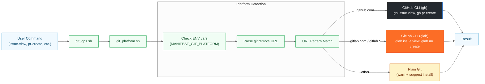

**Detection Logic**:

1. **Environment Override**: `MANIFEST_GIT_PLATFORM` forces specific platform
2. **Remote URL Parsing**: Reads `git remote get-url origin` (or `$MANIFEST_GIT_REMOTE`)
3. **Pattern Matching**:
   - `*github.com*` → GitHub (gh)
   - `*gitlab.com*` or `*gitlab.*` → GitLab (glab)
   - Other → Plain git (warn)

**Subcommand Mapping**:

| Generic | GitHub (gh) | GitLab (glab) |
|---------|-------------|---------------|
| issue-comment | gh issue comment | glab issue note |
| issue-edit | gh issue edit | glab issue update |
| pr-create | gh pr create | glab mr create |
| pr-view | gh pr view | glab mr view |

---

## Bootstrap Installation Flow

Complete installation and configuration deployment process. Mirrors `main()` in
`bootstrap.sh` plus the routines in `bootstrap/lib/`: the services banner is printed
**after** the existing config is loaded (so displayed toggles match what deploys), and
soft-failure guards keep `set -e` from aborting the pipeline mid-flight — the full
deploy → skillclaw state → python deps → auth → verify → summary sequence always runs.

```mermaid
%%{init: {'theme':'neutral'}}%%
flowchart TD
    classDef input fill:#f0f9ff,stroke:#0284c7,color:#0c4a6e
    classDef process fill:#f0fdf4,stroke:#16a34a,color:#14532d
    classDef decision fill:#fef3c7,stroke:#d97706,color:#78350f
    classDef success fill:#22c55e,stroke:#166534,color:#fff
    classDef skip fill:#e5e7eb,stroke:#6b7280,color:#374151
    classDef warning fill:#eab308,stroke:#a16207,color:#fff

    START["./bootstrap.sh"]:::input
    LOAD_LIBS["Load bootstrap/lib/*.sh<br/>+ parse CLI arguments"]:::process

    RECONFIG{"--reconfigure?"}:::decision
    RECONFIG_PATH["Reconfigure path:<br/>services.yml → skillclaw state<br/>→ python deps + browser-use"]:::process

    LOAD_CONFIG["Load existing services.yml<br/>(merge with CLI flags;<br/>explicit flags win)"]:::process
    BANNER["Show services banner<br/>(printed AFTER config load —<br/>reflects merged toggles)"]:::process
    CONFIRM{"Continue<br/>with setup?"}:::decision
    CANCELLED["Setup cancelled"]:::skip

    PLATFORM["Check platform +<br/>create ~/.manifest state dirs"]:::process

    SKIP_INSTALL{"--skip-install?"}:::decision
    INSTALLS["Install CLIs (soft-fail, counted):<br/>package manager · node · claude<br/>gemini · codex · gh · glab · jq · cursor"]:::process

    DEPLOY["deploy_configs<br/>(~/.claude primary; chmod +x<br/>scripts/*.sh AND *.py;<br/>write services.yml)"]:::process
    SKILLCLAW["skillclaw_apply_state<br/>(launchd cleanup guarded —<br/>no set -e abort)"]:::process
    PYDEPS["Install python deps<br/>+ browser-use (if enabled)"]:::process

    MCP{"--install-mcp?"}:::decision
    INSTALL_MCP["Configure MCP servers<br/>(interactive per-server)"]:::process

    SKIP_AUTH{"--skip-auth?"}:::decision
    AUTH["Auth checks (soft-fail, counted):<br/>claude · gemini · codex<br/>gh · glab · cursor info"]:::process

    VERIFY["verify_installation<br/>(errors counted, never aborts)"]:::process
    SUMMARY["print_summary<br/>(quick-start + auth guidance)"]:::process
    DONE["Installation complete"]:::success
    EXIT_WARN["Exit 1 if verification<br/>reported errors"]:::warning

    START --> LOAD_LIBS
    LOAD_LIBS --> RECONFIG
    RECONFIG -->|Yes| RECONFIG_PATH
    RECONFIG_PATH --> DONE
    RECONFIG -->|No| LOAD_CONFIG
    LOAD_CONFIG --> BANNER
    BANNER --> CONFIRM
    CONFIRM -->|No| CANCELLED
    CONFIRM -->|Yes| PLATFORM
    PLATFORM --> SKIP_INSTALL
    SKIP_INSTALL -->|No| INSTALLS
    SKIP_INSTALL -->|Yes| DEPLOY
    INSTALLS --> DEPLOY
    DEPLOY --> SKILLCLAW
    SKILLCLAW --> PYDEPS
    PYDEPS --> MCP
    MCP -->|Yes| INSTALL_MCP
    MCP -->|No| SKIP_AUTH
    INSTALL_MCP --> SKIP_AUTH
    SKIP_AUTH -->|No| AUTH
    SKIP_AUTH -->|Yes| VERIFY
    AUTH --> VERIFY
    VERIFY --> SUMMARY
    SUMMARY --> DONE
    SUMMARY -.-> EXIT_WARN
```

**Key Features**:

- **Banner after config load**: the services banner is printed only after
  `load_existing_config` merges `services.yml` with CLI flags, so the displayed toggles
  always match what will actually be deployed
- **Soft-fail install/auth/verify**: per-tool installs, auth checks, and
  `verify_installation` return error counts instead of aborting under `set -e`; the
  pipeline always reaches the summary (verification errors still exit 1 at the end)
- **Deploy chmod covers Python**: `deploy_configs` marks both `scripts/*.sh` and
  `scripts/*.py` executable
- **skillclaw_apply_state runs unconditionally after deploy**: applies enable/disable state
  and removes any legacy launchd capture daemon; the launchd cleanup is guarded so a missing
  service can no longer abort the rest of the bootstrap (python deps, auth, verify, summary)
- **Auto-Detection**: gh/glab default to `auto` mode (enable if already installed)
- **Platform-Specific Install**: Uses appropriate package manager (brew/apt/dnf/pacman)
- **Dependency Checking**: Verifies jq is installed (required for git_ops.sh JSON normalization)
- **SkillClaw (disabled by default)**: When `--enable-skillclaw` is passed, sets `chmod 700`
  on `~/.skillclaw/` and enables the passive transcript-ingestion pipeline; no proxy, no daemon,
  no supervisor required

---

## Parallel Agent Execution Flow

How multiple LLM agents are orchestrated for cross-verification with consensus scoring,
including sandbox detection and output verification.

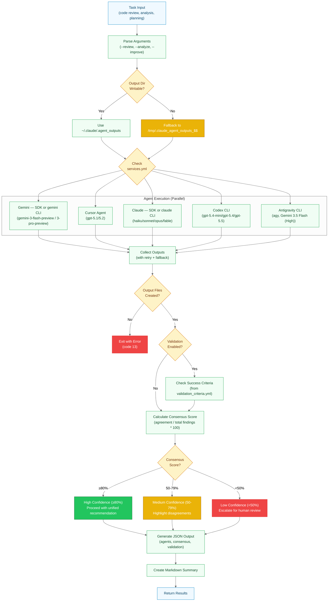

**Execution Model**:

- **Sandbox Detection**: Auto-detects write restrictions and falls back to `/tmp` if needed
- **Parallel Execution**: All enabled agents run simultaneously via background processes
- **Backend Selection**: Claude/Gemini run via SDK when package + API key are present,
  otherwise via their OAuth-authenticated CLI through CLIAgent (see
  [Agent Backend Selection](#agent-backend-selection-sdk-vs-cli-fallback))
- **Output Verification**: Explicit check that files were created before proceeding
- **Retry Logic**: Failed agents retry once after 5s delay
- **Credit Fallback**: Automatically retries with cheaper models on quota errors
- **Partial Results**: Continues with available agents if some fail

**Sandbox Handling** (New in 2026-02-06):

When running in sandboxed environments (e.g., Task subagents):

1. Script tests if `~/.claude/.agent_outputs` is writable
2. Falls back to `/tmp/.claude_agent_outputs_$$` if restricted
3. Verifies output files exist after agents complete
4. Exit code 13 if no files created (with helpful error message)

**Consensus Calculation**:

```text
Consensus Score = (Agreements / Total_Findings) * 100

≥80%: High confidence (auto-proceed)
50-79%: Medium confidence (show disagreements)
<50%: Low confidence (user decision required)
```

---

## Skill Processing Architecture

How slash commands (skills) are processed from user input to execution with parallel agent integration.

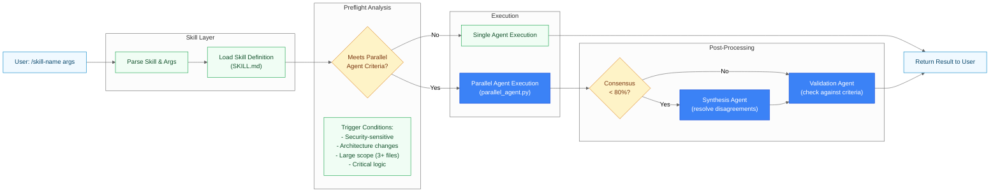

**Command Types**:

- **ALWAYS Parallel**: `/refactor-python`, `/refactor-shell` (security-sensitive)
- **CONDITIONAL**: `/docs-diagrams` (5+ modules), `/plan-manage` (complex planning),
  `/browser-test` (critical flows, 3+ tests)
- **NEVER Parallel**: `/docs-readme` (straightforward documentation)

---

## Validation Pipeline

How code changes and agent outputs are validated against Tier 1 (critical) and Tier 2 (quality) criteria.

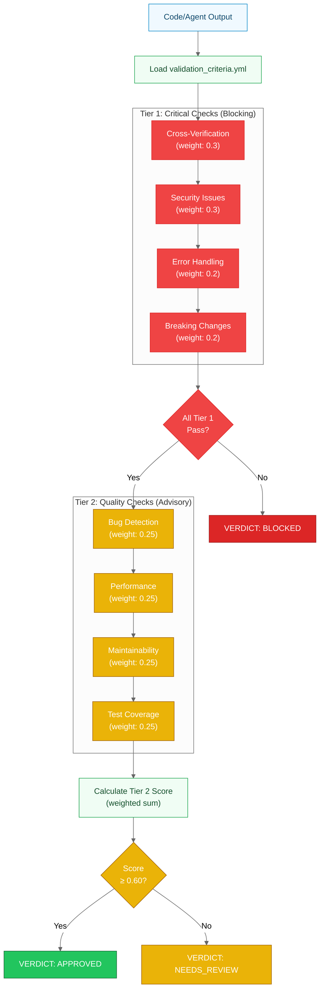

**Validation Verdicts**:

- **APPROVED**: All Tier 1 pass, Tier 2 ≥ 0.60 → Safe to proceed
- **NEEDS_REVIEW**: All Tier 1 pass, Tier 2 < 0.60 → Manual review recommended
- **BLOCKED**: Any Tier 1 fails → Changes rejected

**Command-Specific Overrides**:
Commands can override default thresholds in `validation_criteria.yml`:

```yaml
command_overrides:
  refactor-python:
    tier1:
      security_issues: 0.5  # Higher weight for Python security
  project-commit:
    tier2:
      test_coverage: 0.0    # Don't require tests for commits
```

---

## Model Selection & Credit Fallback

Automatic model tier selection and graceful fallback when quota/credits are exhausted.

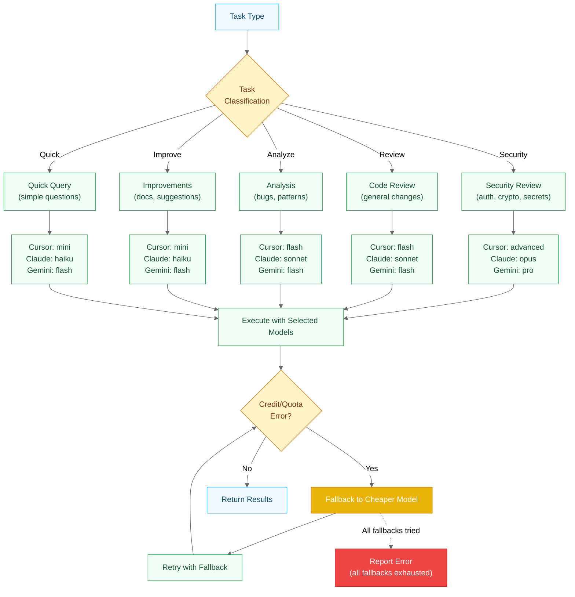

**Cursor Fallback Chain**:

```text
gpt-5.2 (advanced) → gpt-5.1-codex (flash) → gpt-5.1-codex-mini (mini)
```

**Claude Fallback Chain**:

```text
fable → opus → sonnet → haiku
```

**Gemini Fallback Chain**:

```text
gemini-3-pro-preview (pro) → gemini-3-flash-preview (flash)
```

**Codex Fallback Chain**:

```text
gpt-5.5 (advanced) → gpt-5.4 (flash) → gpt-5.4-mini (mini)
```

**Error Detection**:
The script parses stderr for patterns:

- "credit", "quota", "rate limit", "insufficient"
- Automatically retries with next cheaper model
- Continues with available agents if one exhausts credits

---

## Model Pin Staleness Check

How `model_check.sh` verifies the `model_tiers` pins in `parallel_agent.yml` against live
provider listings, including the opt-in live-probe mode (`MODEL_CHECK_PROBE=1`) for
OAuth-only machines, and how `check_status.sh` reports the result honestly
(stale / unverified / verified). Warn-only: every failure degrades to SKIPPED and the
exit code is always 0.

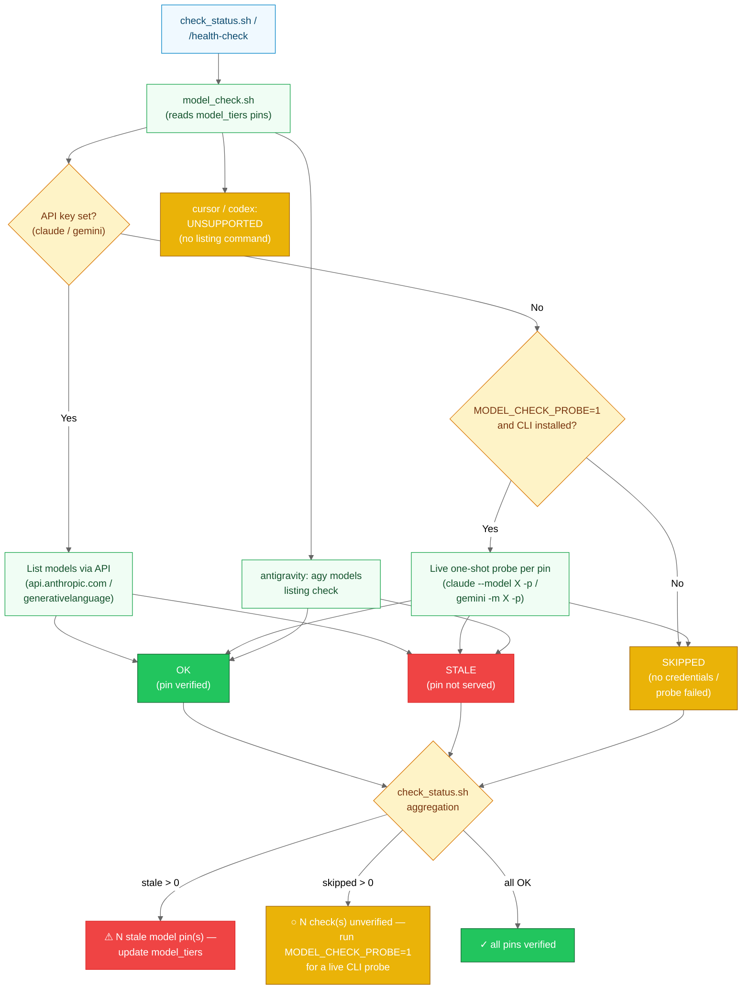

**Check modes per provider**:

| Provider | With API key | Without API key | Notes |
|----------|--------------|-----------------|-------|
| claude | `GET /v1/models` listing | `MODEL_CHECK_PROBE=1`: one tiny `claude --model <pin> -p` call per pin; else SKIPPED | Probe needed because OAuth-only machines have no key — broken pins would otherwise read as green |
| gemini | `GET /v1beta/models` listing | `MODEL_CHECK_PROBE=1`: one tiny `gemini -m <pin> -p` call per pin; else SKIPPED | Current pins: `gemini-3-flash-preview` / `gemini-3-pro-preview` |
| antigravity | n/a | `agy models` listing (no key needed) | CLI listing only |
| cursor / codex | n/a | n/a | UNSUPPORTED — no model-listing command |

**Honest reporting** (`check_status.sh`):

- Any STALE pins → yellow warning with count (update `model_tiers`)
- Any SKIPPED checks → "unverified" line suggesting `MODEL_CHECK_PROBE=1 model_check.sh`;
  the green "all pins verified" line never overclaims what was actually checked
- All OK → green "Model pin check complete — all pins verified"

---

## Configuration Layer

How YAML configuration files control behavior, thresholds, and service toggles.

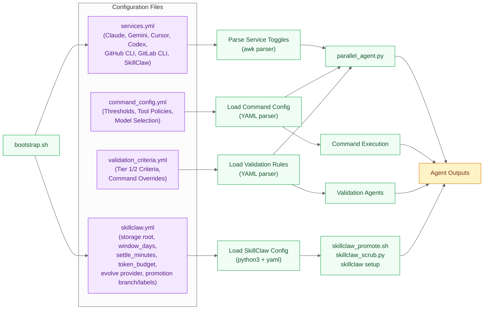

**services.yml Structure** (SkillClaw entry):

```yaml
services:
  claude:
    enabled: true
    command: claude
  gemini:
    enabled: true
    command: gemini
  cursor:
    enabled: true
    command: cursor
  skillclaw:
    enabled: false       # opt-in; enable with --enable-skillclaw
    command: skillclaw
    storage: ~/.skillclaw
  git_cli:
    github:
      enabled: auto  # auto-detect
      command: gh
    gitlab:
      enabled: auto
      command: glab
    detection:
      platform: auto
      remote: origin
```

**Key Features**:

- **Service Toggles**: Enable/disable agents and Git CLIs (including SkillClaw)
- **Auto-Detection**: gh/glab default to `auto` (enable if installed)
- **Nested Configuration**: git_cli section contains github/gitlab subsections
- **Reconfigurable**: `bootstrap.sh --reconfigure` updates toggles without reinstall
- **skillclaw.yml**: Controls `~/.skillclaw` storage layout, ingest knobs (`window_days`,
  `settle_minutes`, `max_tool_output_chars`), evolve knobs (`token_budget`, `claude -p`
  Max-backed runner), and PR promotion settings (branch prefix, base branch, labels)

---

## Cross-Verification Consensus

How agent outputs are compared and consensus scores are calculated for decision-making.

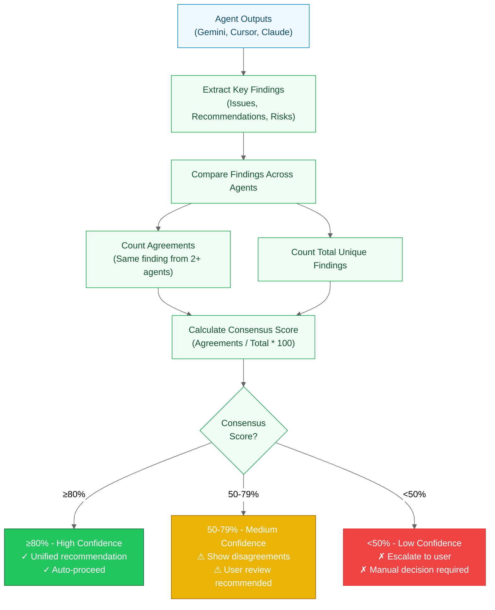

**Example Consensus Calculation**:

Given 3 of 5 agents with these findings (Gemini, Cursor, Claude shown for brevity):

- **Gemini**: [A, B, C, D]
- **Cursor**: [A, B, E]
- **Claude**: [A, C, F]

**Analysis**:

- Total unique findings: A, B, C, D, E, F = **6**
- Agreements (2+ agents):
  - A: all 3 agents shown ✓
  - B: Gemini + Cursor ✓
  - C: Gemini + Claude ✓
- Agreement count: **3**
- **Consensus Score**: 3/6 * 100 = **50%** (MEDIUM)

**Action**: Show disagreements (D, E, F are unique to single agents), recommend user review.

---

## Service State Management

Lifecycle and state transitions of enabled services throughout the framework.

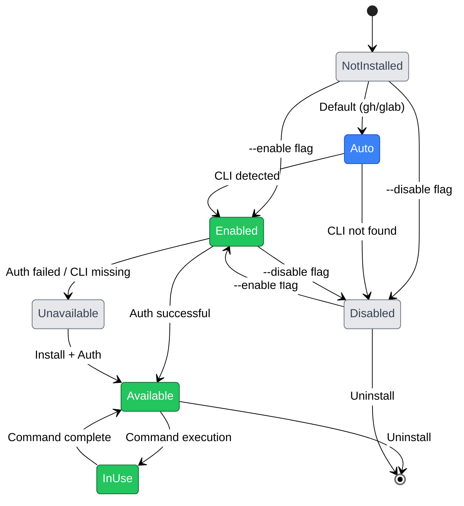

**State Descriptions**:

- **NotInstalled**: Service not yet configured (initial state)
- **Auto**: Auto-detect mode (default for gh/glab)
- **Enabled**: Explicitly enabled by user
- **Disabled**: Explicitly disabled by user
- **Available**: CLI installed and authenticated (ready for use)
- **Unavailable**: Enabled but CLI missing or auth failed
- **InUse**: Currently executing a command

**Transitions**:

- `bootstrap.sh` initializes state based on flags and detection
- `services.yml` persists state across sessions
- `bootstrap.sh --reconfigure` allows state changes without reinstall

---

## Issue Management Architecture

Shows the two issue management commands and how they interact with different platforms.

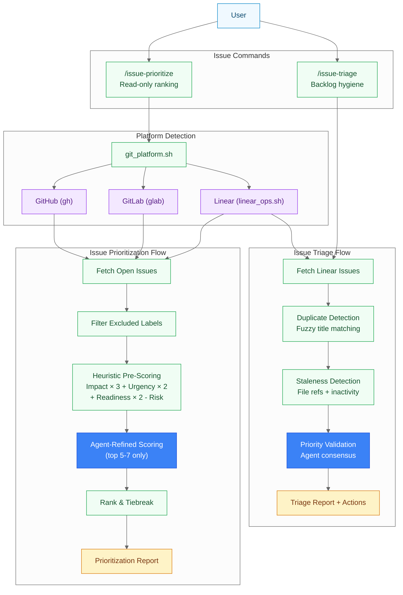

**Key differences**:

- **issue-prioritize**: Multi-platform (GitHub, GitLab, Linear), read-only, scoring-focused
- **issue-triage**: Linear-only, performs mutations (mark duplicates, close stale), hygiene-focused

**Scoring formula**: `Priority Score = (Impact × 3) + (Urgency × 2) + (Readiness × 2) - Risk`

**Tiebreakers**: bugs > features, unblockers > isolated, planned > unplanned, older > newer

---

## Issue-Linking Hooks (commit-issue-sync / pr-issue-sync)

How the issue-linking hooks keep the GitHub/GitLab issue tracker in sync as commits
land and PRs/MRs open. A single PostToolUse dispatcher (`issue_support_hook.sh`)
classifies the Bash command that just ran and, only on success, routes to the shared
engine (`issue_support.sh`). The engine is **fail-open**: `sync-pr`/`sync-commit`
always exit 0 (bounded by a per-hook `run_with_timeout`), so a git action is never
blocked. An optional native `git post-commit` hook covers commits made outside an
AI tool.

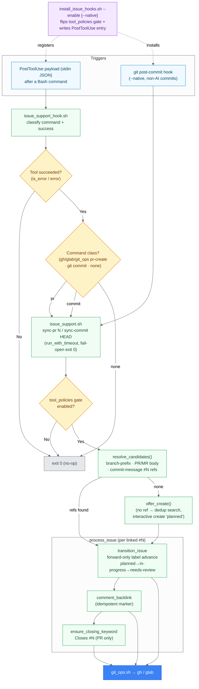

**Trigger → target mapping**:

| Trigger | Hook class | Engine call | Status target | Extra action |
|---------|-----------|-------------|---------------|--------------|
| PR/MR created (`gh`/`glab`/`git_ops.sh pr-create`) | `pr` | `sync-pr N` | `needs-review` | back-link comment + ensure `Closes #N` |
| `git commit` / `git_ops.sh commit` | `commit` | `sync-commit HEAD` | `in-progress` | back-link comment (only advances issues already `planned`) |
| any other Bash command | `none` | — | — | no-op (exit 0) |

**Key properties**:

- **Opt-in & reversible**: `install_issue_hooks.sh --enable/--remove` flips the
  `tool_policies.{pr-issue-sync,commit-issue-sync}.enabled` gate and idempotently
  adds/removes the PostToolUse entry in `~/.claude/settings.json`. `--native` adds a
  guarded `git post-commit` hook (refuses to clobber a pre-existing one).
- **Fail-open**: `sync-pr`/`sync-commit` always exit 0; an internal `__inner`
  re-exec is bounded by `hook_timeout_seconds` (default 5s) so a slow tracker
  degrades to a warning — a re-run heals it (FR-017).
- **Idempotent**: comment back-links carry a `<!-- issue-support:sync v1 ... -->`
  marker; `Closes #N` and label transitions are skipped when already satisfied.
- **Forward-only lifecycle**: `planned → in-progress → needs-review → done` — a
  transition never moves an issue backward (rank check in `transition_issue`).
- **Issue resolution**: a linked issue is found from the branch numeric prefix
  (`017-foo` → `#17`), `#N` refs in the PR/MR body, and commit-message references.

---

## Autonomous Issue Developer (/auto-issue-dev)

How `/auto-issue-dev` (engine: `auto_issue_dev.sh`) develops **exactly one** opted-in
issue per invocation and opens a PR for review — never merging. `/loop` re-runs the
skill with fresh context for the next issue. Selection is opt-in (the `auto-dev`
label) and dependency-aware: issues with unmet `depends on #N` / `blocked by #N`
references are tagged `blocked-dependency` and skipped. Status sync and `Closes #N`
are delegated to the issue-linking hooks (above).

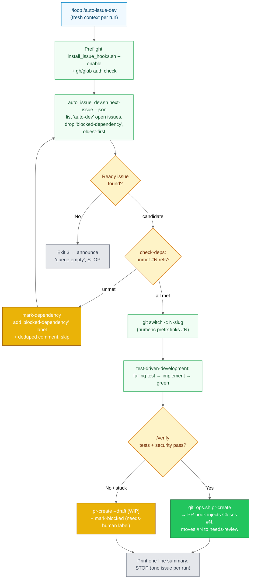

**Engine subcommands** (`auto_issue_dev.sh`, wraps `git_ops.sh`):

| Subcommand | Behavior | Exit |
|------------|----------|------|
| `next-issue [--json]` | First READY `auto-dev` issue (oldest-first, deps met) | `0` ready / `3` none |
| `check-deps <N> [--json]` | Parse `depends on / blocked by / requires / needs #N`; verify each ref is closed/merged | `0` ready / `2` unmet / `1` missing |
| `mark-blocked <N> <reason>` | Add `needs-human` label + deduped comment (fail-open) | `0` |
| `mark-dependency <N> <refs>` | Add `blocked-dependency` label + deduped comment (fail-open) | `0` |

**Invariants**:

- **Never merges** — stops at PR-open; a human reviews and merges.
- **One issue per invocation** — the loop lives in `/loop`, not inside the skill.
- **Opt-in only** — issues without the `auto-dev` label are never touched.
- **On failure** — push WIP, open a **draft** PR (no `Closes`), and `mark-blocked`
  so a human inspects partial work; if there are no commits, skip the draft.
- **Status hand-off** — `planned → in-progress → needs-review` and `Closes #N` are
  applied by the issue-linking hooks, not by this engine (see previous section).

**Labels** (`labels.yml`): `auto-dev` (opt-in selection), `blocked-dependency`
(unmet dependency, excluded until the blocker merges), `needs-human` (auto-dev
could not complete; needs a human).

---

## Label Management Architecture

How the canonical label registry drives consistent label provisioning across GitHub, GitLab, and Linear.

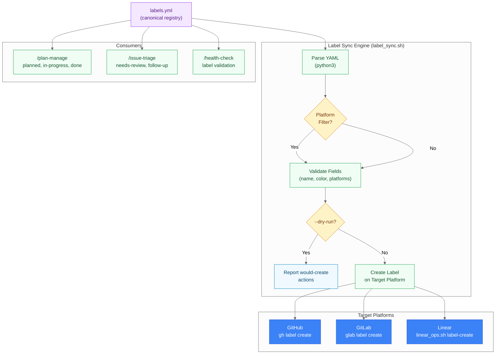

**Canonical Labels** (3 platforms):

| Label | Color | Platforms | Used By |
|-------|-------|-----------|---------|
| `planned` | `#1D76DB` (Blue) | GitHub, GitLab, Linear | /plan-manage create |
| `in-progress` | `#FBCA04` (Yellow) | GitHub, GitLab, Linear | /plan-manage execute, commit-issue-sync |
| `needs-review` | `#E3A21A` (Orange) | GitHub, GitLab, Linear | /issue-triage, pr-issue-sync |
| `done` | `#0E8A16` (Green) | GitHub, GitLab, Linear | /plan-manage execute |
| `follow-up` | `#D4C5F9` (Lavender) | GitHub, GitLab, Linear | /issue-triage |
| `future` | `#C2E0C6` (Green) | GitHub, GitLab, Linear | /issue-prioritize |
| `auto-dev` | (opt-in) | GitHub, GitLab, Linear | /auto-issue-dev (selection) |
| `needs-human` | (flag) | GitHub, GitLab, Linear | /auto-issue-dev (mark-blocked) |
| `blocked-dependency` | (flag) | GitHub, GitLab, Linear | /auto-issue-dev (mark-dependency) |

**Deprecated**: `processed` (replaced by `done`)

**Sync Modes**:

- `--dry-run`: Report what would be created without making changes
- `--validate`: Alias for `--dry-run` (validation only)
- `--platform <name>`: Restrict sync to a single platform (github, gitlab, linear)

---

## SkillClaw Passive Ingest & Evolve Pipeline

How existing Claude Code session transcripts are passively read, scrubbed for secrets,
distilled into candidate skills, and promoted to the committed library via a PR-gated review.
No proxy, no socket, no daemon — works with Claude Max out of the box.

```mermaid
%%{init: {'theme':'neutral'}}%%
flowchart LR
    classDef input fill:#f0f9ff,stroke:#0284c7,color:#0c4a6e
    classDef process fill:#f0fdf4,stroke:#16a34a,color:#14532d
    classDef decision fill:#fef3c7,stroke:#d97706,color:#78350f
    classDef secure fill:#fee2e2,stroke:#dc2626,color:#7f1d1d
    classDef config fill:#f3e8ff,stroke:#9333ea,color:#581c87
    classDef output fill:#22c55e,stroke:#166534,color:#fff

    TRANSCRIPTS["~/.claude/projects/**/*.jsonl\n(Claude Code session transcripts\nalready on disk)"]:::input

    INGEST["skillclaw_ingest.py\nnormalize turns\nstrip tool-output noise\nwindow=30d / settle=5m\nincremental state file"]:::process

    SCRUB["skillclaw_scrub.py\nRedact API keys,\nauth headers, tokens"]:::secure

    EVOLVE["skillclaw_evolve.py\nmap-reduce via claude -p\n(Max-backed)\nchunks ≤ 100 000 tokens"]:::process

    EVOLVED_LIB["~/.skillclaw/skills/\n(evolved candidates)"]:::process

    CLASSIFY["skillclaw_promote.py\nClassify NEW / CHANGED\nDrop invalid frontmatter\nCopy rejected → rejected/"]:::decision

    PROMOTE["skillclaw_promote.sh\nPR-gate: one open\nskillclaw/evolve-* PR\nat a time"]:::process

    GIT_BRANCH["git switch -c\nskillclaw/evolve-N-SHA"]:::process
    PR["git_ops.sh pr-create\n(needs-review + follow-up labels)"]:::process

    SKILLSHARE[".skillshare/skills/\n(committed library)"]:::output

    TRANSCRIPTS --> INGEST
    INGEST --> SCRUB
    SCRUB --> EVOLVE
    EVOLVE --> EVOLVED_LIB
    EVOLVED_LIB --> CLASSIFY
    CLASSIFY -->|accepted| PROMOTE
    CLASSIFY -->|rejected| EVOLVED_LIB
    PROMOTE --> GIT_BRANCH
    GIT_BRANCH --> PR
    PR --> SKILLSHARE
```

**Pipeline Stages**:

| Stage | Component | Description |
|-------|-----------|-------------|
| Source | `~/.claude/projects/**/*.jsonl` | Claude Code writes session transcripts to disk automatically; SkillClaw reads them passively |
| Ingest | `skillclaw_ingest.py` | Normalizes turns, strips tool-output noise (`max_tool_output_chars=500`), applies `window_days=30` + `settle_minutes=5` filters, tracks processed files via incremental state |
| Scrub | `skillclaw_scrub.py` | Redacts `sk-ant-*`, `sk-proj-*`, bearer tokens, `x-api-key` headers before evolve/promote |
| Evolve | `skillclaw_evolve.py` | Map-reduce via headless `claude -p` (Max-backed); greedily packs sessions into chunks under `token_budget=100 000`; reduce deduplicates by skill name |
| Classify | `skillclaw_promote.py` | Compares evolved `~/.skillclaw/skills/` against committed library; emits NEW / CHANGED / UNCHANGED; drops skills with missing or malformed frontmatter; copies rejected candidates to `~/.skillclaw/skills/rejected/` |
| Promote | `skillclaw_promote.sh` | Idempotency check (one open `skillclaw/evolve-*` PR at a time); one commit per skill; opens review PR via `git_ops.sh` |
| Review | GitHub/GitLab PR | Human review gate; each skill is an independent commit — revert to drop; merge deploys via `bootstrap.sh` skill sync |

**Key new skills**:

- `/skill-evolve` — Preview or open a review PR for SkillClaw-evolved skills
  (`skillclaw_promote.sh --apply`); dry-run by default
- `/pass-cli` — Retrieve secrets from Proton Pass via `pass-cli` agent CLI;
  handles session setup, vault/item discovery, and auto-recovery

---

## Related Documents

- [AGENTS.md](../AGENTS.md) - AI agent instructions for all platforms
- [CLAUDE.md](../CLAUDE.md) - Claude Code project instructions
- [README.md](../README.md) - Project overview and quick start
- [docs/GETTING_STARTED.md](GETTING_STARTED.md) - First-time setup walkthrough
- [docs/CONFIGURATION.md](CONFIGURATION.md) - Complete configuration reference
- [docs/TROUBLESHOOTING.md](TROUBLESHOOTING.md) - Common problems and solutions
- [configs/claude/.plans/README.md](../configs/claude/.plans/README.md) - Plan management quick reference
