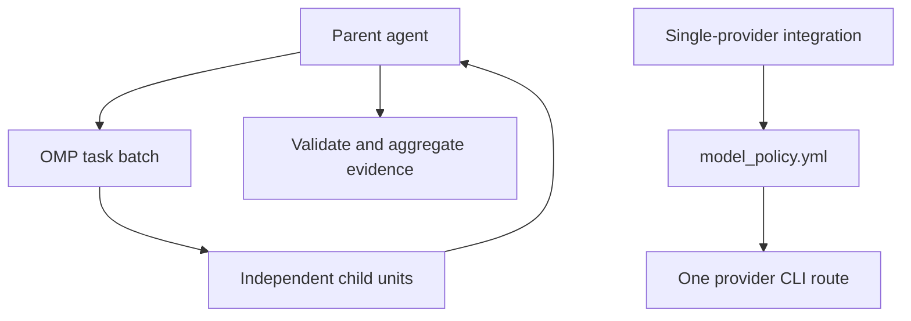

# Agent Workflow

> OMP-native interactive dispatch and retained single-provider integrations.

Interactive work uses OMP task batches and parent-side evidence validation.
Noninteractive integrations resolve one CLI route through `model_policy.yml`.
