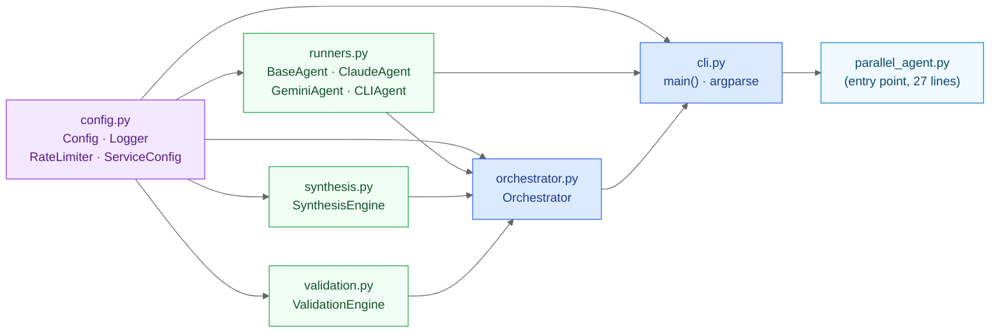
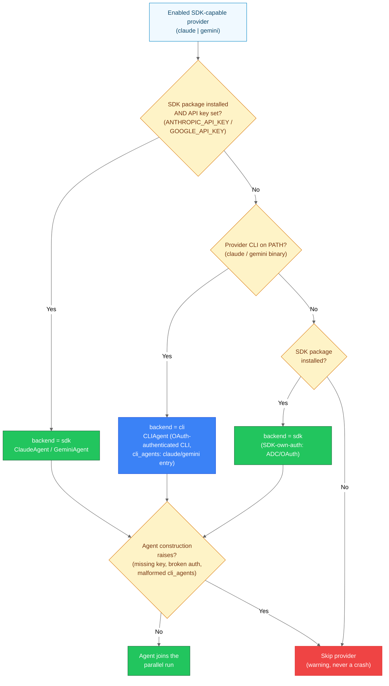
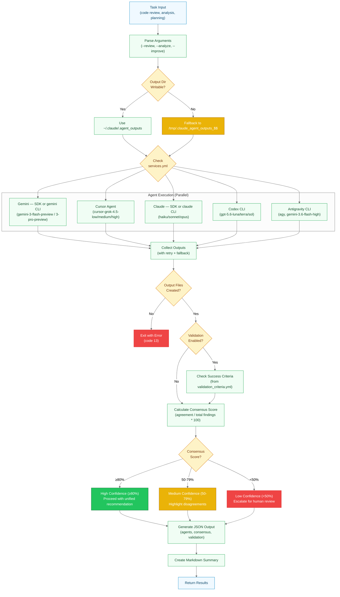

# Agent Dispatch

> Module graph, backend selection, and the execution flow of a parallel run.

## agents/ Package Module Dependency Graph

Import dependency graph of the `agents/` package (PR #260). Arrows point from depended-upon
module to dependant — `config.py` is the shared foundation with zero local deps; `cli.py` has
the highest fan-in and wires all modules together.



**Module responsibilities**:

| Module | Responsibility | Deps |
|--------|---------------|------|
| `config.py` | Config, Logger, RateLimiter, ServiceConfig, optional SDK guards | stdlib, yaml |
| `runners.py` | All four agent classes + BaseAgent | config |
| `synthesis.py` | SynthesisEngine — disagreement resolution | config |
| `validation.py` | ValidationEngine — Tier 1/2 criteria | config |
| `orchestrator.py` | Parallel execution, consensus scoring, Rich streaming | config, runners, synthesis, validation |
| `cli.py` | Argparse, `main()`, agent wiring | config, runners, orchestrator |
| `parallel_agent.py` | `asyncio.run(main())` entry point | cli |

**Design principle**: Dependency arrows flow strictly bottom-up. No circular imports.
`config.py` is independently testable; `orchestrator.py` is testable without `cli.py`.

---

## Agent Backend Selection (SDK vs CLI Fallback)

How `select_backend()` in `agents/cli.py` picks an execution backend for the SDK-capable
providers (Claude, Gemini). The SDK is preferred only when both the package and its API key
are present; otherwise the OAuth-authenticated provider CLI (`claude` / `gemini`) is used via
the generic CLIAgent — the common subscription-login setup needs no API key. An installed SDK
may carry its own auth (ADC/OAuth), so it is tried before the provider is skipped.



**Key points**:

- **Cursor / Codex / Antigravity / Devin** have no SDK path — they always run via CLIAgent and bypass
  `select_backend()` entirely
- **All five providers** can therefore execute through CLIAgent paths; the `cli_agents:` block
  in `parallel_agent.yml` carries the per-provider argv shape (`base_args`, `model_args`,
  `prompt_args`, output strategy)
- **Degradation is per-provider**: a failed backend (exception at construction) skips just that
  provider with a warning; orchestration continues with the remaining agents subject to the
  minimum-agent check

---

## Parallel Agent Execution Flow

How multiple LLM agents are orchestrated for cross-verification with consensus scoring,
including sandbox detection and output verification.



**Execution Model**:

- **Sandbox Detection**: Auto-detects write restrictions and falls back to `/tmp` if needed
- **Parallel Execution**: All enabled agents run simultaneously via background processes
- **Backend Selection**: Claude/Gemini run via SDK when package + API key are present,
  otherwise via their OAuth-authenticated CLI through CLIAgent (see
  [Agent Backend Selection](#agent-backend-selection-sdk-vs-cli-fallback))
- **Output Verification**: Explicit check that files were created before proceeding
- **Retry Logic**: Failed agents retry once after 5s delay
- **Credit Fallback**: Automatically retries with cheaper models on quota errors
- **Partial Results**: Continues with available agents if some fail

**Sandbox Handling** (New in 2026-02-06):

When running in sandboxed environments (e.g., Task subagents):

1. Script tests if `~/.claude/.agent_outputs` is writable
2. Falls back to `/tmp/.claude_agent_outputs_$$` if restricted
3. Verifies output files exist after agents complete
4. Exit code 13 if no files created (with helpful error message)

**Consensus Calculation**:

```text
Consensus Score = (Agreements / Total_Findings) * 100

≥80%: High confidence (auto-proceed)
50-79%: Medium confidence (show disagreements)
<50%: Low confidence (user decision required)
```

---

---

[← Architecture Diagrams](README.md)
