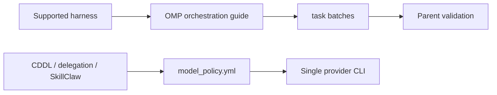

# Architecture

> Manifest deploys guides, skills, and retained runtime integrations.

Interactive and noninteractive paths have separate contracts: OMP manages
interactive workers; `model_policy.yml` serves retained single-provider tools.
