# Application & Orchestration Architecture

> How the deployed tree and the parallel-agent orchestrator are laid out.

## Application Architecture

High-level overview of the complete system showing major components and their relationships.

```mermaid
%%{init: {'theme':'neutral'}}%%
flowchart TB
    classDef input fill:#f0f9ff,stroke:#0284c7,color:#0c4a6e
    classDef process fill:#f0fdf4,stroke:#16a34a,color:#14532d
    classDef output fill:#fef3c7,stroke:#d97706,color:#78350f
    classDef config fill:#f3e8ff,stroke:#9333ea,color:#581c87
    classDef external fill:#3b82f6,stroke:#1d4ed8,color:#fff

    USER["User"]:::input
    BOOTSTRAP["bootstrap.sh"]:::process
    CLAUDE_CLI["Claude CLI"]:::process

    subgraph "Installation & Setup"
        BOOTSTRAP
        INSTALL["Dependency Installation"]:::process
        DEPLOY["Config Deployment"]:::process
        AUTH["Authentication Setup"]:::process
        BOOTSTRAP --> INSTALL --> DEPLOY --> AUTH
    end

    subgraph "Configuration Layer"
        SERVICES["services.yml"]:::config
        COMMAND_CFG["command_config.yml"]:::config
        VALIDATION_CFG["validation_criteria.yml"]:::config
    end

    subgraph "Orchestration Layer"
        CLAUDE_CLI
        PARALLEL_PY["parallel_agent.py"]:::process
        AGENTS_PKG["agents/ package\n(cli · orchestrator · runners\nconfig · synthesis · validation)"]:::process
        GIT_PLATFORM["git_platform.sh"]:::process
        GIT_OPS["git_ops.sh"]:::process
    end

    subgraph "Agent Services"
        GEMINI["Gemini<br/>(SDK or gemini CLI)"]:::external
        CURSOR["Cursor Agent"]:::external
        CLAUDE_API["Claude<br/>(SDK or claude CLI)"]:::external
        CODEX["Codex CLI"]:::external
        AGY["Antigravity CLI (agy)"]:::external
        DEVIN["Devin CLI (opt-in)"]:::external
        GH["GitHub CLI (gh)"]:::external
        GLAB["GitLab CLI (glab)"]:::external
    end

    subgraph "SkillClaw Subsystem"
        SKILLCLAW_INGEST["skillclaw_ingest.py\n(normalize + window/settle\n+ incremental state)"]:::process
        SKILLCLAW_SCRUB["skillclaw_scrub.py\n(secret redaction)"]:::process
        SKILLCLAW_EVOLVE["skillclaw_evolve.py\n(map-reduce via claude -p)"]:::process
        SKILLCLAW_PROMOTE["skillclaw_promote.sh\n(classify → reject-dir → PR)"]:::process
        retired skill supply[".apm/skills/\n(committed library)"]:::config
        SKILLCLAW_INGEST --> SKILLCLAW_SCRUB --> SKILLCLAW_EVOLVE --> SKILLCLAW_PROMOTE --> retired skill supply
    end

    USER --> BOOTSTRAP
    BOOTSTRAP --> SERVICES
    USER --> CLAUDE_CLI
    CLAUDE_CLI --> PARALLEL_PY
    PARALLEL_PY --> AGENTS_PKG
    CLAUDE_CLI --> GIT_OPS
    GIT_OPS --> GIT_PLATFORM
    GIT_PLATFORM -.->|github| GH
    GIT_PLATFORM -.->|gitlab| GLAB
    PARALLEL_PY --> GEMINI
    PARALLEL_PY --> CURSOR
    PARALLEL_PY --> CLAUDE_API
    PARALLEL_PY --> CODEX
    PARALLEL_PY --> AGY
    SERVICES -.->|config| PARALLEL_PY
    COMMAND_CFG -.->|thresholds| PARALLEL_PY
    VALIDATION_CFG -.->|criteria| PARALLEL_PY
    CLAUDE_CLI -.->|transcripts| SKILLCLAW_INGEST
```

**Key Components**:

- **bootstrap.sh**: Automated installation and configuration deployment with Python version detection
- **Git Platform Scripts**: Platform-agnostic Git operations (GitHub/GitLab/plain git)
- **parallel_agent.py**: Python orchestrator with full feature parity
  (logging, validation, synthesis, streaming, Codex agent, services.yml)
- **Configuration Layer**: YAML files controlling behavior, validation rules, and Phase 3 features
- **Agent Services**: External LLM and Git hosting CLIs. Claude and Gemini execute via their
  SDK when the package + API key are present, otherwise fall back to their OAuth-authenticated
  CLI binaries (`claude` / `gemini`) through the generic CLIAgent — all five providers can run
  through CLIAgent paths
- **SkillClaw Subsystem**: Passive transcript ingestion pipeline — reads existing Claude Code
  session `.jsonl` files, scrubs secrets, distills candidate skills via `claude -p` (Max-backed
  map-reduce), and opens a PR-gated review into `.apm/skills/`; no daemon, no proxy

---

## Python Parallel Agent Architecture

Architecture of the modular `agents/` package. `parallel_agent.py` is now a thin entry point;
all logic lives in six focused modules: `cli`, `orchestrator`, `runners`, `config`, `synthesis`, `validation`.

```mermaid
%%{init: {'theme':'neutral'}}%%
flowchart TB
    classDef active fill:#dcfce7,stroke:#16a34a,color:#14532d
    classDef pending fill:#fef3c7,stroke:#d97706,color:#78350f
    classDef error fill:#fee2e2,stroke:#dc2626,color:#7f1d1d
    classDef external fill:#dbeafe,stroke:#2563eb,color:#1e3a8a
    classDef config fill:#f3e8ff,stroke:#9333ea,color:#581c87

    USER["User/Claude CLI"]:::external

    subgraph "agents/cli.py"
        MAIN["main()"]:::active
        SELECT["select_backend()<br/>(sdk | cli | skip)"]:::active
    end

    subgraph "agents/config.py"
        LOGGER["Logger<br/>(correlation IDs, rotation)"]:::active
        CONFIG["Config<br/>(YAML loader)"]:::config
        SVC_CFG["ServiceConfig<br/>(services.yml)"]:::config
        LIMITER["RateLimiter<br/>(token bucket)"]:::active
    end

    subgraph "agents/orchestrator.py"
        ORCH["Orchestrator"]:::active
        STREAM["Streaming Display<br/>(Rich Live)"]:::active
    end

    subgraph "agents/runners.py"
        BASE["BaseAgent<br/>(rate limiting, timeout, fallback)"]:::active
        CLAUDE_AG["ClaudeAgent<br/>(SDK, streaming support)"]:::active
        GEMINI_AG["GeminiAgent<br/>(SDK, dual package support)"]:::active
        CLI_AG["CLIAgent<br/>(claude | gemini | cursor | codex | antigravity | devin,<br/>config-driven)"]:::active
    end

    subgraph "agents/validation.py + synthesis.py"
        VALIDATE["ValidationEngine<br/>(Tier 1 + Tier 2)"]:::active
        SYNTH["SynthesisEngine<br/>(disagreement resolution)"]:::active
    end

    subgraph "External APIs"
        ANTHROPIC["Anthropic API<br/>(Claude)"]:::external
        GOOGLE["Google Gemini API<br/>(OAuth/API key)"]:::external
        CLI_BINS["CLI binaries<br/>(claude | gemini | cursor | codex | agy)"]:::external
    end

    subgraph "Configuration Files"
        PA_YML["parallel_agent.yml<br/>(models, synthesis, streaming)"]:::config
        SVC_YML["services.yml<br/>(agent toggles)"]:::config
        VAL_YML["validation_criteria.yml<br/>(tier1/tier2 rules)"]:::config
        SYNTH_MD["synthesis.md<br/>(prompt template)"]:::config
    end

    subgraph "Outputs"
        LOGS["parallel_agent.log<br/>(JSON structured)"]:::pending
        RESULTS["results_*.json<br/>(agent outputs)"]:::pending
        SUMMARY["summary_*.md<br/>(markdown report)"]:::pending
    end

    USER --> MAIN
    MAIN --> CONFIG
    MAIN --> SVC_CFG
    MAIN --> LOGGER
    MAIN --> SELECT
    SELECT -.->|sdk| CLAUDE_AG
    SELECT -.->|sdk| GEMINI_AG
    SELECT -.->|cli fallback| CLI_AG
    MAIN --> ORCH
    CONFIG -.->|load| PA_YML
    SVC_CFG -.->|load| SVC_YML
    LOGGER -.->|write| LOGS

    ORCH --> VALIDATE
    ORCH --> SYNTH
    ORCH --> STREAM
    ORCH --> BASE

    BASE --> LIMITER
    BASE --> CLAUDE_AG
    BASE --> GEMINI_AG
    BASE --> CLI_AG

    CLAUDE_AG --> ANTHROPIC
    GEMINI_AG --> GOOGLE
    CLI_AG --> CLI_BINS

    VALIDATE -.->|load| VAL_YML
    SYNTH -.->|load| SYNTH_MD
    SYNTH --> ANTHROPIC

    ORCH -.->|write| RESULTS
    ORCH -.->|write| SUMMARY

    STREAM -.->|display| USER
```



**Components**:

- **ServiceConfig**: Reads `services.yml` for agent enable/disable state, minimum agent validation
- **Logger**: Structured JSON logging with correlation IDs (`YYYYMMDD_HHMMSS_PID`),
  rotating file handler (10MB, 5 backups), performance metrics
- **ValidationEngine**:
  - Tier 1 (critical): Security, error handling, breaking changes, cross-verification
  - Tier 2 (quality): Bug detection, performance, maintainability, test coverage
  - Verdicts: APPROVED, NEEDS_REVIEW, BLOCKED
- **SynthesisEngine**: Automatic disagreement resolution when consensus < 50%; invokes
  Claude via CLI (`claude -p`) or SDK depending on `synthesis.backend` (`auto` matches
  primary claude agent backend selection)
- **Streaming**: Real-time Rich Live display with progressive updates (4 updates/sec, 500 char truncation)
- **RateLimiter**: Token bucket algorithm with burst support and adaptive backoff
- **select_backend()**: Per-provider backend picker for SDK-capable providers (Claude, Gemini):
  SDK when package + API key are both present, else OAuth-authenticated CLI binary via CLIAgent,
  else SDK-own-auth (ADC/OAuth), else skip with a warning — never a crashed orchestration
- **CLIAgent**: Generic YAML-driven subprocess agent; provider variation (claude | gemini |
  cursor | codex | antigravity | devin) is config data in the `cli_agents:` block — no
  per-provider subclass needed. The claude/gemini entries back the OAuth CLI fallback
- **Dual Package Support**: google-genai (new) with fallback to google-generativeai (legacy), unified interface

**Execution Flow**:

1. **Initialization**: Load config + services.yml, create logger with correlation ID, set up rate limiters
2. **Agent Selection**: services.yml state -> `--*-only` exclusive flags -> `--no-*` overrides -> minimum agent check
3. **Backend Selection**: `select_backend()` picks SDK vs CLI fallback for Claude/Gemini;
   Cursor/Codex/Antigravity/Devin always run via CLIAgent
4. **Agent Execution**: Run every enabled agent (Claude/Gemini/Cursor/Codex/Antigravity, plus
   opt-in Devin) in parallel with streaming or progress display
5. **Consensus**: Calculate consensus score using keyword-based analysis
6. **Synthesis**: If consensus < 50%, trigger SynthesisEngine for unified recommendation
7. **Validation**: Run ValidationEngine if `--validate` flag set
8. **Output**: Write structured logs, JSON results (with duration), markdown summary (sandbox-aware fallback)

**Statistics**:

- Modules: 6 (`config`, `runners`, `synthesis`, `validation`, `orchestrator`, `cli`) + `__init__`
- Classes: 11 (Config, ServiceConfig, Logger, RateLimiter, ValidationEngine, SynthesisEngine,
  BaseAgent, ClaudeAgent, GeminiAgent, CLIAgent, Orchestrator)
- CLI Flags: 28 (argparse in `agents/cli.py`)
- Agents: 6 (Claude, Gemini, Cursor, Codex, Antigravity, Devin — Devin opt-in, default off)
- Total lines: ~2,540 across package (27-line entry point)

---

---

[← Architecture Diagrams](README.md)
