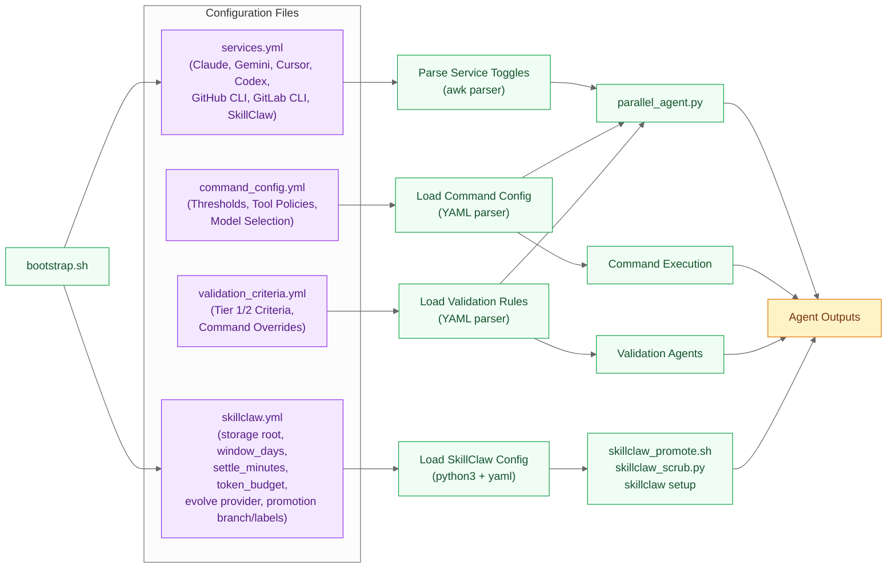
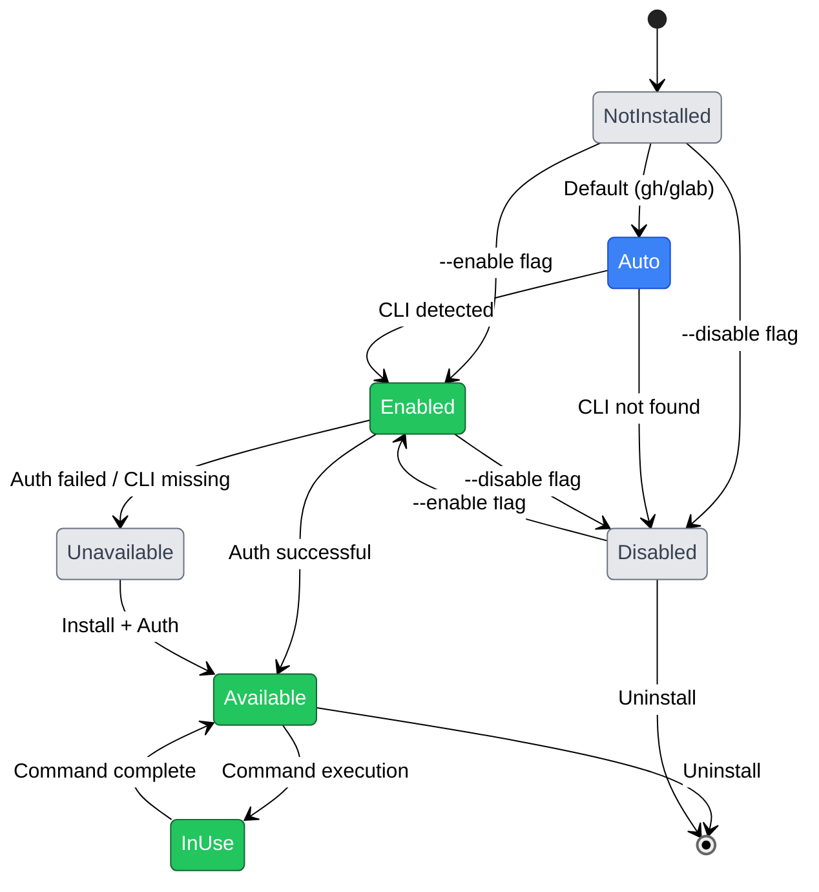
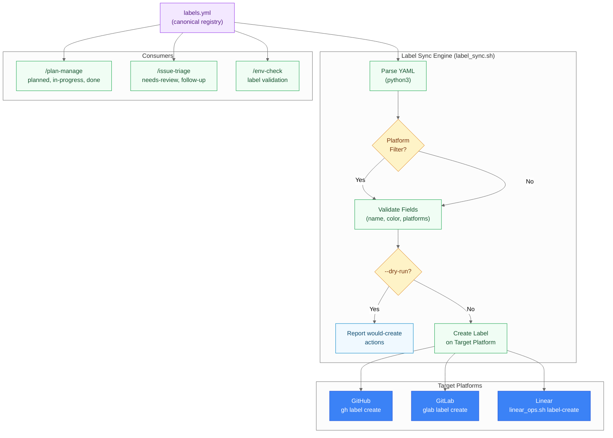

# Configuration & Labels

> Config layering, service state, and the label registry.

**Last Updated**: 2026-08-20

## Configuration Layer

How YAML configuration files control behavior, thresholds, and service toggles.



**services.yml Structure** (SkillClaw entry):

```yaml
services:
  claude:
    enabled: true
    command: claude
  gemini:
    enabled: true
    command: gemini
  cursor:
    enabled: true
    command: cursor-agent
  skillclaw:
    enabled: false       # opt-in; enable with --enable-skillclaw
    command: skillclaw
    storage: ~/.skillclaw
  git_cli:
    github:
      enabled: auto  # auto-detect
      command: gh
    gitlab:
      enabled: auto
      command: glab
    detection:
      platform: auto
      remote: origin
```

**Key Features**:

- **Service Toggles**: Enable/disable agents and Git CLIs (including SkillClaw)
- **Auto-Detection**: gh/glab default to `auto` (enable if installed)
- **Nested Configuration**: git_cli section contains github/gitlab subsections
- **Reconfigurable**: `bootstrap.sh --reconfigure` updates toggles without reinstall
- **skillclaw.yml**: Controls `~/.skillclaw` storage layout, ingest knobs (`window_days`,
  `settle_minutes`, `max_tool_output_chars`), evolve knobs (`token_budget`, `claude -p`
  Max-backed runner), and PR promotion settings (branch prefix, base branch, labels)

---

## Service State Management

Lifecycle and state transitions of enabled services throughout the framework.



**State Descriptions**:

- **NotInstalled**: Service not yet configured (initial state)
- **Auto**: Auto-detect mode (default for gh/glab)
- **Enabled**: Explicitly enabled by user
- **Disabled**: Explicitly disabled by user
- **Available**: CLI installed and authenticated (ready for use)
- **Unavailable**: Enabled but CLI missing or auth failed
- **InUse**: Currently executing a command

**Transitions**:

- `bootstrap.sh` initializes state based on flags and detection
- `services.yml` persists state across sessions
- `bootstrap.sh --reconfigure` allows state changes without reinstall

---

## Label Management Architecture

How the canonical label registry drives consistent label provisioning across GitHub, GitLab, and Linear.



**Canonical Labels** (3 platforms):

| Label | Color | Platforms | Used By |
|-------|-------|-----------|---------|
| `planned` | `#1D76DB` (Blue) | GitHub, GitLab, Linear | /plan-manage create |
| `in-progress` | `#FBCA04` (Yellow) | GitHub, GitLab, Linear | /plan-manage execute, issue-sync-commit |
| `needs-review` | `#E3A21A` (Orange) | GitHub, GitLab, Linear | /issue-triage, issue-sync-pr |
| `done` | `#0E8A16` (Green) | GitHub, GitLab, Linear | /plan-manage execute |
| `follow-up` | `#D4C5F9` (Lavender) | GitHub, GitLab, Linear | /issue-triage |
| `future` | `#C2E0C6` (Green) | GitHub, GitLab, Linear | /issue-prioritize |
| `auto-dev` | `#5319E7` (Purple) | GitHub, GitLab, Linear | /issue-dev-auto (selection) |
| `needs-human` | `#B60205` (Red) | GitHub, GitLab, Linear | /issue-dev-auto (mark-blocked) |
| `blocked-dependency` | `#6A737D` (Gray) | GitHub, GitLab, Linear | /issue-dev-auto (mark-dependency) |

**Deprecated**: `processed` (replaced by `done`)

**Sync Modes**:

- `--dry-run`: Report what would be created without making changes
- `--validate`: Alias for `--dry-run` (validation only)
- `--platform <name>`: Restrict sync to a single platform (github, gitlab, linear)

---

---

[← Architecture Diagrams](README.md)
