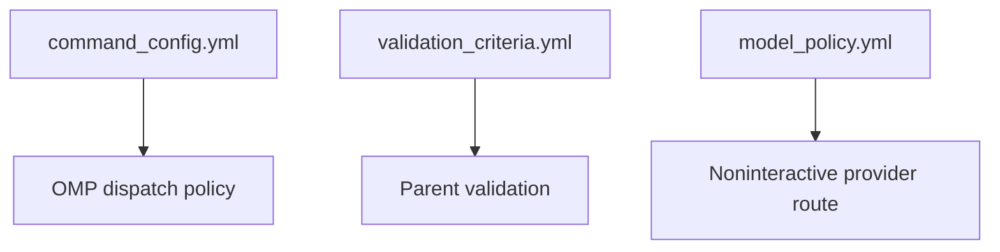

# Configuration Architecture

```mermaid
flowchart TD
  C[command_config.yml] --> D[OMP dispatch policy]
  V[validation_criteria.yml] --> P[Parent validation]
  M[model_policy.yml] --> I[Noninteractive provider route]
```

`command_config.yml` governs skills and OMP dispatch. `model_policy.yml` governs
only retained single-provider integrations.
