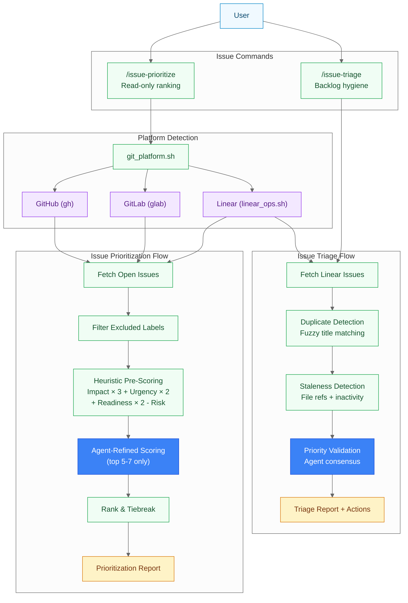
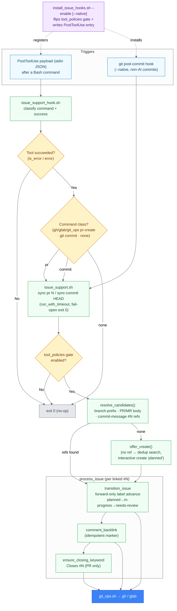
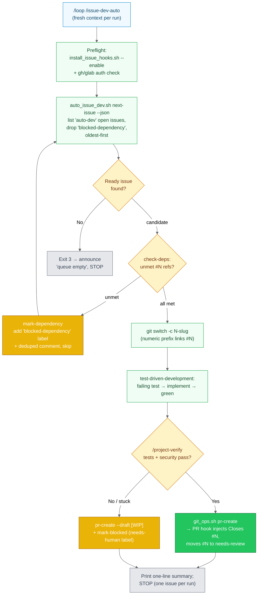

# Issue Management

> Tracker architecture, the sync hooks, and the autonomous developer loop.

**Last Updated**: 2026-08-20

## Issue Management Architecture

Shows the two issue management commands and how they interact with different platforms.

**Key differences**:

- **issue-prioritize**: Multi-platform (GitHub, GitLab, Linear), read-only, scoring-focused
- **issue-triage**: Linear-only, performs mutations (mark duplicates, close stale), hygiene-focused

**Scoring formula**: `Priority Score = (Impact × 3) + (Urgency × 2) + (Readiness × 2) - Risk`

**Tiebreakers**: bugs > features, unblockers > isolated, planned > unplanned, older > newer

---

## Issue-Linking Hooks (issue-sync-commit / issue-sync-pr)

How the issue-linking hooks keep the GitHub/GitLab issue tracker in sync as commits
land and PRs/MRs open. A single PostToolUse dispatcher (`issue_support_hook.sh`)
classifies the Bash command that just ran and, only on success, routes to the shared
engine (`issue_support.sh`). The engine is **fail-open**: `sync-pr`/`sync-commit`
always exit 0 (bounded by a per-hook `run_with_timeout`), so a git action is never
blocked. An optional native `git post-commit` hook covers commits made outside an
AI tool.

**Trigger → target mapping**:

| Trigger | Hook class | Engine call | Status target | Extra action |
|---------|-----------|-------------|---------------|--------------|
| PR/MR created (`gh`/`glab`/`git_ops.sh pr-create`) | `pr` | `sync-pr N` | `needs-review` | back-link comment + ensure `Closes #N` |
| `git commit` / `git_ops.sh commit` | `commit` | `sync-commit HEAD` | `in-progress` | back-link comment (only advances issues already `planned`) |
| any other Bash command | `none` | — | — | no-op (exit 0) |

**Key properties**:

- **Opt-in & reversible**: `install_issue_hooks.sh --enable/--remove` flips the
  `tool_policies.{issue-sync-pr,issue-sync-commit}.enabled` gate and idempotently
  adds/removes the PostToolUse entry in `~/.claude/settings.json`. `--native` adds a
  guarded `git post-commit` hook (refuses to clobber a pre-existing one).
- **Fail-open**: `sync-pr`/`sync-commit` always exit 0; an internal `__inner`
  re-exec is bounded by `hook_timeout_seconds` (default 5s) so a slow tracker
  degrades to a warning — a re-run heals it (FR-017).
- **Idempotent**: comment back-links carry a `<!-- issue-support:sync v1 ... -->`
  marker; `Closes #N` and label transitions are skipped when already satisfied.
- **Forward-only lifecycle**: `planned → in-progress → needs-review → done` — a
  transition never moves an issue backward (rank check in `transition_issue`).
- **Issue resolution**: a linked issue is found from the branch numeric prefix
  (`017-foo` → `#17`), `#N` refs in the PR/MR body, and commit-message references.

---

## Autonomous Issue Developer (/issue-dev-auto)

How `/issue-dev-auto` (engine: `auto_issue_dev.sh`) develops **exactly one** opted-in
issue per invocation and opens a PR for review — never merging. `/loop` re-runs the
skill with fresh context for the next issue. Selection is opt-in (the `auto-dev`
label) and dependency-aware: issues with unmet `depends on #N` / `blocked by #N`
references are tagged `blocked-dependency` and skipped. Status sync and `Closes #N`
are delegated to the issue-linking hooks (above).

**Engine subcommands** (`auto_issue_dev.sh`, wraps `git_ops.sh`):

| Subcommand | Behavior | Exit |
|------------|----------|------|
| `next-issue [--json]` | First READY `auto-dev` issue (oldest-first, deps met) | `0` ready / `3` none |
| `check-deps <N> [--json]` | Parse `depends on / blocked by / requires / needs #N`; verify each ref is closed/merged | `0` ready / `2` unmet / `1` missing |
| `mark-blocked <N> <reason>` | Add `needs-human` label + deduped comment (fail-open) | `0` |
| `mark-dependency <N> <refs>` | Add `blocked-dependency` label + deduped comment (fail-open) | `0` |

**Invariants**:

- **Never merges** — stops at PR-open; a human reviews and merges.
- **One issue per invocation** — the loop lives in `/loop`, not inside the skill.
- **Opt-in only** — issues without the `auto-dev` label are never touched.
- **On failure** — push WIP, open a **draft** PR (no `Closes`), and `mark-blocked`
  so a human inspects partial work; if there are no commits, skip the draft.
- **Status hand-off** — `planned → in-progress → needs-review` and `Closes #N` are
  applied by the issue-linking hooks, not by this engine (see previous section).

**Labels** (`labels.yml`): `auto-dev` (opt-in selection), `blocked-dependency`
(unmet dependency, excluded until the blocker merges), `needs-human` (auto-dev
could not complete; needs a human).

---

---

[← Architecture Diagrams](README.md)
