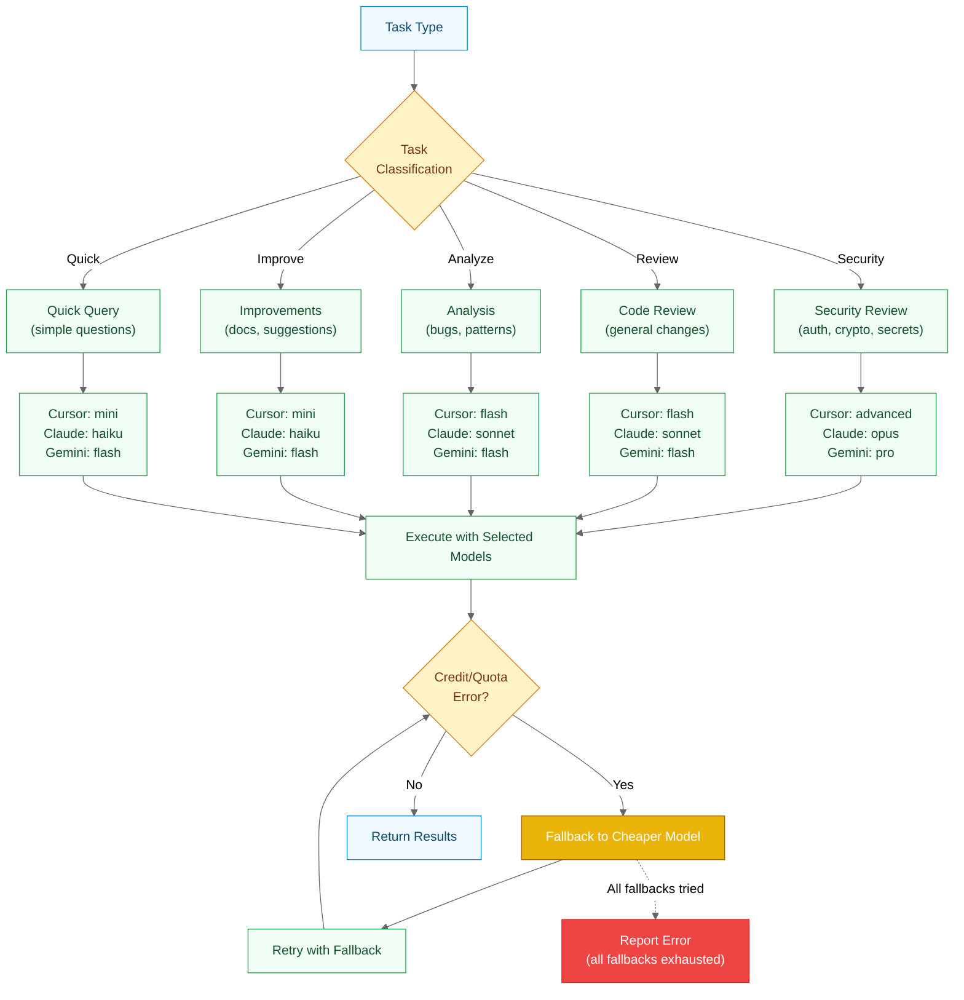
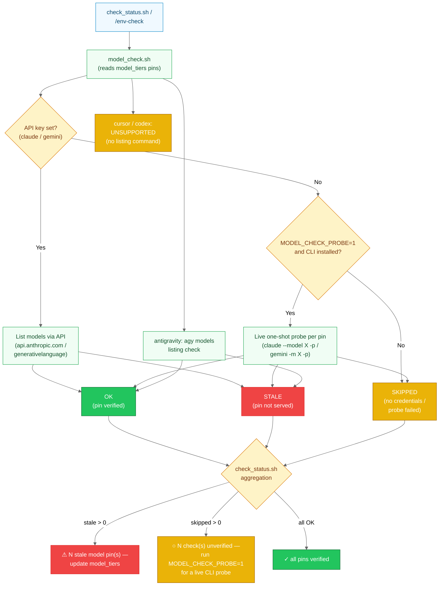

# Model Selection

> Which model a run gets, and how stale pins are detected.

**Last Updated**: 2026-08-20

## Model Selection & Credit Fallback

Automatic model tier selection and graceful fallback when quota/credits are exhausted.



**Cursor Fallback Chain**:

```text
gpt-5.2 (advanced) → gpt-5.1-codex (flash) → gpt-5.1-codex-mini (mini)
```

**Claude Fallback Chain**:

```text
opus → sonnet → haiku
```

**Gemini Fallback Chain**:

```text
gemini-3-pro-preview (pro) → gemini-3-flash-preview (flash)
```

**Codex Fallback Chain**:

```text
gpt-5.6-sol (advanced) → gpt-5.6-terra (flash) → gpt-5.6-luna (mini)
```

**Error Detection**:
The script parses stderr for patterns:

- "credit", "quota", "rate limit", "insufficient"
- Automatically retries with next cheaper model
- Continues with available agents if one exhausts credits

---

## Model Pin Staleness Check

How `model_check.sh` verifies the `model_tiers` pins in `parallel_agent.yml` against live
provider listings, including the opt-in live-probe mode (`MODEL_CHECK_PROBE=1`) for
OAuth-only machines, and how `check_status.sh` reports the result honestly
(stale / unverified / verified). Warn-only: every failure degrades to SKIPPED and the
exit code is always 0.



**Check modes per provider**:

| Provider | With API key | Without API key | Notes |
|----------|--------------|-----------------|-------|
| claude | `GET /v1/models` listing | `MODEL_CHECK_PROBE=1`: one tiny `claude --model <pin> -p` call per pin; else SKIPPED | Probe needed because OAuth-only machines have no key — broken pins would otherwise read as green |
| gemini | `GET /v1beta/models` listing | `MODEL_CHECK_PROBE=1`: one tiny `gemini -m <pin> -p` call per pin; else SKIPPED | Pins UNVERIFIED — the CLI is ineligible on a free-tier account (`IneligibleTierError`, migrate to Antigravity), so the probe cannot reach model selection either |
| antigravity | n/a | `agy models` listing (no key needed) | CLI listing only. Match the **slug** form (`gemini-3.6-flash-low`) — agy ≥1.1.8 lists slugs, not the display labels 1.1.1 emitted |
| cursor | n/a | `cursor-agent --list-models` listing, plus a `MODEL_CHECK_PROBE=1` per-pin fallback | The probe runs inside a throwaway temp dir: `cursor-agent` demands `--trust`, and trusting the operator's cwd is not this script's call |
| codex | n/a | `MODEL_CHECK_PROBE=1` probe only | UNSUPPORTED for listing — the CLI exposes no `models`/`--list-models`, so a probe is the only verification path. Needs `--skip-git-repo-check` |
| devin | n/a | listing only, never probed | `devin models list` is login-gated, and `devin -p` **starts an interactive login** when logged out — so probing it would try to log the operator in. Reports SKIPPED (unpinned by design) |

**Honest reporting** (`check_status.sh`):

- Any STALE pins → yellow warning with count (update `model_tiers`)
- Any SKIPPED checks → "unverified" line suggesting `MODEL_CHECK_PROBE=1 model_check.sh`;
  the green "all pins verified" line never overclaims what was actually checked
- All OK → green "Model pin check complete — all pins verified"

---

---

[← Architecture Diagrams](README.md)
