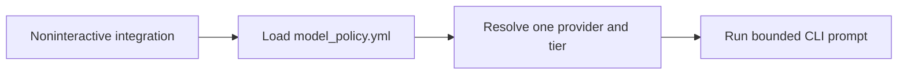

# Model Policy

```mermaid
flowchart LR
  P[Noninteractive integration] --> L[Load model_policy.yml]
  L --> R[Resolve one provider and tier]
  R --> C[Run bounded CLI prompt]
```

The model policy is a single-provider routing policy. Interactive task batches
use OMP roles and do not use provider CLI fan-out.
