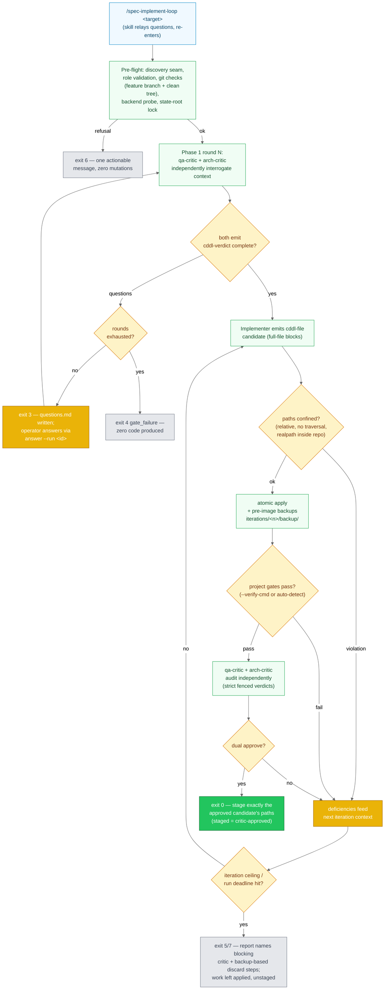

# Skill & Development Pipelines

> SkillClaw ingest/evolve and the critic-driven development loop.

## SkillClaw Passive Ingest & Evolve Pipeline

How existing Claude Code session transcripts are passively read, scrubbed for secrets,
distilled into candidate skills, and promoted to the committed library via a PR-gated review.
No proxy, no socket, no daemon — works with Claude Max out of the box.

```mermaid
%%{init: {'theme':'neutral'}}%%
flowchart LR
    classDef input fill:#f0f9ff,stroke:#0284c7,color:#0c4a6e
    classDef process fill:#f0fdf4,stroke:#16a34a,color:#14532d
    classDef decision fill:#fef3c7,stroke:#d97706,color:#78350f
    classDef secure fill:#fee2e2,stroke:#dc2626,color:#7f1d1d
    classDef config fill:#f3e8ff,stroke:#9333ea,color:#581c87
    classDef output fill:#22c55e,stroke:#166534,color:#fff

    TRANSCRIPTS["~/.claude/projects/**/*.jsonl\n(Claude Code session transcripts\nalready on disk)"]:::input

    INGEST["skillclaw_ingest.py\nnormalize turns\nstrip tool-output noise\nwindow=30d / settle=5m\nincremental state file"]:::process

    SCRUB["skillclaw_scrub.py\nRedact API keys,\nauth headers, tokens"]:::secure

    EVOLVE["skillclaw_evolve.py\nmap-reduce via claude -p\n(Max-backed)\nchunks ≤ 100 000 tokens"]:::process

    EVOLVED_LIB["~/.skillclaw/skills/\n(evolved candidates)"]:::process

    CLASSIFY["skillclaw_promote.py\nClassify NEW / CHANGED\nDrop invalid frontmatter\nCopy rejected → rejected/"]:::decision

    PROMOTE["skillclaw_promote.sh\nPR-gate: one open\nskillclaw/evolve-* PR\nat a time"]:::process

    GIT_BRANCH["git switch -c\nskillclaw/evolve-N-SHA"]:::process
    PR["git_ops.sh pr-create\n(needs-review + follow-up labels)"]:::process

    retired skill supply[".apm/skills/\n(committed library)"]:::output

    TRANSCRIPTS --> INGEST
    INGEST --> SCRUB
    SCRUB --> EVOLVE
    EVOLVE --> EVOLVED_LIB
    EVOLVED_LIB --> CLASSIFY
    CLASSIFY -->|accepted| PROMOTE
    CLASSIFY -->|rejected| EVOLVED_LIB
    PROMOTE --> GIT_BRANCH
    GIT_BRANCH --> PR
    PR --> retired skill supply
```

**Pipeline Stages**:

| Stage | Component | Description |
|-------|-----------|-------------|
| Source | `~/.claude/projects/**/*.jsonl` | Claude Code writes session transcripts to disk automatically; SkillClaw reads them passively |
| Ingest | `skillclaw_ingest.py` | Normalizes turns, strips tool-output noise (`max_tool_output_chars=500`), applies `window_days=30` + `settle_minutes=5` filters, tracks processed files via incremental state |
| Scrub | `skillclaw_scrub.py` | Redacts `sk-ant-*`, `sk-proj-*`, bearer tokens, `x-api-key` headers before evolve/promote |
| Evolve | `skillclaw_evolve.py` | Map-reduce via headless `claude -p` (Max-backed); greedily packs sessions into chunks under `token_budget=100 000`; reduce deduplicates by skill name |
| Classify | `skillclaw_promote.py` | Compares evolved `~/.skillclaw/skills/` against committed library; emits NEW / CHANGED / UNCHANGED; drops skills with missing or malformed frontmatter; copies rejected candidates to `~/.skillclaw/skills/rejected/` |
| Promote | `skillclaw_promote.sh` | Idempotency check (one open `skillclaw/evolve-*` PR at a time); one commit per skill; opens review PR via `git_ops.sh` |
| Review | GitHub/GitLab PR | Human review gate; each skill is an independent commit — revert to drop; merge deploys via `bootstrap.sh` skill sync |

**Key new skills**:

- `/skill-evolve` — Preview or open a review PR for SkillClaw-evolved skills
  (`skillclaw_promote.sh --apply`); dry-run by default
- `/pass-cli` — Retrieve secrets from Proton Pass via `pass-cli` agent CLI;
  handles session setup, vault/item discovery, and auto-recovery

---

## Critic-Driven Development Loop (/spec-implement-loop)

How CDDL (`cddl_loop.py` + the `cddl/` package, feature 482) runs a two-phase,
critic-gated implementation over a resolved spec+plan context (speckit or
superpowers, via the `spec_review.sh` discovery seam). Both critics must emit
structured `complete` verdicts before any code; the implement→verify→critique
loop stages exactly the final approved candidate's paths — the loop never
commits, pushes, merges, or reverts. Runs persist under
`~/.manifest/cddl/runs/` (keep-everything, per-iteration backups); audit events
append via `audit_log.sh` (fail-open).



Key seams: `CDDL_CLI` (injectable `claude -p` runner; tests stub it),
`spec_review.sh` `discover_artifacts` (file-target-aware layout pairing),
`audit_log.sh` `AUDIT_LOG_FILE` (per-tool audit stream), role prompts in
`configs/claude/prompts/cddl/` (editable without code changes; zero-touch
deploy, no agent-registry writes).

---

---

[← Architecture Diagrams](README.md)
