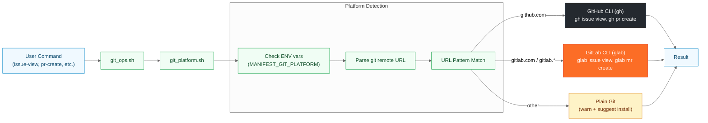

# Platform & Bootstrap

> Git platform detection and the bootstrap installation sequence.

**Last Updated**: 2026-08-20

## Git Platform Detection & Operations

Platform-agnostic Git operations flow with automatic platform detection and routing to appropriate CLI tools.

**Detection Logic**:

1. **Environment Override**: `MANIFEST_GIT_PLATFORM` forces specific platform
2. **Remote URL Parsing**: Reads `git remote get-url origin` (or `$MANIFEST_GIT_REMOTE`)
3. **Pattern Matching**:
   - `*github.com*` → GitHub (gh)
   - `*gitlab.com*` or `*gitlab.*` → GitLab (glab)
   - Other → Plain git (warn)

**Subcommand Mapping**:

| Generic | GitHub (gh) | GitLab (glab) |
|---------|-------------|---------------|
| issue-comment | gh issue comment | glab issue note |
| issue-edit | gh issue edit | glab issue update |
| pr-create | gh pr create | glab mr create |
| pr-view | gh pr view | glab mr view |

---

## Bootstrap Installation Flow

Complete installation and configuration deployment process. Mirrors `main()` in
`bootstrap.sh` plus the routines in `bootstrap/lib/`: the services banner is printed
**after** the existing config is loaded (so displayed toggles match what deploys), and
soft-failure guards keep `set -e` from aborting the pipeline mid-flight — the full
deploy → skillclaw state → python deps → auth → verify → summary sequence always runs.

```mermaid
%%{init: {'theme':'neutral'}}%%
flowchart TD
    classDef input fill:#f0f9ff,stroke:#0284c7,color:#0c4a6e
    classDef process fill:#f0fdf4,stroke:#16a34a,color:#14532d
    classDef decision fill:#fef3c7,stroke:#d97706,color:#78350f
    classDef success fill:#22c55e,stroke:#166534,color:#fff
    classDef skip fill:#e5e7eb,stroke:#6b7280,color:#374151
    classDef warning fill:#eab308,stroke:#a16207,color:#fff

    START["./bootstrap.sh"]:::input
    LOAD_LIBS["Load bootstrap/lib/*.sh<br/>+ parse CLI arguments"]:::process

    RECONFIG{"--reconfigure?"}:::decision
    RECONFIG_PATH["Reconfigure path:<br/>services.yml → skillclaw state<br/>→ python deps + browser-use"]:::process

    LOAD_CONFIG["Load existing services.yml<br/>(merge with CLI flags;<br/>explicit flags win)"]:::process
    BANNER["Show services banner<br/>(printed AFTER config load —<br/>reflects merged toggles)"]:::process
    CONFIRM{"Continue<br/>with setup?"}:::decision
    CANCELLED["Setup cancelled"]:::skip

    PLATFORM["Check platform +<br/>create ~/.manifest state dirs"]:::process

    SKIP_INSTALL{"--skip-install?"}:::decision
    INSTALLS["Install CLIs (soft-fail, counted):<br/>package manager · node · claude<br/>gemini · codex · gh · glab · jq · cursor"]:::process

    DEPLOY["deploy_configs<br/>(~/.claude primary; chmod +x<br/>scripts/*.sh AND *.py;<br/>write services.yml)"]:::process
    SKILLCLAW["skillclaw_apply_state<br/>(launchd cleanup guarded —<br/>no set -e abort)"]:::process
    PYDEPS["Install python deps<br/>+ browser-use (if enabled)"]:::process

    MCP{"--install-mcp?"}:::decision
    INSTALL_MCP["Configure MCP servers<br/>(interactive per-server)"]:::process

    SKIP_AUTH{"--skip-auth?"}:::decision
    AUTH["Auth checks (soft-fail, counted):<br/>claude · gemini · codex<br/>gh · glab · cursor info"]:::process

    VERIFY["verify_installation<br/>(errors counted, never aborts)"]:::process
    SUMMARY["print_summary<br/>(quick-start + auth guidance)"]:::process
    DONE["Installation complete"]:::success
    EXIT_WARN["Exit 1 if verification<br/>reported errors"]:::warning

    START --> LOAD_LIBS
    LOAD_LIBS --> RECONFIG
    RECONFIG -->|Yes| RECONFIG_PATH
    RECONFIG_PATH --> DONE
    RECONFIG -->|No| LOAD_CONFIG
    LOAD_CONFIG --> BANNER
    BANNER --> CONFIRM
    CONFIRM -->|No| CANCELLED
    CONFIRM -->|Yes| PLATFORM
    PLATFORM --> SKIP_INSTALL
    SKIP_INSTALL -->|No| INSTALLS
    SKIP_INSTALL -->|Yes| DEPLOY
    INSTALLS --> DEPLOY
    DEPLOY --> SKILLCLAW
    SKILLCLAW --> PYDEPS
    PYDEPS --> MCP
    MCP -->|Yes| INSTALL_MCP
    MCP -->|No| SKIP_AUTH
    INSTALL_MCP --> SKIP_AUTH
    SKIP_AUTH -->|No| AUTH
    SKIP_AUTH -->|Yes| VERIFY
    AUTH --> VERIFY
    VERIFY --> SUMMARY
    SUMMARY --> DONE
    SUMMARY -.-> EXIT_WARN
```

**Key Features**:

- **Banner after config load**: the services banner is printed only after
  `load_existing_config` merges `services.yml` with CLI flags, so the displayed toggles
  always match what will actually be deployed
- **Soft-fail install/auth/verify**: per-tool installs, auth checks, and
  `verify_installation` return error counts instead of aborting under `set -e`; the
  pipeline always reaches the summary (verification errors still exit 1 at the end)
- **Deploy chmod covers Python**: `deploy_configs` marks both `scripts/*.sh` and
  `scripts/*.py` executable
- **skillclaw_apply_state runs unconditionally after deploy**: applies enable/disable state
  and removes any legacy launchd capture daemon; the launchd cleanup is guarded so a missing
  service can no longer abort the rest of the bootstrap (python deps, auth, verify, summary)
- **Auto-Detection**: gh/glab default to `auto` mode (enable if already installed)
- **Platform-Specific Install**: Uses appropriate package manager (brew/apt/dnf/pacman)
- **Dependency Checking**: Verifies jq is installed (required for git_ops.sh JSON normalization)
- **SkillClaw (disabled by default)**: When `--enable-skillclaw` is passed, sets `chmod 700`
  on `~/.skillclaw/` and enables the passive transcript-ingestion pipeline; no proxy, no daemon,
  no supervisor required

---

---

[← Architecture Diagrams](README.md)
