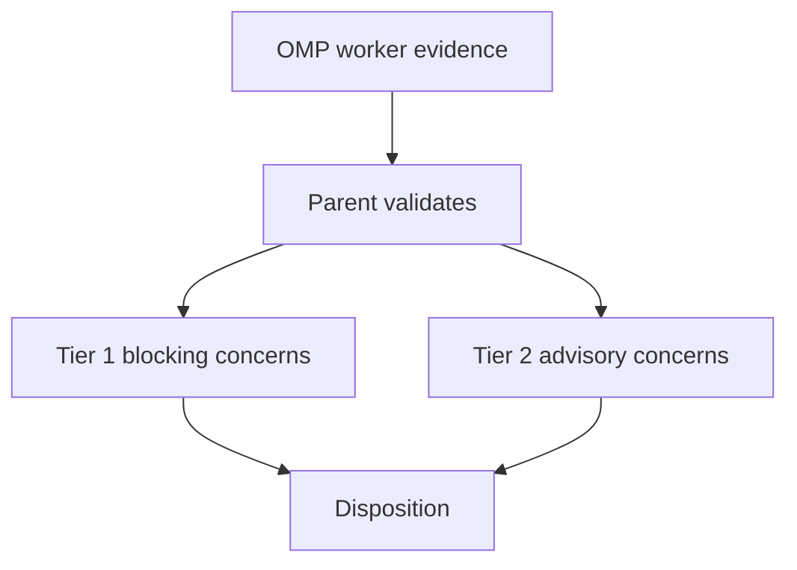

# Validation Flow

The parent validates evidence and makes the final disposition. Independent
review enters this flow only on risk-based escalation from a confirmed risk
condition. The unattended gate retains a fail-closed injected single-reviewer
seam.
