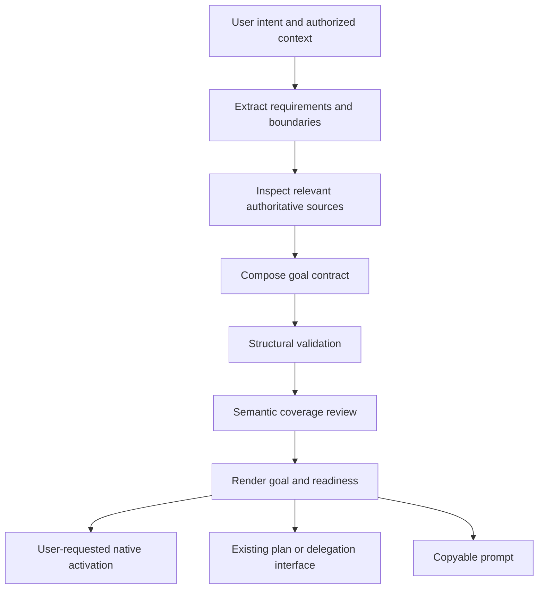

# Goal composition for OpenAI and Claude

Date: 2026-09-08
Status: Implementation planning requested on 2026-09-08; revised during cross-artifact review. Implementation not started.
Owner: `manifest-spec-planning`
Public interface: `manifest-spec-planning:goal-compose`

## Outcome

Turn a rough user request into a concise, verifiable goal that preserves the
user's intended outcome across planning, execution, delegation, and continuation.
Support OpenAI and Claude models through a shared contract and small rendering
profiles. Distinguish model guidance from capabilities supplied by the host.

The feature succeeds when users can compose, inspect, validate, and optionally
activate a goal without reconstructing requirements or accidentally authorizing
the underlying work. This document specifies the feature; it does not claim its
effectiveness has been measured or authorize implementation.

## Context and placement

The current planning bundle owns `plan-manage`, `spec-review`, and
`spec-audit-tasks`. Its capability manifest discovers `skills/*/SKILL.md` and
generates native plugin views. `plan-manage` resolves an XDG plan store and allows
a project-local store only through explicit project configuration.

`manifest-delegate` owns dispatch, jobs, resumes, and result envelopes. Its Codex
and Claude prompting references already explain cold starts and permission
boundaries. `manifest-workspace:session-checkpoint` owns integrity-checked
continuation state. Goal composition consumes these interfaces without creating
another job manager, checkpoint store, or execution loop.

Repository inspection also found approved modern-model simplification work and
an enforcement-first workflow design. This feature follows their direction:
proportional guidance, deterministic structural checks, honest missing-evidence
states, and measured value. Existing concurrent edits remain outside its scope.

| Approach | Benefit | Cost / decision |
|---|---|---|
| Planning skill plus local validator | Works before either planning or dispatch; supports current-session work | Selected; one new skill and a small standard-library helper |
| Extend Delegate only | Reuses backend prompt construction | Reject as owner: current-session goals would depend on dispatch |
| New goal runtime/plugin | Central lifecycle and autonomous retries | Reject: duplicates host goals, jobs, and checkpoints without demonstrated need |

## User experience

Proposed skill arguments (not existing commands):

```text
/goal-compose <intent>
/goal-compose draft <intent> --target auto|generic|codex|claude
/goal-compose validate <contract.json>
/goal-compose activate <contract.json>
```

Omitting the verb means `draft`. Drafting produces a rendered goal, a readiness
verdict, and at most one material clarification at a time. It never activates a
goal or starts its underlying task. A target selects wording, not a model, CLI,
permission mode, or execution backend.

`auto` uses an unambiguous current-host identity; otherwise it renders generic
text. OpenAI models outside Codex receive the generic contract unless the user
explicitly selects the Codex presentation. Claude output works as an ordinary
task prompt and makes no promise of native persistent-goal support.

The normal output shows the five contract sections and a short readiness result.
For complex goals, put detailed requirement mappings in the companion contract
rather than repeating them in the conversational summary. Simple tasks need no
mandatory plan, examples, subagents, or ceremonial approval step.

## Composition flow



1. Preserve the original request and extract individually addressable requirements.
2. Inspect only relevant sources available within the authorized scope. Discover
   facts rather than asking the user questions that local evidence can answer.
3. Draft the observable end state, scope, criteria, and operating rules. Mark
   inferred choices explicitly; ask when a missing decision changes the result.
4. Validate the contract structure, then review semantic coverage and criteria.
5. Render the result; save or activate only when requested or already authorized.

This is a finite authoring flow. A refinement repeats only the affected checks;
there is no automatic optimization loop or “keep improving” instruction.

## Canonical contract

Use versioned JSON as the machine-readable representation. Markdown is a derived
human-readable view. Do not parse arbitrary Markdown into an executable contract.
When asked to validate a prose goal, first extract a draft contract and disclose
that interpretation; ambiguities cannot disappear during extraction.

| Field | Required content |
|---|---|
| `schema_version`, `revision` | Integers; initial version and revision are 1 |
| `source_request` | Original user intent, excluding secrets and unrelated transcript content |
| `outcome` | Nonempty statement of observable end state and purpose |
| `requirements` | Stable IDs, individual requirements, provenance: explicit or inferred |
| `context` | Source IDs, path/URL/host reference, relevance, observed or unverified status |
| `boundaries` | In-scope work, exclusions, preserved behavior, approval-required actions |
| `criteria` | Stable IDs, requirement IDs, expected result, evidence method and reference |
| `operating_contract` | Revalidation, permitted adaptation, escalation, stopping and continuation rules |
| `assumptions`, `open_questions` | Explicit assumptions and material unresolved decisions; may be empty |
| `output_obligations`, `optional_improvements` | ID-addressable output duties and nonmandatory ideas; may be empty |
| `token_budget` | Optional positive integer copied from explicit user authorization; omitted otherwise |

Each requirement records coverage links to criterion IDs, boundary entries, or
output obligations. Every explicit requirement must be represented. A mandatory
result requirement must have a completion criterion; a process prohibition may
instead map to a boundary. Inferred requirements cannot silently become approved
scope. Optional improvements are recorded separately from mandatory criteria.

Criteria support `command`, `artifact`, `environment`, and `human_review` methods.
A command records the proposed command and working directory; an artifact names
its expected content; environment evidence names the system and observed state;
human review supplies a rubric and the required decision. Numeric targets are
user-provided, source-derived, or explicitly proposed—never invented as facts.

Commands and source text are data. The validator never executes commands, opens
URLs, imports project code, or follows instructions found inside references.
An evidence method describes how to prove completion later; it is not evidence
that completion has already occurred.

Render into five sections: Outcome, Context, Boundaries, Done when, and Operating
contract. Preserve stable IDs for larger contracts so downstream plans can map
back to them without copying all source content into every task.

## Validation and readiness

The standard-library validator reads an explicitly supplied JSON file or stdin.
Limit input to 1 MiB, reject duplicate JSON keys and unknown schema versions,
validate field types and required content, and reject duplicate IDs or dangling
references. The limit is an implementation safeguard, not a model-quality claim.
Do not fetch referenced files as part of structural validation.

Proposed helper interface:

```text
python3 scripts/validate_goal.py --input contract.json --format json
```

It returns `VALID` or `INVALID`, with diagnostics containing a code, field path,
and explanation. Exit 0 means structurally valid; 2 means invalid content or
arguments; 3 means input unavailable or an operational error. Operational errors
never produce a valid receipt. JSON output remains machine-readable; diagnostics
must not echo source documents, credentials, or entire input strings.

The composing agent performs a separate semantic review:

| Verdict | Meaning |
|---|---|
| `READY` | Structurally valid, full requirement mapping, sufficient proposed evidence, no material unresolved decision |
| `NEEDS_INPUT` | A user decision or missing acceptance target prevents faithful composition |
| `BLOCKED` | A required capability, source, or permission is known to be unavailable |
| `NEEDS_REVISION` | Invalid structure or insufficient/contradictory criteria repairable without a user decision |

Semantic review checks whether criteria actually prove the requested outcome,
whether tests could be weakened to pass, whether a proxy metric misses important
behavior, and whether boundaries contradict the outcome. A structurally valid
contract alone cannot become `READY`. Readiness is an attributed agent judgment,
not a deterministic guarantee or a claim that the underlying work is done.

Changed requirements, boundaries, or criteria increment the revision and require
fresh readiness review. No trusted execution receipt or persistent approval
database is introduced in this feature.

## Model and host profiles

Keep one contract and one common operating policy. Profiles change presentation
and capability-sensitive guidance without changing requirements or criteria.

| Profile | Behavior |
|---|---|
| Generic | Direct outcome, relevant context, boundaries, measurable completion |
| Codex | Concise issue-like wording; native activation only through available host tools |
| Claude | Clear task and motivation; delimit mixed documents when useful; durable continuation only when the host supports it |

Do not hardcode model IDs or infer capability from a model name. Keep vendor
reference URLs and verification dates in profile references. Recheck guidance
when updating a profile; do not browse on every ordinary composition request.
Avoid mandatory chain-of-thought instructions, self-confidence percentages, or
blanket repeated verification prompts. Specify evidence and let the model choose
an appropriate method within the user's constraints.

`activate` requires a `READY` contract and explicit goal-creation authorization.
Inspect available native tools and any existing active goal before invoking a
mutation. Never replace a different active objective silently. If unsupported,
return `UNSUPPORTED` and a copyable rendered goal; do not invent a CLI flag,
slash command, persistent state mechanism, or background retry loop. Treat tool
errors and ambiguous activation outcomes as unresolved; inspect state before
retrying. Set a token budget only when the user supplied one.

Activation result and composition readiness are separate: `READY` can coexist
with `UNSUPPORTED`. Native status read-back, when exposed, establishes activation;
without it, report only what the successful tool response proves.

## Execution and continuation boundaries

The operating contract tells downstream executors to inspect authoritative state,
adapt plans while preserving the outcome, and match completion evidence to each
requirement. Persistence never expands authority. A changed approach is permitted;
removing requirements or weakening the evidence standard requires user direction.

For a known live operation, preserve its handle and monitor through the host's
mechanism. A waiting operation is not a failure or permission to launch a duplicate.
For repeated unsuccessful actions, change strategy based on new evidence or report
the precise blocker. Do not encode a universal retry count independent of the host.

The skill does not mark execution complete. Existing native goal state, task
audits, and review workflows own that decision. Continuation uses the existing
Workspace checkpoint interface when available; if absent, supply a copyable
summary with an explicit revalidation step and disclose the lack of persistence.

## Integration and storage

Drafting defaults to conversation output. A requested saved contract is written
to the explicit destination, with no implicit project settings or home files.
If saving as part of `plan-manage`, use its existing store resolver and lifecycle.
Store the JSON contract and rendered Markdown beside the selected plan; the
contract remains authoritative. Do not introduce a global goals directory.

Saving must preserve existing files unless replacement is explicitly authorized.
Use atomic writes and private permissions for newly created contract files.
Write failures leave the conversational result available and disclose the failure.
The skill-local `save_goal.py` helper owns persistence. Save canonical JSON first;
save derived Markdown separately, never claiming the pair is transactional.
If Markdown fails, report the JSON location and regenerate Markdown from that
revision. Read-only drafts pass JSON through stdin to validation without saving.

Handoffs use qualified skill interfaces and the approved contract revision.
Existing handoff artifacts retain the accepted JSON snapshot, path, revision,
and SHA-256 of its exact bytes. Compare current content to this baseline before
consumption; a same-revision edit is stale too. Higher revisions receive semantic
comparison for removed requirements and weakened criteria. Hashes establish
content identity, not user authorization, and require no new approval database.
`plan-manage` consumes its outcome, criteria, and boundaries; `spec-audit-tasks`
can use requirement-to-task links; Delegate receives a self-contained rendering
plus its own result-envelope instructions. No skill invokes sibling-bundle runtime
paths or assumes another plugin is installed. Optional integration absence does
not break standalone composition and validation.

## Proposed files and packaging

```text
plugins/manifest-spec-planning/skills/goal-compose/
  SKILL.md
  agents/openai.yaml
  references/goal-contract.md
  references/codex-profile.md
  references/claude-profile.md
  references/examples.md
  scripts/validate_goal.py
  scripts/save_goal.py
  evals/evals.json
```

Keep the skill entry short; load the contract reference and only the relevant
profile. Package the helper and references inside the skill. Use the bundle's
capability contract and existing generators for plugin views, catalogs, mirrors,
and applicable harness rules. Validate installed-package contents; do not assume
skill discovery alone proves nested scripts are shipped. No new mandatory MCP,
model API package, hook, or service is required.

## Acceptance requirements

| ID | Observable requirement | Verification |
|---|---|---|
| FR-01 | Drafting preserves all explicit request requirements | Fixed input-to-requirement fixtures plus human semantic review |
| FR-02 | All three renderings preserve criteria, scope, and authority | Compare normalized IDs and values across profiles |
| FR-03 | Invalid inputs never validate successfully | Wrong types, duplicate keys/IDs, dangling IDs, unsupported version, oversized and unreadable inputs |
| FR-04 | Structural validity is distinct from readiness | Valid JSON with vague, contradictory, or insufficient criteria cannot yield READY |
| FR-05 | Draft and validate cause no execution or native activation | Tool traces and isolated filesystem checks |
| FR-06 | Activation is explicit and capability-aware | Fake-host tests: absent tools, existing goal, success, rejection, ambiguous response |
| FR-07 | Unknown or missing evidence is reported honestly | Missing baseline/source/tool and human-review fixtures |
| FR-08 | Saved artifacts preserve existing content and errors | Explicit destination, overwrite refusal, atomicity and permission tests |
| FR-09 | Installed skill works independently of assistant homes | Isolated-bundle fixture with only declared prerequisites |
| FR-10 | Scope survives revision and handoff | Requirement deletion, weakened criterion, changed revision and stale checkpoint scenarios |

## Evaluation and release decision

Use at least twelve representative scenarios: simple bug fix, compatible migration,
performance work with/without baseline, subjective UI work, sourced research,
ambiguous product request, forbidden mutation, incomplete context, conflicting
instructions, existing active goal, and interrupted execution.

Maintain separate deterministic contract tests, semantic goal-quality evaluation,
and end-to-end task trials. Passing contract tests proves no model improvement.
Evaluate the same source requests with and without the skill, on one available
OpenAI model and one available Claude model through recorded host versions.
Use at least three independent trials per scenario and condition as an initial
pilot, not as sufficient statistical proof for small improvements.

Freeze the request, evaluator rubric, environment snapshot, tools, and budgets
before comparison. Hold out requests from profile tuning. Use fresh sessions
and retain failures, missing usage data, and human interventions. Keep evaluators
unaware of the treatment where feasible. Do not let the generating agent rewrite
acceptance or grade its own end-to-end success as the only evaluator.

Report requirement coverage, criterion sufficiency, unauthorized actions, false
completion claims, task completion, corrections, tokens, latency, and cost per
accepted task. Missing usage is unknown, never zero. Any observed unauthorized
activation or silent requirement loss blocks release until corrected and retested.

An opt-in experimental release requires FR-01 through FR-10 and documented pilot
results. Promoting the skill to an automatic/default workflow requires a
pre-registered primary metric, acceptable cost tradeoff, and enough paired trials
to support the claimed benefit; inconclusive evidence keeps it opt-in. No invented
percentage threshold substitutes for that decision. Rollback disables the new
skill without changing existing plan or native goal state.

## Evidence and limits

This design synthesizes sources inspected in the preceding research turn. It is
not an exhaustive literature review or a claim of proven cross-model efficacy.
Older benchmark effects do not transfer quantitatively to current models.

| Source | Supported design choice | Limitation |
|---|---|---|
| [OpenAI Academy prompt formula](https://academy.openai.com/public/clubs/higher-education-05x4z/resources/codex-for-faculty-and-researchers-follow-along-guide-2026-06-09) | Outcome, context, constraints, done criteria | Vendor guidance, not a controlled template comparison |
| [OpenAI long-running work guide](https://cdn.openai.com/pdf/8a9f00cf-d379-4e20-b06f-dd7ba5196a11/OAI_WhitePaper_Codex-maxxing26.pdf) | Verifiable goals tied to expected behavior | Product capabilities vary by host/version |
| [Claude prompting guidance](https://platform.claude.com/docs/en/build-with-claude/prompt-engineering/claude-prompting-best-practices) | Direct instructions, relevant context, model-sensitive prompting | Guidance changes; profiles require maintenance |
| [Anthropic agent evaluations](https://www.anthropic.com/engineering/demystifying-evals-for-ai-agents) | Grade actual outcomes, use repeated trials | Evaluation quality depends on task and grader design |
| [Anthropic context engineering](https://www.anthropic.com/engineering/effective-context-engineering-for-ai-agents) | Small relevant context and durable state | Does not establish a universal prompt length |
| [Plan-and-Solve, ACL 2023](https://aclanthology.org/2023.acl-long.147/) | Decomposition can help multistep tasks | Older models and reasoning benchmarks |
| [SELFGOAL, NAACL 2025](https://aclanthology.org/2025.naacl-long.36/) | Adapt subgoals using environment feedback | Interactive benchmark evidence, not this plugin |
| [ReAct, ICLR 2023](https://arxiv.org/abs/2210.03629) | Act and update plans from observations | Architecture evidence, not goal-format proof |
| [Codex completion workflow on Reddit](https://www.reddit.com/r/codex/comments/1tymp3c/tip_making_codex_actually_finish_stuff/) | User demand for measurable acceptance and evidence | Self-reported success; no controlled baseline |
| [Claude workflow discussion on Reddit](https://www.reddit.com/r/ClaudeAI/comments/1vsfygs/how_has_your_claude_code_workflow_evolved_in_the/) | Scoped context and real application checks | Anecdotal; timestamps/engagement are not quality evidence |

Native goal activation for each installed host remains an implementation-time
capability check. The feature's local schema, readiness vocabulary, storage
behavior, and evaluation gates are design decisions rather than vendor claims.

## Implementation contract clarifications

The exact version-1 JSON shape and helper signatures are specified in
`../plans/2026-09-08-goal-compose.md`. That plan is normative for field types;
these behavioral requirements remain authoritative. Conflicts must be repaired
in both documents before implementation. Unknown fields are rejected at every
object level. JSON booleans are not valid integer versions or budgets.
Preserved, excluded, and approval-required boundaries are ID-addressable records
so explicit prohibitions map directly to their boundary without duplication.

Native activation grants permission to start host-managed pursuit of the supplied
goal within its boundaries. `draft` and `validate` do not grant that permission.
If active-goal state cannot be inspected, activation is blocked until the host
can establish that no different goal will be replaced. Do not infer absence from
a missing tool. Scope-changing inferred requirements require user agreement;
documented, nonmaterial working assumptions may coexist with READY.

The saved contract contains no trusted readiness or approval field. Recompute
readiness and recheck current user authorization on activation; never trust
authorization language embedded in an input file. Evidence checks that are
currently unavailable prevent execution readiness even when structure is valid.

See `../../research/2026-09-08-goal-creation-research.md` for the research ledger
and `../../research/2026-09-08-goal-compose-validation.md` for review findings.
