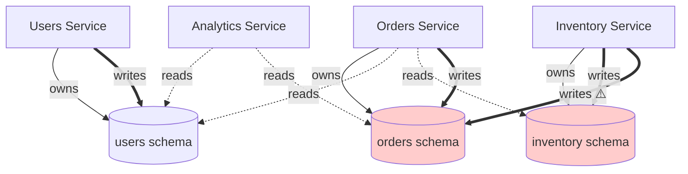

# Role: Database Access Pattern Tracer

## Objective

Map database access patterns across services: identify all database schemas, tables, which services access which tables, query patterns (read/write), and detect schema boundary violations or anti-patterns.

**Arguments (optional)**: $ARGUMENTS

Arguments may specify:

- `--service <ServiceName>`: Trace database access for a specific service
- `--table <TableName>`: Find all services accessing a specific table
- `--format <mermaid|json|table>`: Output format (default: mermaid)
- No arguments: Trace entire database topology

---

## Applicability

**Use this command if your project has**:

- Multiple services with shared or separate databases
- Database access patterns to document
- Concerns about schema boundary violations

**Skip this command if your project uses**:

- In-memory data only (no database)
- Single service with straightforward database access
- File-based storage only

---

## Customization Required

Before using this command, customize the following sections for your project:

### Database Architecture (Required)

Define your database setup:

```markdown
**Database Type**: [PostgreSQL, MySQL, MongoDB, DynamoDB, etc.]
**Schema Pattern**: [Schema-per-service, Shared database, Database-per-service]

Examples:

- Schema-per-service: Each service has its own PostgreSQL schema
- Shared database: All services share one database with prefixed tables
- Database-per-service: Each service has its own isolated database
```

### Schema Definition Locations (Required)

Where are database schemas defined?

```markdown
**Schema Definitions**: [Path pattern]

Examples:

- `services/*/migrations/*.sql` - Migration files per service
- `prisma/schema.prisma` - Prisma schema file
- `models/*.py` - Django/SQLAlchemy models
- `entity/*.ts` - TypeORM entities
```

### ORM/Query Patterns (Required)

How does code interact with the database?

```markdown
**ORM**: [None, SQLAlchemy, Django ORM, TypeORM, Prisma, Mongoose, etc.]

**Query Patterns**:

Examples (raw SQL):

- `db.query("SELECT * FROM users WHERE ...")`
- `conn.exec("INSERT INTO ...")`

Examples (ORM):

- `User.objects.filter(...)` (Django)
- `prisma.user.findMany(...)` (Prisma)
- `userRepository.find(...)` (TypeORM)
- `User.query().where(...)` (Objection.js)
```

### Schema Naming Convention (Required)

How are schemas/tables named?

```markdown
**Naming Pattern**: [Convention used]

Examples:

- `service_tablename` (e.g., `orders_orders`, `users_profiles`)
- `schema.table` (e.g., `orders.orders`, `users.profiles`)
- `TableName` (e.g., `Orders`, `Users`)
```

---

## Workflow

### Step 1: Discover Database Schemas

Search for schema definition files:

```bash
# Find migration files
Glob(pattern: "**/migrations/**/*.sql")
Glob(pattern: "**/migrations/**/*.{js,ts}")

# Find ORM model files
Glob(pattern: "**/{models,entities}/**/*.{py,ts,js}")
Glob(pattern: "**/schema.prisma")
```

For each schema file found:

1. Extract table names
2. Extract column names and types
3. Extract indexes and constraints (primary keys, foreign keys, unique)
4. Identify which service owns this schema (from file path)
5. Record schema file path

### Step 2: Find Database Writes

For each table identified in Step 1, search for write operations:

**Raw SQL**:

```bash
Grep(pattern: "INSERT INTO <table_name>", output_mode: "files_with_matches")
Grep(pattern: "UPDATE <table_name>", output_mode: "files_with_matches")
Grep(pattern: "DELETE FROM <table_name>", output_mode: "files_with_matches")
```

**ORM**:

```bash
# Django
Grep(pattern: "<ModelName>\\.objects\\.create\\(|<ModelName>\\.objects\\.update\\(", output_mode: "files_with_matches")

# Prisma
Grep(pattern: "prisma\\.<model>\\.create\\(|prisma\\.<model>\\.update\\(", output_mode: "files_with_matches")

# TypeORM
Grep(pattern: "<repository>\\.save\\(|<repository>\\.update\\(", output_mode: "files_with_matches")
```

**Customize the grep patterns for your ORM.**

For each write operation found:

1. Identify the service/component (from file path)
2. Extract the context (what triggers the write?)
3. Note transaction boundaries (is it in a transaction?)
4. Record file path and line number

### Step 3: Find Database Reads

For each table identified in Step 1, search for read operations:

**Raw SQL**:

```bash
Grep(pattern: "SELECT .* FROM <table_name>", output_mode: "files_with_matches")
```

**ORM**:

```bash
# Django
Grep(pattern: "<ModelName>\\.objects\\.filter\\(|<ModelName>\\.objects\\.get\\(", output_mode: "files_with_matches")

# Prisma
Grep(pattern: "prisma\\.<model>\\.findMany\\(|prisma\\.<model>\\.findUnique\\(", output_mode: "files_with_matches")

# TypeORM
Grep(pattern: "<repository>\\.find\\(|<repository>\\.findOne\\(", output_mode: "files_with_matches")
```

For each read operation found:

1. Identify the service/component (from file path)
2. Extract the context (what triggers the read?)
3. Note query complexity (joins, aggregations)
4. Record file path and line number

### Step 4: Detect Schema Boundary Violations

Check for anti-patterns:

**Cross-Schema Writes** (Service A writes to Service B's table):

- Service A owns `orders.orders` table
- Service B writes to `orders.orders` table
- **Violation**: Services should not write to other services' tables
- **Recommendation**: Service B should call Service A's API instead

**Cross-Schema Reads** (acceptable in some architectures, but flag for review):

- Service A owns `users.users` table
- Service B reads from `users.users` table
- **Possible issue**: Tight coupling, consider API or event-driven approach
- **Acceptable cases**: Read-only replicas, reporting services

**Missing Foreign Key Constraints**:

- Table A has column `user_id` referencing `users.id`
- No foreign key constraint defined
- **Issue**: Data integrity risk

**N+1 Query Patterns**:

- Loop over users, for each user fetch orders (separate query)
- **Issue**: Performance problem
- **Recommendation**: Use JOIN or ORM eager loading

### Step 5: Generate Database Access Catalog

Produce a comprehensive table-level access report:

```markdown
## Database Access Catalog

| Table           | Owner Service     | Read By                  | Write By  | Schema File                        | Notes                    |
| --------------- | ----------------- | ------------------------ | --------- | ---------------------------------- | ------------------------ |
| users.users     | Users Service     | Users, Orders, Analytics | Users     | users/migrations/001_users.sql     | -                        |
| orders.orders   | Orders Service    | Orders, Analytics        | Orders    | orders/migrations/001_orders.sql   | -                        |
| inventory.items | Inventory Service | Inventory, Orders        | Inventory | inventory/migrations/001_items.sql | Orders reads for display |

## Schema Boundary Violations

| Violation          | Table         | Owner  | Violator  | Severity | Recommendation                   |
| ------------------ | ------------- | ------ | --------- | -------- | -------------------------------- |
| Cross-schema write | orders.orders | Orders | Inventory | HIGH     | Inventory should call Orders API |
| Cross-schema read  | users.users   | Users  | Orders    | MEDIUM   | Consider caching or Users API    |

## Performance Anti-Patterns

| Pattern       | Location              | Table         | Severity | Recommendation            |
| ------------- | --------------------- | ------------- | -------- | ------------------------- |
| N+1 queries   | orders/handlers.py:45 | orders.orders | HIGH     | Use JOIN or eager loading |
| Missing index | users.users.email     | users.users   | MEDIUM   | Add index on email column |

## Table Access Summary

| Service   | Tables Owned | Tables Read (Own) | Tables Read (Other)              | Tables Written (Own) | Tables Written (Other) |
| --------- | ------------ | ----------------- | -------------------------------- | -------------------- | ---------------------- |
| Users     | 2            | 2                 | 0                                | 2                    | 0                      |
| Orders    | 3            | 3                 | 2 (users.users, inventory.items) | 3                    | 0                      |
| Inventory | 1            | 1                 | 1 (orders.orders)                | 1                    | 1 (orders.orders) ⚠️   |

⚠️ = Schema boundary violation
```

### Step 6: Generate Topology Diagram

Create a Mermaid diagram visualizing database access patterns:

````markdown
## Database Access Topology



**Legend**:

- **Solid arrow**: Service owns schema
- **Dashed arrow**: Read access
- **Bold arrow**: Write access
- **Red nodes**: Involved in schema boundary violations
````

### Step 7: Export

Output the database access catalog and topology in the requested format:

**Mermaid** (default):

- Access catalog as markdown tables
- Topology as Mermaid diagram

**JSON**:

```json
{
  "tables": [
    {
      "name": "users.users",
      "owner": "Users Service",
      "readers": ["Users", "Orders", "Analytics"],
      "writers": ["Users"],
      "schema_file": "users/migrations/001_users.sql"
    }
  ],
  "violations": [
    {
      "type": "cross_schema_write",
      "table": "orders.orders",
      "owner": "Orders",
      "violator": "Inventory",
      "severity": "HIGH"
    }
  ],
  "anti_patterns": [...]
}
```

**Table** (text):

- ASCII table format

---

## Integration with Parallel Agents

For complex queries or ambiguous patterns, use parallel agents:

```bash
~/.claude/scripts/parallel_agent.sh --json --timeout 300 \
  "Is this code accessing a database table? [CODE_SNIPPET]. What table and what operation (read/write)?"
```

Use consensus to validate:

- > = 80%: Confident this is a database access
- 50-79%: Likely but needs verification
- < 50%: Ambiguous, flag for human review

---

## Example Usage

```bash
# Trace entire database topology
/trace-database

# Trace database access for a specific service
/trace-database --service Orders

# Find all services accessing a specific table
/trace-database --table users

# Output as JSON
/trace-database --format json > database-access.json
```

---

## Output File

Save the output to:

```bash
docs/ARCHITECTURE_DATABASE.md
docs/architecture/database-topology.md
architecture/database.md
```

Update when:

- New tables are added
- Services are added/removed
- Database access patterns change
- Schema migrations occur

---

## Advanced: Migration Validation

Use database tracing to validate migrations:

```bash
# Before migration
/trace-database --format json > before.json

# After migration (in staging)
/trace-database --format json > after.json

# Diff to see changes
diff before.json after.json
```

This helps catch:

- Unintended schema boundary violations
- Missing index additions
- Services affected by schema changes

---

## Critical Rules

1. **Do not modify any files** except the output documentation file.
2. **Be thorough**: Search all services for database access.
3. **Flag violations prominently**: Schema boundary violations can cause data corruption.
4. **Consider read vs write**: Cross-schema reads may be acceptable, writes are not.
5. **Document performance anti-patterns**: N+1 queries, missing indexes.

---

## Customization Examples

### Example 1: Schema-per-Service (PostgreSQL)

```markdown
**Database Type**: PostgreSQL
**Schema Pattern**: Schema-per-service (e.g., `orders`, `users`, `inventory`)

**Schema Definitions**: `services/*/migrations/*.sql`

**ORM**: SQLAlchemy (Python)

**Query Patterns**:

- Writes: `session.add(<model>)`, `session.query(<Model>).update(...)`
- Reads: `session.query(<Model>).filter(...)`

**Naming Pattern**: `schema.table` (e.g., `orders.orders`, `users.users`)
```

### Example 2: Shared Database (MySQL)

```markdown
**Database Type**: MySQL
**Schema Pattern**: Shared database with table prefixes (e.g., `orders_orders`, `users_users`)

**Schema Definitions**: `migrations/*.sql`

**ORM**: Prisma (Node.js/TypeScript)

**Query Patterns**:

- Writes: `prisma.<model>.create(...)`, `prisma.<model>.update(...)`
- Reads: `prisma.<model>.findMany(...)`, `prisma.<model>.findUnique(...)`

**Naming Pattern**: `servicename_tablename` (e.g., `orders_orders`)
```

### Example 3: Database-per-Service (MongoDB)

```markdown
**Database Type**: MongoDB
**Schema Pattern**: Database-per-service (e.g., `orders-db`, `users-db`)

**Schema Definitions**: `models/*.js` (Mongoose schemas)

**ORM**: Mongoose (Node.js)

**Query Patterns**:

- Writes: `Model.create(...)`, `Model.updateOne(...)`
- Reads: `Model.find(...)`, `Model.findById(...)`

**Naming Pattern**: Collections are typically pluralized model names (e.g., `orders`, `users`)
```

---

## Related Documentation

- [trace-events](./trace-events.md) - Event topology tracing
- [trace-api](./trace-api.md) - API topology tracing

---

## License

Same as Manifest project (see root LICENSE file)
