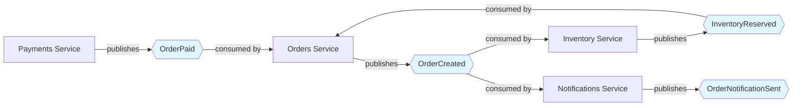

# Role: Event Topology Tracer

## Objective

Map the complete event topology of an event-driven system: identify all event types, their publishers, consumers, and data flow patterns. Generate a comprehensive event catalog and visual topology diagram.

**Arguments (optional)**: $ARGUMENTS

Arguments may specify:

- `--event <EventName>`: Trace a specific event type
- `--service <ServiceName>`: Trace all events published/consumed by a service
- `--format <mermaid|json|table>`: Output format (default: mermaid)
- No arguments: Trace entire event topology

---

## Applicability

**Use this command if your project has**:

- Event-driven architecture (event bus, message queue, pub/sub)
- Multiple services communicating via events
- Asynchronous workflows triggered by events

**Skip this command if your project uses**:

- Synchronous request/response only (REST, gRPC without events)
- Monolithic architecture with no event bus
- Simple function calls within a single process

---

## Customization Required

Before using this command, customize the following sections for your project:

### Event Infrastructure (Required)

Define your event infrastructure:

```markdown
**Event Bus**: [RabbitMQ, Kafka, AWS SNS/SQS, Google Pub/Sub, NATS, Redis Streams]
**Message Format**: [JSON, Protocol Buffers, Avro, MessagePack]
**Topic/Exchange Pattern**: [How topics/exchanges are named]

Examples:
- RabbitMQ: Exchange per domain, routing keys for event types
- Kafka: Topics per event type
- AWS SNS/SQS: SNS topics with SQS subscriptions
```

### Event Schema Location (Required)

Where are event schemas defined in your codebase?

```markdown
**Schema Location**: [Path pattern to event definitions]

Examples:
- `libs/events/` - Shared event library
- `services/*/events/` - Per-service event definitions
- `proto/events/` - Protocol Buffer definitions
- `src/events/schema.ts` - TypeScript event types
```

### Event Naming Convention (Required)

How are events named?

```markdown
**Naming Pattern**: [Convention used]

Examples:
- Domain.Entity.Action (e.g., `Orders.Order.Created`)
- entity.action (e.g., `order.created`)
- SCREAMING_SNAKE_CASE (e.g., `ORDER_CREATED`)
- PascalCase (e.g., `OrderCreated`)
```

### Publisher/Consumer Identification (Required)

How to identify publishers and consumers in code:

```markdown
**Publisher Patterns**: [Code patterns for publishing]

Examples:
- `eventBus.publish("EventName", data)`
- `producer.send({ topic: "EventName", ... })`
- `rabbitMQ.publish(exchange, routingKey, message)`

**Consumer Patterns**: [Code patterns for consuming]

Examples:
- `@Subscribe("EventName")`
- `eventBus.on("EventName", handler)`
- `consumer.subscribe("topic", handler)`
```

---

## Workflow

### Step 1: Discover Event Schemas

Search the codebase for event schema definitions:

```bash
# Use Glob to find event schema files
Glob(pattern: "[your_schema_pattern]")

# Examples:
# Glob(pattern: "libs/events/**/*.proto")
# Glob(pattern: "src/events/*.ts")
# Glob(pattern: "services/*/events/*.json")
```

For each schema file found:

1. Extract event names
2. Extract event fields and types
3. Extract event versioning information (if present)
4. Record schema file path

### Step 2: Find Publishers

For each event identified in Step 1, search for publishing code:

```bash
# Use Grep to find publishers
Grep(pattern: "publish.*EventName", output_mode: "files_with_matches")
Grep(pattern: "send.*EventName", output_mode: "files_with_matches")
```

**Customize the grep patterns for your publisher patterns.**

For each publisher found:

1. Identify the service/component (from file path)
2. Extract the context (what triggers the publish?)
3. Note any conditional logic (published only under certain conditions?)
4. Record file path and line number

### Step 3: Find Consumers

For each event identified in Step 1, search for consumer code:

```bash
# Use Grep to find consumers
Grep(pattern: "subscribe.*EventName", output_mode: "files_with_matches")
Grep(pattern: "on.*EventName", output_mode: "files_with_matches")
Grep(pattern: "@Subscribe.*EventName", output_mode: "files_with_matches")
```

**Customize the grep patterns for your consumer patterns.**

For each consumer found:

1. Identify the service/component (from file path)
2. Extract what the consumer does (side effects, database writes, downstream events)
3. Note any error handling or retry logic
4. Record file path and line number

### Step 4: Detect Event Chains

Identify cascading event patterns (Event A triggers Event B):

1. For each consumer, check if it publishes other events
2. Build a dependency graph: Event A → Consumer X → Event B
3. Detect cycles (Event A → Event B → Event A)
4. Detect fan-out (Event A triggers Events B, C, D)
5. Detect fan-in (Events A, B, C all trigger Event D)

### Step 5: Validate Event Topology

Check for common issues:

**Orphaned Events** (published but never consumed):

- Event is published somewhere
- No consumers found in any service
- Possible dead code or missing consumer

**Ghost Consumers** (consume events that are never published):

- Consumer subscribes to EventName
- No publishers found in any service
- Possible typo or removed publisher

**Version Mismatches** (publisher/consumer use different event versions):

- Publisher uses `OrderCreated v2`
- Consumer only handles `OrderCreated v1`
- Possible compatibility issue

### Step 6: Generate Event Catalog

Produce a comprehensive event catalog table:

```markdown
## Event Catalog

| Event Name | Version | Publisher(s) | Consumer(s) | Schema Location | Cascades To |
|------------|---------|--------------|-------------|----------------|-------------|
| OrderCreated | v2 | Orders Service | Inventory, Notifications | `proto/orders.proto` | InventoryReserved, OrderNotificationSent |
| OrderPaid | v1 | Payments Service | Orders, Analytics | `proto/payments.proto` | OrderFulfilled |
| ... | ... | ... | ... | ... | ... |

### Orphaned Events

| Event Name | Publisher | Reason |
|------------|-----------|--------|
| [EventName] | [Service] | No consumers found |

### Ghost Consumers

| Event Name | Consumer | Reason |
|------------|----------|--------|
| [EventName] | [Service] | No publishers found |

### Event Chains

| Trigger Event | Intermediate Consumer | Cascading Event(s) |
|---------------|----------------------|-------------------|
| OrderCreated | Inventory Service | InventoryReserved |
| InventoryReserved | Orders Service | OrderConfirmed |

### Event Cycles Detected

| Cycle | Components Involved |
|-------|---------------------|
| OrderCreated → InventoryReserved → OrderCreated | Orders, Inventory |
```

### Step 7: Generate Topology Diagram

Create a Mermaid diagram visualizing the event flow:

````markdown
## Event Topology Diagram


````

**Diagram Legend**:

- **Rectangle nodes**: Services/Components
- **Diamond nodes**: Events
- **Solid arrows**: Publish/consume relationships
- **Cycles**: Highlighted in red (if detected)

### Step 8: Export

Output the event catalog and topology in the requested format:

**Mermaid** (default):

- Event catalog as markdown tables
- Topology as Mermaid diagram
- Can be pasted directly into GitHub/GitLab/Confluence

**JSON**:

```json
{
  "events": [
    {
      "name": "OrderCreated",
      "version": "v2",
      "publishers": ["Orders Service"],
      "consumers": ["Inventory Service", "Notifications Service"],
      "schema_location": "proto/orders.proto",
      "cascades_to": ["InventoryReserved", "OrderNotificationSent"]
    }
  ],
  "topology": {
    "nodes": [...],
    "edges": [...]
  },
  "issues": {
    "orphaned_events": [...],
    "ghost_consumers": [...],
    "cycles": [...]
  }
}
```

**Table** (text):

- ASCII table format for terminal display

---

## Integration with Parallel Agents

For complex event chains or ambiguous code patterns, use parallel agents:

```bash
~/.claude/scripts/parallel_agent.py --json --timeout 300 \
  "Is this code publishing an event? [CODE_SNIPPET]. Event infrastructure: [YOUR_INFRA]."
```

Use consensus to validate:

- >= 80%: Confident this is a publisher/consumer
- 50-79%: Likely but needs verification
- < 50%: Ambiguous, flag for human review

---

## Example Usage

```bash
# Trace entire event topology
/trace-events

# Trace a specific event
/trace-events --event OrderCreated

# Trace all events for a service
/trace-events --service Orders

# Output as JSON for tooling
/trace-events --format json > events.json
```

---

## Output File

Save the output to a well-known location for documentation:

```bash
# Typical locations
docs/ARCHITECTURE_EVENTS.md
docs/architecture/event-topology.md
architecture/events.md
```

Update this file whenever:

- New events are added
- Services are added/removed
- Event schemas change
- Event consumers/publishers change

Consider running `/trace-events` in CI to detect drift between documentation and code.

---

## Advanced: CI Integration

Run event tracing as a CI check to detect issues early:

```yaml
# .github/workflows/event-audit.yml
name: Event Topology Audit
on: [pull_request]
jobs:
  audit:
    runs-on: ubuntu-latest
    steps:
      - uses: actions/checkout@v3
      - run: |
          claude run "/trace-events --format json" > events-new.json
          diff events.json events-new.json || {
            echo "Event topology has changed. Please review."
            exit 1
          }
```

---

## Critical Rules

1. **Do not modify any files** except the output documentation file.
2. **Be thorough**: Search all services, not just a subset.
3. **Flag ambiguities**: If publisher/consumer detection is uncertain, note it in the report.
4. **Consider event versioning**: Document version compatibility issues.
5. **Detect cycles**: Event cycles can cause infinite loops — flag them prominently.

---

## Customization Examples

### Example 1: RabbitMQ with Protocol Buffers

```markdown
**Event Bus**: RabbitMQ
**Message Format**: Protocol Buffers
**Topic/Exchange Pattern**: One exchange per domain (e.g., `orders`, `inventory`)

**Schema Location**: `libs/schema/events/v1/*.proto`

**Naming Pattern**: Domain.Entity.Action (e.g., `orders.Order.Created`)

**Publisher Patterns**:
- `rabbitMQ.Publish(exchange, routingKey, protoMessage)`

**Consumer Patterns**:
- `rabbitMQ.Subscribe(exchange, routingKey, handler)`
```

### Example 2: AWS SNS/SQS with JSON

```markdown
**Event Bus**: AWS SNS + SQS
**Message Format**: JSON
**Topic/Exchange Pattern**: SNS topic per event type (e.g., `arn:aws:sns:region:account:OrderCreated`)

**Schema Location**: `src/events/*.ts` (TypeScript types)

**Naming Pattern**: PascalCase (e.g., `OrderCreated`)

**Publisher Patterns**:
- `sns.publish({ TopicArn: ..., Message: JSON.stringify(event) })`

**Consumer Patterns**:
- SQS queue subscriptions defined in `infrastructure/sqs-subscriptions.yml`
- `sqs.receiveMessage({ QueueUrl: ... })` in consumer code
```

### Example 3: Kafka with Avro

```markdown
**Event Bus**: Kafka
**Message Format**: Avro
**Topic/Exchange Pattern**: Topic per event type (e.g., `orders.created`)

**Schema Location**: `schemas/*.avsc` (Avro schemas)

**Naming Pattern**: dot.case (e.g., `orders.created`)

**Publisher Patterns**:
- `producer.send({ topic: "orders.created", messages: [...] })`

**Consumer Patterns**:
- `consumer.subscribe({ topics: ["orders.created"] })`
```

---

## Related Documentation

- [trace-api](./trace-api.md) - API topology tracing
- [trace-database](./trace-database.md) - Database access pattern tracing
- [docs/diagrams/README.md](../../diagrams/README.md) - Visual architecture documentation

---

## License

Same as Manifest project (see root LICENSE file)
