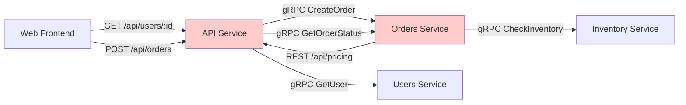

# Role: API Topology Tracer

## Objective

Map the complete API topology of a distributed system: identify all API endpoints (REST, gRPC, GraphQL), their providers (servers), consumers (clients), request/response schemas, and dependency chains.

**Arguments (optional)**: $ARGUMENTS

Arguments may specify:
- `--service <ServiceName>`: Trace APIs for a specific service
- `--api-type <rest|grpc|graphql>`: Filter by API type
- `--format <mermaid|json|table>`: Output format (default: mermaid)
- No arguments: Trace entire API topology

---

## Applicability

**Use this command if your project has**:
- Microservices or distributed components communicating via APIs
- Multiple API types (REST + gRPC, REST + GraphQL)
- Service-to-service API calls

**Skip this command if your project uses**:
- Single service with no external API calls
- Only frontend-to-backend API (no service-to-service)
- Monolithic architecture with function calls

---

## Customization Required

Before using this command, customize the following sections for your project:

### API Types Used (Required)

Check which API types your project uses:

```markdown
**REST**: Yes/No
**gRPC**: Yes/No
**GraphQL**: Yes/No
**Other**: [SOAP, WebSocket, etc.]
```

### API Definition Locations (Required)

Where are API contracts defined?

```markdown
**REST**:
- OpenAPI/Swagger specs: `[path pattern]`
- Route definitions: `[path pattern]`

Examples:
- `docs/openapi.yaml`
- `src/routes/*.ts`
- `@app.route("/api/endpoint")` decorators

**gRPC**:
- Protocol Buffer service definitions: `[path pattern]`

Examples:
- `proto/**/*.proto`
- `libs/schema/services/*.proto`

**GraphQL**:
- Schema definitions: `[path pattern]`

Examples:
- `schema.graphql`
- `src/graphql/**/*.graphql`
- `@ObjectType()` / `@Query()` decorators
```

### Service Identification (Required)

How to identify which service owns an API:

```markdown
**Service Structure**: [How services are organized]

Examples:
- `services/<service-name>/` - One directory per service
- `apps/<service-name>/` - Nx/monorepo structure
- `src/` - Monolith with internal modules
```

### Client Call Patterns (Required)

How to identify API clients in code:

```markdown
**REST Clients**:
- [Pattern to search for]

Examples:
- `axios.get("/api/endpoint")`
- `fetch("https://service/api/endpoint")`
- `http.Get(url)`

**gRPC Clients**:
- [Pattern to search for]

Examples:
- `client.GetUser(ctx, req)`
- `new UserServiceClient(...)`

**GraphQL Clients**:
- [Pattern to search for]

Examples:
- `useQuery(GET_USER_QUERY)`
- `client.query({ query: GET_USER })`
```

---

## Workflow

### Step 1: Discover API Definitions

#### For REST APIs:

```bash
# Find OpenAPI specs
Glob(pattern: "**/*openapi*.{yaml,yml,json}")
Glob(pattern: "**/*swagger*.{yaml,yml,json}")

# Find route definitions
Grep(pattern: "@app\\.route\\(|@Get\\(|@Post\\(|router\\.get\\(", output_mode: "files_with_matches")
```

For each REST endpoint found:
1. Extract HTTP method (GET, POST, PUT, DELETE, PATCH)
2. Extract path (e.g., `/api/users/:id`)
3. Extract request/response schemas
4. Identify the service that provides it (from file path)
5. Note authentication requirements

#### For gRPC APIs:

```bash
# Find proto service definitions
Glob(pattern: "**/*.proto")
Grep(pattern: "service \\w+", output_mode: "content")
```

For each gRPC service found:
1. Extract service name
2. Extract RPC methods
3. Extract request/response message types
4. Identify the service that implements it (check for server code)
5. Note streaming vs unary

#### For GraphQL APIs:

```bash
# Find GraphQL schemas
Glob(pattern: "**/*.graphql")
Glob(pattern: "**/schema.{ts,js}")
Grep(pattern: "type Query|type Mutation", output_mode: "content")
```

For each GraphQL endpoint found:
1. Extract queries and mutations
2. Extract types
3. Extract resolvers
4. Identify the service that provides it
5. Note field-level resolvers

### Step 2: Find API Servers

For each API definition, find the server implementation:

**REST**:
```bash
# Find handler implementations
Grep(pattern: "def <endpoint_name>|func <handler_name>|async <handler_name>", output_mode: "files_with_matches")
```

**gRPC**:
```bash
# Find service implementations
Grep(pattern: "class \\w+Service|type \\w+Server|implement \\w+Service", output_mode: "files_with_matches")
```

**GraphQL**:
```bash
# Find resolver implementations
Grep(pattern: "Query: \\{|Mutation: \\{|resolvers = \\{", output_mode: "files_with_matches")
```

For each server found:
1. Identify the service/component (from file path)
2. Extract any middleware (auth, rate limiting, logging)
3. Note dependencies (database calls, other API calls)
4. Record file path and line number

### Step 3: Find API Clients

For each API, search for client code that calls it:

**REST**:
```bash
Grep(pattern: "fetch\\(.*<endpoint_path>|axios.*<endpoint_path>|http.Get.*<endpoint_path>", output_mode: "files_with_matches")
```

**gRPC**:
```bash
Grep(pattern: "<ServiceName>Client\\(|client.<RpcMethod>\\(", output_mode: "files_with_matches")
```

**GraphQL**:
```bash
Grep(pattern: "useQuery\\(<QueryName>|useMutation\\(<MutationName>|client.query.*<QueryName>", output_mode: "files_with_matches")
```

For each client found:
1. Identify the calling service/component (from file path)
2. Extract call context (what triggers the API call?)
3. Note error handling and retry logic
4. Record file path and line number

### Step 4: Detect API Dependency Chains

Identify cascading API call patterns (Service A → Service B → Service C):

1. For each API handler, check if it makes calls to other APIs
2. Build a dependency graph: `/api/orders` (Orders) → `/api/inventory` (Inventory)
3. Detect cycles (Service A calls Service B calls Service A)
4. Detect fan-out (Service A calls Services B, C, D in parallel)
5. Calculate call depth (longest chain from entry point to leaf service)

### Step 5: Validate API Topology

Check for common issues:

**Orphaned APIs** (defined but never called):
- API endpoint exists
- No clients found in any service
- Possible dead code or external-only API

**Missing Implementations** (clients call non-existent APIs):
- Client calls `/api/endpoint`
- No server implementation found
- Possible typo or missing service

**Version Mismatches**:
- Client uses `v2` endpoint
- Server only implements `v1`
- Possible compatibility issue

**Circular Dependencies**:
- Service A calls Service B
- Service B calls Service A
- Risk of deadlock or infinite loops

### Step 6: Generate API Catalog

Produce a comprehensive API catalog:

```markdown
## REST API Catalog

| Endpoint | Method | Provider | Consumer(s) | Auth Required | Request/Response |
|----------|--------|----------|-------------|---------------|------------------|
| /api/users/:id | GET | Users Service | Web Frontend, Orders Service | Yes (JWT) | User schema |
| /api/orders | POST | Orders Service | Web Frontend | Yes (JWT) | Order schema |
| ... | ... | ... | ... | ... | ... |

## gRPC API Catalog

| Service | Method | Provider | Consumer(s) | Streaming | Proto Location |
|---------|--------|----------|-------------|-----------|----------------|
| UserService | GetUser | Users Service | Orders, Notifications | No | proto/users.proto |
| OrderService | StreamOrders | Orders Service | Analytics | Server streaming | proto/orders.proto |
| ... | ... | ... | ... | ... | ... |

## GraphQL API Catalog

| Type | Field | Provider | Consumer(s) | Resolver | Returns |
|------|-------|----------|-------------|----------|---------|
| Query | user(id: ID!) | API Service | Web Frontend | users.resolver.ts | User |
| Mutation | createOrder | API Service | Web Frontend | orders.resolver.ts | Order |
| ... | ... | ... | ... | ... | ... |

## Orphaned APIs

| API | Provider | Reason |
|-----|----------|--------|
| [Endpoint] | [Service] | No clients found |

## Missing Implementations

| API | Client | Reason |
|-----|--------|--------|
| [Endpoint] | [Service] | No server found |

## Circular Dependencies

| Cycle | Services Involved |
|-------|------------------|
| /api/orders → /api/inventory → /api/orders | Orders, Inventory |
```

### Step 7: Generate Topology Diagram

Create a Mermaid diagram visualizing API dependencies:

````markdown
## API Topology Diagram



**Legend**:
- **Rectangle nodes**: Services
- **Arrows with labels**: API calls (protocol + endpoint/method)
- **Red nodes**: Involved in circular dependencies
````

### Step 8: Export

Output the API catalog and topology in the requested format:

**Mermaid** (default):
- API catalog as markdown tables
- Topology as Mermaid diagram

**JSON**:
```json
{
  "apis": {
    "rest": [...],
    "grpc": [...],
    "graphql": [...]
  },
  "topology": {
    "nodes": [...],
    "edges": [...]
  },
  "issues": {
    "orphaned_apis": [...],
    "missing_implementations": [...],
    "circular_dependencies": [...]
  }
}
```

**Table** (text):
- ASCII table format for terminal display

---

## Integration with Parallel Agents

For complex or ambiguous API patterns, use parallel agents:

```bash
~/.claude/scripts/parallel_agent.sh --json --timeout 300 \
  "Is this code calling an API? [CODE_SNIPPET]. What API and what service?"
```

---

## Example Usage

```bash
# Trace entire API topology
/trace-api

# Trace APIs for a specific service
/trace-api --service Orders

# Trace only gRPC APIs
/trace-api --api-type grpc

# Output as JSON
/trace-api --format json > apis.json
```

---

## Output File

Save the output to:

```bash
docs/ARCHITECTURE_APIS.md
docs/architecture/api-topology.md
architecture/apis.md
```

Update when:
- New endpoints are added
- Services are added/removed
- API contracts change

---

## Critical Rules

1. **Do not modify any files** except the output documentation file.
2. **Be thorough**: Search all services for API definitions and calls.
3. **Flag ambiguities**: If unclear whether code is an API call, note it in the report.
4. **Document authentication**: Note which APIs require auth and what type.
5. **Detect circular dependencies**: These can cause cascading failures — flag prominently.

---

## Related Documentation

- [trace-events](./trace-events.md) - Event topology tracing
- [trace-database](./trace-database.md) - Database access pattern tracing

---

## License

Same as Manifest project (see root LICENSE file)
